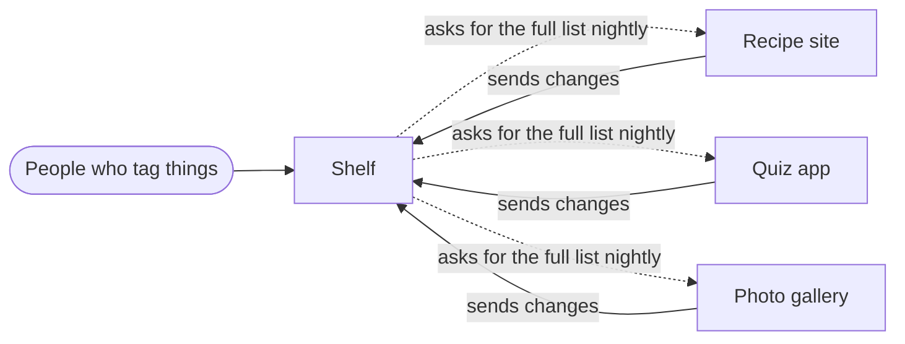

## In one sentence

Designing a system means deciding its parts, how they talk to each other and what each one promises, *before* you write the code.

## Example

Suppose someone asks you to build this: “Let people put tags on things in our apps, and find things by tag.” That’s Shelf, the example this course uses all the way through.

You could open an editor and start. Within a day you would hit questions that code can’t answer for you:

- The recipe site deletes a recipe. What happens to its tags? Are they gone, or kept in case the recipe comes back?
- Can someone put the tag “vegetarian” on a photo?
- The quiz app sends the same change twice. Is anything counted twice?
- How fast must a lookup be? How many lookups arrive at once?

Every one of these is a decision. If you make it halfway through writing a function, you make it alone, in a hurry, and it ends up buried in the code. Months later someone asks why tags vanish when a recipe is briefly unpublished, and nobody remembers that it was ever decided.

<Compare>
<Side title="Deciding while coding" tone="bad">
The delete handler removes the item and its tags, because that was the easy thing to write. Three weeks later the recipe site republishes 200 recipes after a bug, and every tag on them is gone for good.
</Side>
<Side title="Deciding first" tone="good">
Before coding, you write: “A deleted item keeps its tags for 30 days in case it comes back.” It’s one sentence. The recipe site’s bug costs nothing, because the tags are still there when the recipes return.
</Side>
</Compare>

Here is a first, tiny design for Shelf. It answers three questions and nothing else:

1. **What are the parts?** Shelf itself, and the apps that plug into it (the recipe site, the quiz app, the photo gallery). Each app owns its items; Shelf owns the tags.
2. **How do they talk?** Apps tell Shelf when their items change. Shelf also asks each app for its full list once a night, as a safety net.
3. **What does each promise?** Shelf promises that a deleted item keeps its tags for 30 days. Each app promises that its full list really is complete.

<Diagram
  title="A first sketch of Shelf"
  description="Three apps (the recipe site, the quiz app and the photo gallery) each send their changes to Shelf. Shelf also pulls a full list from each app every night. People tag items through Shelf."
>

</Diagram>

That sketch took ten minutes. It already rules out a whole class of bugs, and everyone who reads it knows what Shelf will and won’t do.

## The general idea

<Term id="system-design">System design</Term> is the thinking you do before building. A design answers:

- **What are the parts, and what does each one own?** Owning means being the one place where that data is correct.
- **How do the parts talk?** Who calls whom, when, and with what.
- **What does each part promise?** What it accepts, what it returns, how it fails, and how it behaves when things go wrong. A promise like this is called a <Term id="contract">contract</Term>.

It starts from <Term id="requirement">requirements</Term>: what the system must do, and how well. And it records the <Term id="trade-off">trade-offs</Term>: where you chose one good thing over another, and why.

**Why it saves time.** The cost of changing your mind grows the later you do it:

| When you change your mind | What it costs |
|---|---|
| While designing | Rewrite a sentence. Minutes. |
| While coding | Rewrite some code and its tests. Hours or days. |
| After release | Migrate the stored data, and ask everyone who depends on it to change too. Weeks. |

Designing moves the expensive decisions to the cheap end of that table.

<Callout type="tradeoff" title="How much design is enough?">
Too little, and you rebuild things you could have got right on paper. Too much, and you spend days deciding things you’d learn faster by building a little. A good rule: think hard about decisions that are expensive to change later, and leave the cheap ones until you need them. For a system the size of Shelf, a design fits on one page. You’ll write that page at the end of this course.
</Callout>

## Common mistakes

- **Starting with the technology.** “We’ll use a message queue” is an answer. Start with the question: what must the system do, and how well?
- **Designing only the happy path.** Most real decisions are about what happens when a step fails, is slow, or runs twice.
- **Treating the design as finished.** A design is a living document. When a decision changes, write down what changed and why, so the next person doesn’t undo it by accident.

## Try it

<Sort id="u1-cheap-or-expensive" />
