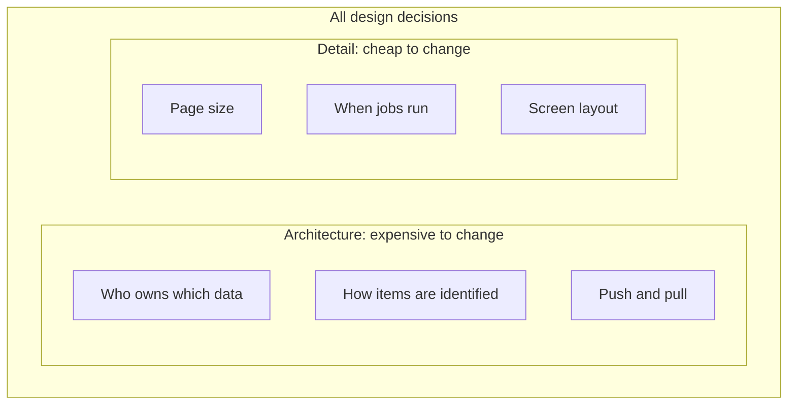

## In one sentence

Architecture is the set of design decisions that are expensive to change later; design is architecture plus all the detail inside each part.

## Example

Here are six decisions from Shelf. Some of them you could change on a quiet afternoon. Others would take weeks and need other teams to change their code too.

| Decision | If it turns out wrong… |
|---|---|
| Shelf keeps its own database of tags; the apps keep their items. | Moving tags into each app means migrating every tag and rewriting every app’s tagging screens. |
| Apps push changes *and* Shelf pulls a full list every night. | Dropping either path changes what every app must build. |
| An item is identified by its app plus the app’s own item id. | Every stored tag points at items this way. Changing it means migrating all of them. |
| A lookup returns 100 items per page. | Change a number. Apps follow the “next page” link, so they don’t notice. |
| The clean-up job that trashes old missing items runs every hour. | Change a setting. |
| The admin screen lists tags in alphabetical order. | Change one line. |

The first three are **architecture**. The last three are design detail.

What makes the difference isn’t how big or important the decision *sounds*. It’s what depends on it. The page size sounds technical, but nothing outside Shelf relies on it being exactly 100. The way items are identified sounds like a small detail, but it’s stored in 300,000 tag records and built into three other apps.

<Compare>
<Side title="Changing the page size">
Edit one number, deploy. Apps keep following `nextCursor` and never notice. An afternoon, at most.
</Side>
<Side title="Changing how items are identified">
Write a <Term id="migration">migration</Term> for every stored tag, agree a new format with three app teams, run old and new side by side until they’ve all moved. Weeks.
</Side>
</Compare>

## The general idea

<Term id="system-design">Design</Term> covers every decision about how a system works, from the biggest to the smallest. <Term id="architecture">Architecture</Term> is the part of the design that is expensive to reverse.

To tell which is which, use **the rewrite test**:

> If getting it wrong means a migration, a rewrite, or other people changing their code, it’s architecture.

Decisions that usually pass the rewrite test:

- **The main parts** of the system and what each one is responsible for.
- **Where data lives** and which part owns it.
- **How the parts talk:** push or pull, requests or events, who calls whom.
- **Contracts other people depend on:** the shape of requests and responses, identifiers, error codes.
- **Big technology choices**, such as the database, when data or code is built around them.

<Diagram
  title="Architecture is part of design"
  description="A large box labelled 'All design decisions' contains a smaller box labelled 'Architecture: expensive to change', holding decisions such as who owns the data, how items are identified and push plus pull. Outside the smaller box, but inside the large one, are cheap decisions such as page size, job schedules and screen layout."
>

</Diagram>

Two things follow from this.

**The line moves with context.** The name of a field inside Shelf’s code is detail: rename it and let the compiler find every use. The name of a field in the JSON that apps send is architecture, because three other teams have written code against it. The same kind of decision can land on either side, depending on who relies on it.

**Architecture is where your care should go.** You can’t think hard about everything. Spend your time on the decisions that pass the rewrite test, and write down why you made them (you’ll learn how in [Recording decisions](/learn/changing-over-time/recording-decisions/)). Leave the rest to be decided, and changed, as you build.

<Callout type="note">
Some people use “architecture” to mean a style, such as “microservices architecture”. That’s one possible answer to some architectural questions. In this course, architecture means the expensive decisions themselves, whatever the answers are.
</Callout>

## Common mistakes

- **Thinking architecture is about size.** A tiny detail that other systems depend on (an id format, an error code) is architecture. A big-sounding internal choice may not be.
- **Treating everything as architecture.** If every decision gets a meeting, nothing gets built. Most decisions are cheap to change; make them and move on.
- **Forgetting that stored data is sticky.** Anything written to a database, or sent to another system that stores it, becomes expensive to change the moment real data exists.

## Try it

<Sort id="u1-architecture-or-design" />
