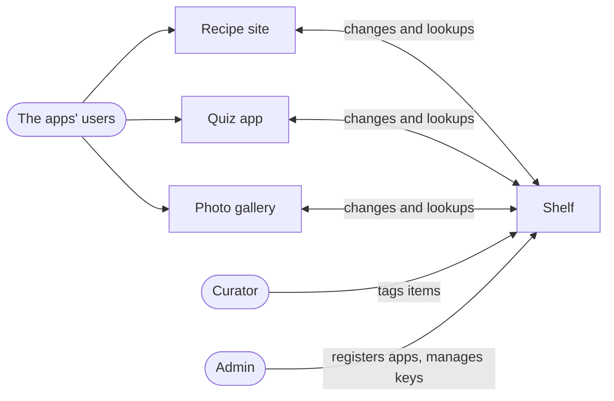
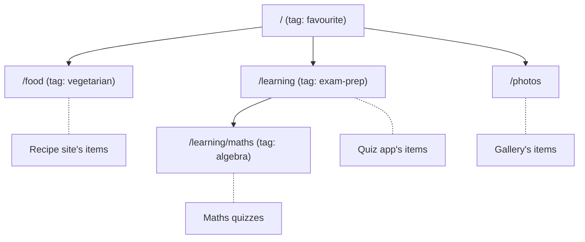

## In one sentence

Shelf is a small labelling service: other apps keep their own items, and Shelf lets people put tags on those items and look them up by tag.

## Example

An organisation runs three apps:

- a **recipe site** with about 12,000 recipes,
- a **quiz app** with about 3,000 quizzes for learners,
- a **photo gallery** with about 45,000 photos.

Each app wants tags. The recipe site wants “vegetarian” and “quick weeknight”. The quiz app wants “exam prep” and “algebra”. Everyone wants “favourite”. Building tagging three times, three slightly different ways, is a waste. So they build it once, as a separate service that all three apps plug into. That service is Shelf.

### Who is involved

| Who | What they do with Shelf |
|---|---|
| **The apps** (recipe site, quiz app, photo gallery) | Plug in. Tell Shelf when their items change. Ask Shelf which items have a tag, to show their own users. |
| **Curators** | Put tags on items, take them off, create and rename tags. |
| **The admin** | Shelf’s one developer. Registers new apps, looks after scopes and keys, gets woken up when something breaks. |
| **The apps’ users** | People browsing recipes or photos. They see tags, but only through the apps. They never talk to Shelf directly. |

<Diagram
  title="Shelf and the people and systems around it"
  description="Shelf sits in the middle. Curators and the admin use Shelf directly. The recipe site, the quiz app and the photo gallery each send their changes to Shelf and ask it for tagged items; Shelf also asks each app for its full list every night. The apps' own users only talk to the apps."
>

</Diagram>

### Four facts you’ll use in every unit

**1. Each app owns its items. Shelf owns the tags.** An app registers with Shelf as a <Term id="source">source</Term>. A recipe, quiz or photo is an <Term id="item">item</Term>, and it belongs to its app. Shelf never stores the recipe itself, only its id, a copy of its title (so Shelf can show it) and a link. The <Term id="tag">tags</Term>, and which items have which tag, belong to Shelf.

**2. Tags live in scopes, and scopes form a tree.** A <Term id="scope">scope</Term> is like a folder for tags. Each app has a home scope, and its items live there or below it.

<Diagram
  title="Shelf's scopes"
  description="The root scope, written as a single slash, has three children: /food (the recipe site's home), /learning (the quiz app's home) and /photos (the photo gallery's home). /learning has one child, /learning/maths, where the quiz app puts its maths quizzes. Example tags: favourite in the root, vegetarian in /food, exam-prep in /learning, algebra in /learning/maths."
>

</Diagram>

A tag defined in a scope can only go on items in that scope **or below it**. “exam-prep” lives in `/learning`, so it fits any quiz, including maths quizzes in `/learning/maths`. It can’t go on a photo. “favourite” lives at the root, so it fits anything.

**3. Apps push, and Shelf also pulls.** When an item changes, its app tells Shelf straight away. That’s a <Term id="push">push</Term>. But apps have bugs and bad days, and some changes never get sent. So every night Shelf also asks each app for its full list of items and fixes anything it missed. That’s a <Term id="pull">pull</Term>, and it’s the safety net.

**4. A missing item keeps its tags for 30 days.** If an app deletes an item, or it stops appearing in the nightly list, Shelf marks it *missing* but keeps its tags. If it comes back within 30 days (a recipe unpublished by mistake, say), its tags are still there.

<Callout type="shelf" title="Shelf in numbers">
Three apps now, maybe twenty in two years. 60,000 items, 2,000 tags and 300,000 tag links. About 150,000 lookups a day. One server, one developer. Small enough to hold in your head.
</Callout>

## The general idea

A <Term id="running-example">running example</Term> is one system you come back to in every lesson, so each idea adds to the same picture instead of starting from scratch.

Shelf is a good one because it is small but not trivial:

- **It has two real sides.** Shelf and the apps are built by different people, so they need clear promises between them: exactly what the rest of the course is about.
- **It has ownership questions.** Who decides an item’s title? Who decides whether it still exists?
- **It has deletion questions.** What happens to tags when an item disappears? What if it comes back?
- **It has permission questions.** Who may tag what? Can the quiz app see the gallery’s tags?

Every part of a design has something to say about Shelf. You’ll meet those parts in the next lesson.

<GoDeeper title="Why not “design Twitter”?">
Famous systems make popular interview questions, but they are a poor way to learn. They are too big to hold in your head, so every answer turns into a list of technologies. A small system with sharp questions (who owns this, what happens when that fails) teaches the thinking. The same thinking scales up.
</GoDeeper>

## Common mistakes

When you meet a new system’s brief, it’s easy to:

- **Assume you know what the words mean.** Does “delete” mean gone for ever, or hidden? Is an “item” a recipe, or a recipe’s page? Pin down every noun.
- **Assume the new system owns everything.** Shelf owns tags, not items. Getting ownership wrong is the most expensive mistake in this course.
- **Forget the people who aren’t users.** The admin who runs Shelf at 3am has requirements too.

## Try it

<Quiz id="u1-shelf-facts" />
