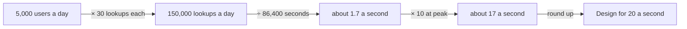

## In one sentence

A back-of-the-envelope estimate turns what you know (users, requests, items) into the numbers a design needs, such as peak requests per second and storage, using arithmetic rough enough to do on paper.

## Example: how big is Shelf?

Before choosing a server, Shelf’s admin needs two numbers: how many lookups a second at the busiest time, and how much data there will be. Neither is known exactly. Both can be estimated in 5 minutes.

### Load: from people to requests per second

Start with what the apps know about their own users. Across all three apps, about 5,000 people a day open pages that show tags. Each such page makes the app ask Shelf for tagged items. The apps reckon on about 30 lookups per person per day.

<Diagram
  title="From users to a design target"
  description="5,000 app users a day, times 30 lookups each, gives 150,000 lookups a day. Divided by the 86,400 seconds in a day, that is about 1.7 lookups a second on average. Times a peak factor of 10, that is about 17 a second at the busiest moment. Rounded up, Shelf is designed for 20 lookups a second."
>

</Diagram>

Step by step:

1. **Requests per day.** 5,000 users × 30 lookups = 150,000 lookups a day.
2. **Average per second.** A day has 86,400 seconds. 150,000 ÷ 86,400 ≈ 1.7 lookups a second.
3. **Peak.** Traffic isn’t spread evenly. Few people browse recipes at 4am, and lots do at 6pm. Shelf assumes the busiest minutes run about ten times the average: 1.7 × 10 ≈ 17 lookups a second.
4. **Round up.** Design for 20 a second: a round number with a little room to spare.

That last figure is the load in Shelf’s latency target: “95% within 200 ms *at 20 requests per second*”. The estimate is where the 20 came from.

Other traffic is small beside it. The nightly pull lists 60,000 items in pages of 500: 120 requests, once a night. Pushes are capped at 60 requests a minute for each key.

### Storage: from items to megabytes

What does Shelf store for one item? Its id (up to 200 characters), a cached title (up to 300), a link, its scope, its status and a few timestamps. That’s a few hundred bytes. Round it up to 1 KB, which also covers the database’s own overhead.

- **Items:** 60,000 items × 1 KB ≈ 60 MB.
- **Tag links:** 300,000 taggings × about 100 bytes ≈ 30 MB.
- **Total:** about 90 MB. Indexes and backups add two or three times that, so call it a few hundred megabytes.

### What the numbers say

Twenty lookups a second and a few hundred megabytes is small. One modest server running Postgres handles it with plenty of room to spare. Shelf doesn’t need a cluster of servers or a separate search engine, and the estimate took 5 minutes to show it.

## The general idea

A <Term id="back-of-the-envelope">back-of-the-envelope estimate</Term> is a quick calculation, good to within a factor of two or so, that tells you which *size* of solution you need. You aren’t predicting the future. You’re finding out whether the answer is one server or a hundred.

The recipe is always the same:

1. **Load.** Users per day × requests per user = requests per day. Divide by 86,400 for the average <Term id="requests-per-second">requests per second</Term>. Multiply by a <Term id="peak-factor">peak factor</Term> (2 to 10 is common) for the busiest moment. That peak is the <Term id="throughput">throughput</Term> the design must sustain.
2. **Storage.** Number of things × size of one thing. Multiply by two or three for indexes, backups and some growth.
3. **Compare** with what one machine can do. If you’re nowhere near the limit, stop: the plain design wins. If you’re close, measure properly before deciding anything.

Handy numbers to keep in your head:

| Fact | Rough value |
|---|---|
| Seconds in a day | 86,400 (call it 100,000 for mental arithmetic) |
| Seconds in a month | about 2.6 million |
| 1 request a second, all day | about 86,000 requests a day |
| 1 KB × 1 million | 1 GB |

**Where the inputs come from.** Ask the people who know: the apps have their own visitor numbers. When nobody knows, guess, write the guess down, and try a high and a low value. If both lead to the same design, the guess doesn’t matter. Shelf’s peak factor of 10 is a guess of exactly that kind. With a factor of 5 or 20, one server would still do.

Do the sums twice: for today, and for the size you expect in a couple of years. Shelf expects up to 20 sources and 500,000 items within two years. Its scalability target (500,000 items and 50 lookups a second, on a bigger server) comes from rerunning these same sums with bigger inputs.

<Callout type="tip" title="Write the units every time">
Most estimating mistakes are unit slips: dividing a daily figure by the seconds in an hour, or mixing up KB and MB. Writing “lookups a day” or “lookups a second” next to every number catches them before they grow.
</Callout>

## Common mistakes

- **Designing for the average.** 1.7 lookups a second sounds like nothing. The busiest minutes are ten times that, and those are the minutes people notice.
- **False precision.** “1.736 requests per second” claims a certainty you don’t have. Round, and say the figure is rough.
- **Stopping at today.** Estimate for the size you expect in two years too, so the design doesn’t need replacing the moment it succeeds.

## Try it

The calculator starts with Shelf’s numbers. Change them to answer the questions below. (It’s also on the [tools page](/tools/), for your own systems.)

<EstimationCalculator />

<Quiz id="u2-what-if-it-grows" />
