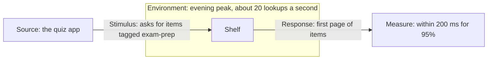

## In one sentence

A quality scenario writes one quality requirement as a tiny story in five parts: who or what starts it, what happens, under what conditions, what the system does, and the number that says whether it did well enough.

## Example: the quiz app at its busiest

Shelf’s latency target says “95% of lookups within 200 ms at 20 requests per second”. It’s measurable, but it’s abstract. Which lookup? At what time of day? What counts as the answer? A quality scenario turns it into a situation you can picture, and then test.

| Part | The question it answers | Shelf |
|---|---|---|
| **Source** | Who or what starts it? | The quiz app |
| **Stimulus** | What do they do, or what happens? | asks for the items tagged `exam-prep` |
| **Environment** | Under what conditions? | during the evening peak, about 20 lookups a second |
| **Response** | What does the system do? | Shelf returns the first page of up to 100 present items, most recently tagged first |
| **Measure** | How do we know it was good enough? | within 200 ms for 95% of requests, and within 500 ms for 99% |

Read it as one sentence: *when the quiz app asks for the items tagged `exam-prep` during the evening peak, Shelf returns the first page of up to 100 present items within 200 ms for 95% of requests.* Anyone can turn that into a load test, and a curator can read it and tell you whether 200 ms is fast enough.

<Diagram
  title="The five parts of a quality scenario"
  description="A source, the quiz app, sends a stimulus, a request for the items tagged exam-prep, to Shelf. Shelf sits inside an environment: the evening peak of about 20 lookups a second. Shelf produces a response, the first page of items, which is checked against a measure: within 200 ms for 95% of requests."
>

</Diagram>

### The same shape for a bad day

Scenarios are at their most useful when something breaks. Here is Shelf’s recovery target written the same way:

| Part | Shelf |
|---|---|
| **Source** | The server’s disk |
| **Stimulus** | fails completely |
| **Environment** | at 03:00 on a weekday, with the admin asleep |
| **Response** | an alert wakes the admin, who rebuilds Shelf on a new server from the nightly backup and the database log copied off every 15 minutes |
| **Measure** | lookups work again within 2 hours, and at most the last 15 minutes of tag changes are lost |

Writing this one out forces two design decisions. The database log has to leave the server every 15 minutes, or the measure can’t be met when the disk dies. And an alert has to reach the admin at 03:00, or nobody starts the 2-hour clock. A good scenario often shows what the design must include.

The source isn’t a person this time. It can be anything that sets things going: a person, an app, a timer, a failing disk.

The environment changes the answer. The recipe site asking for tagged recipes on a quiet afternoon, at the evening peak, and while Postgres is restarting are three different scenarios, and each has a different right response. A target that doesn’t name its environment has quietly assumed a normal day.

## The general idea

A <Term id="quality-scenario">quality scenario</Term> is a way of writing one quality requirement so it can’t stay vague. Every scenario is about one <Term id="quality-attribute">quality attribute</Term>. The first example above is about latency; the second is about <Term id="recovery">recovery</Term>.

The five parts:

- **Source:** who or what starts it. A person, an app, a timer, a failure.
- **Stimulus:** the event. A request, a burst of changes, a crash.
- **Environment:** the conditions at the time. Normal traffic, the evening peak, during the nightly pull, with the database down.
- **Response:** what the system does, as someone outside it would see it.
- **Measure:** the number that decides pass or fail. It must be <Term id="measurable">measurable</Term>: a time, a percentage or a count, with a share where it matters.

Why bother with five parts, when “95% within 200 ms at 20 requests a second” already works?

- **It makes you name the conditions.** Writing the environment forces the next question: “and during the nightly pull?”
- **It reads like a test.** Source, stimulus and environment are the test’s setup. Response and measure are what the test checks.
- **It lets non-developers join in.** Few curators have views about a p95 on its own. Most have views about the quiz app at 6pm.

Scenarios sit in the requirements next to the user stories. Later they turn into load tests, failure drills and alerts, so the effort isn’t wasted.

Write a handful of scenarios, not dozens. Pick the situations that would hurt most if the system got them wrong: the busiest moment, the biggest request, the worst failure. For Shelf, one of those is an app sending the largest batch of changes it’s allowed to. That’s your exercise.

<Callout type="tip" title="The builder checks your measure">
The exercise below checks your measure as you type. If it has no number, or leans on words like “quickly”, it tells you. The same builder is on the [tools page](/tools/) for your own systems.
</Callout>

## Common mistakes

- **A measure without a number.** “Shelf responds quickly” can’t fail a test. Write the time and the share: “within 200 ms for 95% of requests”.
- **Leaving out the environment.** An app pushing changes on a quiet afternoon and at the evening peak are two different requirements.
- **Cramming several situations into one.** “Under any load, with any failure, Shelf stays fast” is five scenarios pretending to be one. Split them.

## Try it

<ScenarioExercise id="u2-push-500-scenario" />
