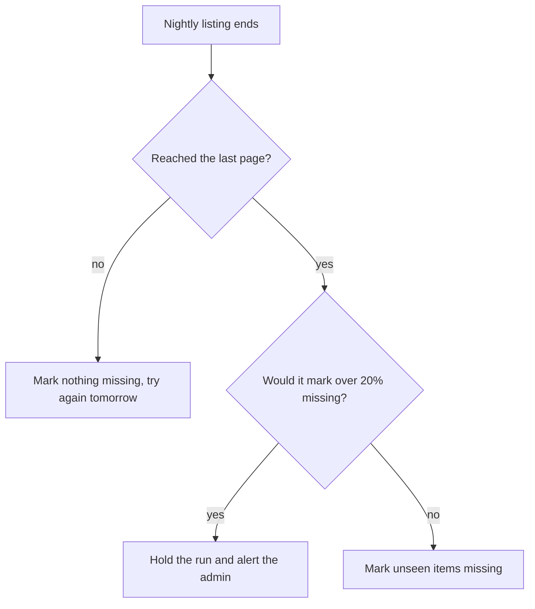

## In one sentence

Constraints are fixed facts the design has to live with, and priorities say, before any conflict happens, which requirement wins when two of them pull in opposite directions.

## Example: the pull that stopped at page 40

### Shelf’s constraints

Some things about Shelf aren’t up for discussion. They aren’t targets to reach. They are facts about the world Shelf lives in, and each one rules something out:

| Constraint | What it rules out |
|---|---|
| One server | Anything that needs a second machine to take over, which is why lookups aim for three nines and not four. |
| One developer | Anything that needs someone watching it. Problems must raise an alert; everything else must fix itself or wait. |
| Postgres | A second database for search or queues. Shelf makes do with what Postgres offers. |
| The apps are built by other teams | Asking them for much. More than one list endpoint per app is expensive, so Shelf must manage with that endpoint plus the pushes. |
| Shelf may not store item content | Searching inside recipes or photos. Shelf keeps an item’s id, title, link and scope, and nothing else. |

Every one of these removes options. That’s useful: a design with fewer options is quicker to finish.

### When two good things collide

It’s 02:00, and Shelf is pulling the photo gallery’s full list: 45,000 photos, in 90 pages of 500. Page 40 times out. Shelf retries after 2, 4 and 8 seconds, and all three attempts fail.

Shelf has now seen 19,500 photos. It hasn’t seen the other 25,500, and it has no idea whether they still exist. It can do one of two things.

<Compare>
<Side title="Freshness first" tone="bad">
Treat the listing as final and mark the 25,500 unseen photos missing, so Shelf matches the gallery as closely as it can. By breakfast, more than half the gallery has vanished from every lookup. If the listing keeps failing at the same page, their tags start being removed in 30 days.
</Side>
<Side title="Correctness first" tone="good">
Abandon the listing and mark nothing missing. Try again the next night. A photo that really was deleted yesterday, and never pushed, stays visible for one more day.
</Side>
</Compare>

Shelf chooses correctness. Not because someone decided at 02:00, but because it was decided months earlier, when the requirements were written. Shelf’s priorities, in order:

1. Never lose or wrongly remove a tag.
2. Lookups stay up.
3. Freshness.
4. Speed.
5. Cost.

Priority 1 beats priority 3. The price was written down too: a deletion that was never pushed can linger for an extra night.

The same list settles a second case. Suppose a listing *does* finish, but would mark more than 20% of a source’s items missing. That looks less like a big clear-out and more like a bug in the app’s listing. So Shelf holds the run and alerts the admin rather than trusting it. Correctness wins again, and this time the cost is a message to the admin.

<Diagram
  title="What Shelf does when a nightly listing ends"
  description="When the nightly listing ends, Shelf first asks whether it reached the last page. If not, it marks nothing missing and tries again the next night. If it did, Shelf asks whether the listing would mark more than 20% of the source's items missing. If yes, it holds the run and alerts the admin. If no, it marks the unseen items missing."
>

</Diagram>

## The general idea

A <Term id="constraint">constraint</Term> is a fixed fact the design must live with. You don’t aim for it, and you don’t measure how well you did against it. You design inside it. “One server” is a constraint. “95% of lookups within 200 ms” is a goal.

A quick test: could you do *better* than it? You can beat a latency target, or come in under budget. You can’t beat “one developer”.

Write constraints down with the requirements, even the obvious ones. An unwritten constraint surprises the next person, who sketches a two-server setup or asks the apps for a second endpoint.

A <Term id="priority">priority</Term> list ranks the requirements so that, when two conflict, you already know which wins. Conflicts are normal, because most good things cost something another requirement wants:

- Fresher data means more work, which costs speed and money.
- More availability needs more servers, which costs money and the developer’s time.
- More checks for correctness can make things slower and less fresh.

Each of those is a <Term id="trade-off">trade-off</Term>. Deciding them in advance matters for three reasons:

- **The decision is calmer.** At 02:00, with 25,500 photos about to vanish, nobody reasons well.
- **It’s consistent.** The same conflict gets the same answer every time, whoever is on duty.
- **It shows up in the design.** Shelf’s rule that an incomplete listing marks nothing missing is priority 1 turned into behaviour. You’ll see it again in the [worked example](/learn/contracts/worked-example/) at the end of the contracts unit.

A good priority list is short and strictly ordered: no two items share a place. For the conflicts you can already see coming, it also states the rule in a sentence: “Correctness beats <Term id="freshness">freshness</Term>: if a listing looks incomplete, mark nothing missing.”

<Callout type="tradeoff" title="What correctness costs Shelf">
Putting correctness first isn’t free. When a pull fails, real deletions wait an extra night. When the 20% guard trips, the admin has to look before anything happens. Shelf accepts both, because a wrongly removed tag is hard to put back, while a stale photo sorts itself out the next night.
</Callout>

## Common mistakes

- **Treating a constraint as a goal.** “One server” isn’t something to achieve and tick off. It shapes every other decision, so write it down where every decision can see it.
- **Ranking everything first.** If lookups, freshness and cost are all “top priority”, the list decides nothing.
- **Deciding during the incident.** The time to choose between freshness and correctness is while writing the requirements, not at 02:00 with the pull half done.

## Try it

<Quiz id="u2-which-wins" />
