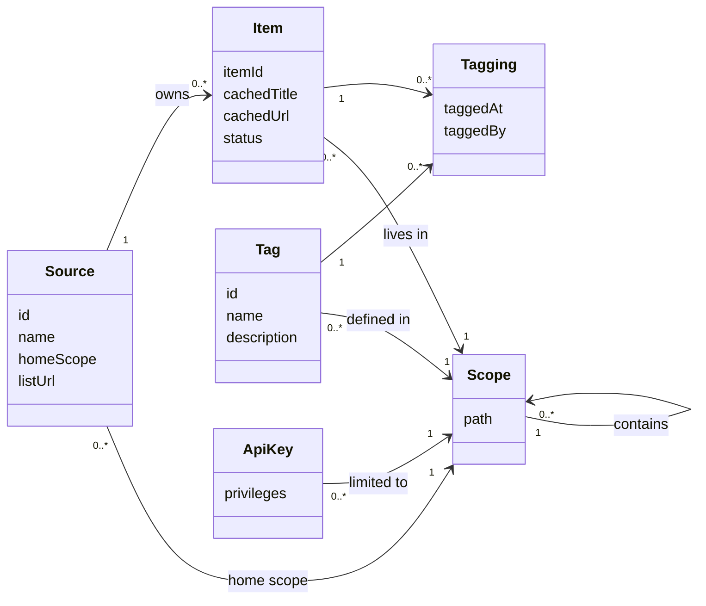

## In one sentence

A relationship says how two concepts connect and how many of each can take part, and you get it right by saying it as a plain sentence, reading it in both directions, and only then drawing it.

## Example: Shelf’s concepts, in sentences

The last lesson found six concepts: source, item, scope, tag, tagging and API key. Now connect them. Start with sentences, not boxes. For each pair, ask “how many of these can one of those have?”, then ask the same question the other way round.

| Plain sentence | Read the other way | Shape |
|---|---|---|
| A source owns any number of items. | Each item belongs to exactly one source. | One-to-many |
| A scope can hold any number of items. | Each item lives in exactly one scope. | One-to-many |
| A scope can define any number of tags. | Each tag is defined in exactly one scope. | One-to-many |
| A scope can be home to several sources. | Each source has exactly one home scope. | One-to-many |
| A scope can contain any number of smaller scopes. | Each scope except the root sits inside exactly one parent. | One-to-many (a tree) |
| An API key works in one scope. | A scope can have any number of keys. | One-to-many |
| An item can have any number of tags. | A tag can be on any number of items. | Many-to-many |

Reading both ways is where the decisions hide. “A source owns many items” is true, but it doesn’t say whether an item could belong to two sources. The second column does: exactly one. That’s why the recipe site’s item `1042` and the photo gallery’s item `1042` are two different items. (More on that in [Identity](/learn/domain-model/identity/).)

### Belongs-to: the side that can’t stand alone

Some “exactly one” ends are stronger than others. Compare an item’s source with an item’s scope.

- Recipe `1042` means something only as the recipe site’s item. It can’t exist without the recipe site, and it can never become the photo gallery’s item.
- A new quiz starts in `/learning`. If the quiz app later moves it into `/learning/maths`, it is still the same quiz.

Both are “exactly one”. But the item **belongs to** its source, while it merely **lives in** a scope. The difference matters later: when a relationship can change, somebody has to decide what happens when it does.

### The many-to-many becomes a thing

Items and tags are many-to-many. Recipe `1042` can be `vegetarian`, `quick-weeknight` and `favourite`, and `favourite` is on 900 things across all three apps. You can’t store that as one field on either side.

And the link itself has facts: *when* was this tag put on this item, and *by whom*? So the link becomes a concept of its own, the *tagging*: one tag on one item. A many-to-many is really two one-to-manys meeting in the middle. An item has many taggings, a tag has many taggings, and each tagging joins exactly one of each.

### Now draw it

Once the sentences are right, the drawing is quick. Here is Shelf’s domain model as a class diagram.

<Diagram
  title="Shelf's domain model"
  description="Six concepts. A scope contains any number of smaller scopes. Each source has exactly one home scope and owns any number of items. Each item lives in exactly one scope. Each tag is defined in exactly one scope. A tag has any number of taggings, and so does an item: each tagging joins one tag to one item. Each API key is limited to exactly one scope."
>

</Diagram>

Read it like this:

- **A box** is a concept (a *class*), with its main attributes listed inside.
- **A line** is a relationship. The label says what it means: “owns”, “defined in”.
- **The numbers at each end** say how many. `1` means exactly one. `0..*` means any number, including none. Each number sits next to the thing it counts: `Source "1" --> "0..*" Item` says one source, any number of items.

### What the lines can’t say

One of Shelf’s most important rules is missing from the diagram: *a tag can only go on items in its scope or below it*. `vegetarian`, defined in `/food`, can go on a recipe but not on a photo. No number on a line can say that, because it compares where two other lines point. Write rules like this in words, next to the diagram. A domain model is the diagram *plus* its rules.

## The general idea

A <Term id="relationship">relationship</Term> says how two kinds of thing are connected. Its <Term id="cardinality">cardinality</Term> says how many of each can take part. Three shapes cover almost everything you’ll meet:

- **<Term id="one-to-many">One-to-many</Term>.** One source, many items. Each item has exactly one source.
- **<Term id="belongs-to">Belongs-to</Term>.** The “one” end of a one-to-many, when the thing on the “many” side can’t exist without it and can’t move to another. An item belongs to its source.
- **<Term id="many-to-many">Many-to-many</Term>.** Many items, many tags, both ways round. Usually the link turns into a concept of its own, like the tagging.

One-to-one exists too, but it’s rare in a domain model. When two things are always exactly one-to-one, ask whether they are really one thing.

A <Term id="class-diagram">class diagram</Term> is the usual way to draw a domain model. Keep it to concepts, their main attributes and their relationships. Leave out database types, methods and anything about screens.

The method, every time:

1. Write each relationship as a plain sentence.
2. Read it the other way round, and decide the number at that end too.
3. Ask whether either side can exist alone (belongs-to), and whether the link has facts of its own (a many-to-many that becomes a concept).
4. Draw it.
5. Write down the rules the lines can’t show.

<Callout type="tradeoff" title="One scope per tag">
Shelf says each tag is defined in exactly one scope. So the recipe site and the photo gallery can’t share a `vegetarian` tag unless it lives in `/`, where it would also fit quizzes. The alternative, a tag that lives in several scopes, is another many-to-many. It’s more flexible, but every “does this tag fit this item?” check gets harder, and so does renaming. Shelf chose the simpler rule. If two apps need the same word, they get two tags, or one tag higher up the tree.
</Callout>

## Common mistakes

- **Reading in one direction only.** “A source has many items” leaves open whether an item can have two sources. Always decide both ends.
- **Hiding a many-to-many in a list.** A list of tag names on each item looks simple. But there is nowhere to record when each tag was added, and finding every item with a tag means reading every item.
- **Expecting the diagram to say everything.** Rules such as “a tag fits its scope or below” need words.

## Try it

<Quiz id="u3-cardinalities" />
