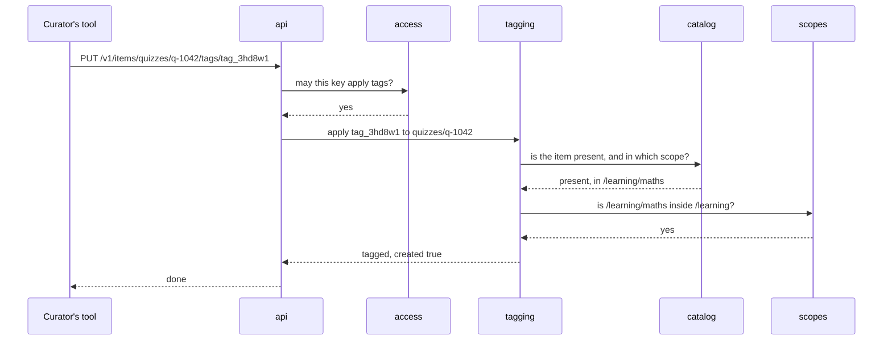

## In one sentence

Group the concepts into modules so that every piece of data has exactly one module in charge of it, and every other part of the system has to ask that module instead of reaching in.

## Example: three ways to mark an item missing

Picture Shelf’s first version, written in a hurry. Any function can read or write any table. An item gets marked missing in three places:

- the push handler, when an app sends a `delete`,
- the nightly pull, when an item is absent from a complete listing,
- a clean-up script the admin wrote one evening.

Each one runs its own `UPDATE items SET status = 'missing'`. Then a new rule arrives: *when an item goes missing, record the time in `missing_since`, so the retention job knows when 30 days are up.* The developer finds two of the three places and updates them. The script is forgotten.

Items marked missing by the script have no `missing_since`. The retention job never trashes them, and nobody notices for months. Nothing crashed. The rule lived in three places, and one of them was out of date.

Now give one part of the code sole charge of items:

```ts
// catalog: the only code that writes to the items table
catalog.upsert(sourceId, changes)       // applies pushed or pulled changes
catalog.markMissing(sourceId, itemIds)  // sets status and missing_since together
catalog.get(sourceId, itemId)           // status, scope, cached title and link
```

The push handler, the nightly pull and the script all call `catalog.markMissing`. The new rule is one change in one place, and nobody can skip it, because nothing else is allowed to touch the table.

### Shelf’s eight modules

Do the same for every concept and you get Shelf’s modules.

| Module | Owns | Asks |
|---|---|---|
| `scopes` | the scope tree, and the rule “is this scope inside that one?” | nobody |
| `access` | API keys and privileges; checks every request | `scopes` |
| `sources` | registered apps: home scopes, list URLs, schedules, source kinds | `scopes` |
| `catalog` | items: cached titles and links, status | `scopes`, `sources` |
| `tagging` | tags, tag aliases and taggings | `catalog`, `scopes` |
| `sync` | taking in pushes and running the nightly pull | `sources`, `catalog` |
| `api` | HTTP: turns each request into module calls | any of the above |
| `ops` | health checks, metrics, the audit log | read-only views of the others |

Follow one request through it. A curator’s tool asks Shelf to put `exam-prep` (defined in `/learning`) on the quiz `q-1042`.

<Diagram
  title="Putting a tag on an item"
  description="A curator's tool sends the request to api. api asks access whether the key may apply tags, and access says yes. api asks tagging to apply the tag. tagging asks catalog whether the item is present and which scope it is in; catalog answers present, in /learning/maths. tagging asks scopes whether /learning/maths is inside the tag's scope, /learning; scopes says yes. tagging stores the tagging and answers api, which answers the tool."
>

</Diagram>

Notice what `tagging` doesn’t do. It never reads the `items` table: it asks `catalog`. It never walks the scope tree: it asks `scopes`. Each answer comes from the one module that owns it. If `catalog` changes how it stores status tomorrow, `tagging` doesn’t notice.

## The general idea

A <Term id="module">module</Term> is a part of the system with one clear job and its own data. The line around it is its <Term id="boundary">boundary</Term>. Other parts cross that line only through the module’s <Term id="interface">interface</Term>: the few functions it chooses to offer. Everything behind them (its tables, its helper code) is private and can change freely.

How to draw the lines:

1. **Start from the data.** Give every concept, and so every table, exactly one owning module.
2. **Put each rule next to the data it protects.** “Record `missing_since` when an item goes missing” lives in `catalog`, because `catalog` owns items.
3. **Keep together what changes together.** Tag aliases exist only because tags get renamed, so they live in `tagging`, not in a module of their own. This is <Term id="cohesion">cohesion</Term>: everything in a module serves one job.
4. **Keep what others must know small.** `tagging` needs an item’s status and scope. It doesn’t need to know how `catalog` stores them. The less one module knows of another’s insides, the lower the <Term id="coupling">coupling</Term>, and the more freely each can change.

Some modules own work rather than concepts. `sync` owns taking in pushes and running the nightly pull, plus its record of how each pull went. `api` owns nothing but the translation from HTTP to module calls. That’s fine. A module is defined by its job, and it owns whatever data that job needs.

<Callout type="tradeoff" title="Modules, not services">
Shelf’s eight modules run in one program, on one server, against one database. The boundaries are folders and exported functions, not network calls. That suits one developer: no extra servers to run, and a change that spans two modules deploys at once. The cost is discipline. Nothing physically stops `sync` from writing to the `taggings` table, so you need a review habit, or a small test that fails when one module reaches into another’s internals. If Shelf ever needs separate services, clean modules are what make the split possible.
</Callout>

## Common mistakes

- **Grouping by technical layer.** Folders called `controllers`, `models` and `database` put every concept in all three. Every change touches every folder, and no single part owns anything.
- **Sharing a table between modules.** If two modules write to the same table, neither owns it, and its rules end up in both places, or in neither.
- **One module per concept, automatically.** A module for tag aliases alone would split one job in two, and each half would need to know the other’s details.

## Try it

<Sort id="u4-which-module" />
