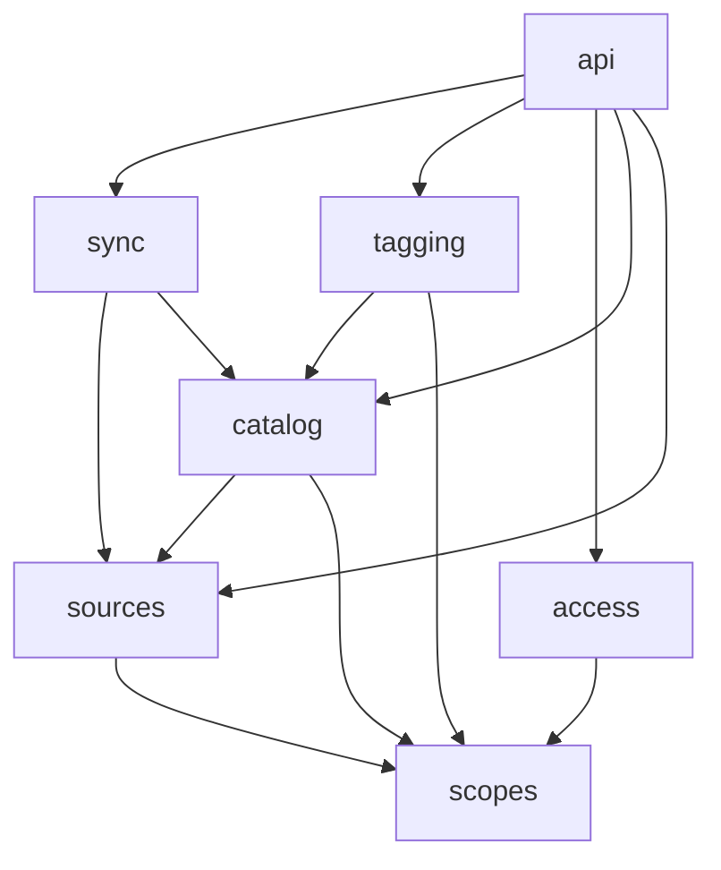

## In one sentence

Point every dependency one way, from the specific, fast-changing parts towards the general, stable ones, so the core of a system never has to change because something that uses it did.

## Example: “can Shelf filter by cooking time?”

The recipe site’s team asks a small favour: could lookups return only recipes that take under 30 minutes? It looks like a few lines in Shelf:

```ts
// catalog: a new cooking_minutes column, filled from the recipe site's pushes
if (sourceId === "recipes" && query.maxMinutes) {
  items = items.filter((item) => item.cookingMinutes <= query.maxMinutes);
}
```

A month later the quiz app wants “difficulty”. Then the gallery wants “camera model”. Each is a few more lines. Now look at what Shelf has become:

- It stores item content, which one of its constraints forbids.
- It changes whenever an app’s idea of a recipe or a quiz changes. Shelf’s one developer is now part of three other teams’ release plans.
- A bug in the photo code can break lookups for recipes, because it’s all in one module.
- The 20th app to plug in will need its own `if`.

The arrows have turned round. Shelf, which should be the stable thing everyone else uses, now depends on the details of everyone who uses it.

### The way it should point

Shelf offers general ideas (items, tags, scopes) and nothing app-specific. The recipe site can meet its need without Shelf changing at all:

- model “quick” as a tag, `quick-weeknight` in `/food`, and let curators apply it, or
- ask Shelf for the `vegetarian` recipes and filter them by cooking time itself, since it owns cooking times.

Either way, the recipe site depends on Shelf, and Shelf knows nothing about recipes.

### Calling isn’t always depending

Here’s a puzzle. Every night Shelf *calls* the recipe site’s list endpoint. Doesn’t that make Shelf depend on the recipe site?

Look at who wrote the rules. Shelf defines the list endpoint’s contract (pages of at most 500 items, `nextCursor` set to null on the last page), and each app implements it. Shelf depends on its own contract, not on anything about recipes. The call goes from Shelf to the app, but the knowledge points from the app to Shelf.

So when you ask which way a dependency points, don’t ask “who calls whom?”. Ask “if one of them changed, which one would have to change too?”

### Inside Shelf

The same rule holds between Shelf’s own modules. Dependencies point one way: from `api` at the top, through the modules that do the work, down to `scopes` at the bottom.

<Diagram
  title="Which Shelf modules depend on which"
  description="api, at the top, depends on sync, tagging, access, catalog and sources. sync depends on sources and catalog. tagging depends on catalog and scopes. catalog depends on sources and scopes. sources and access each depend on scopes. scopes, at the bottom, depends on nothing. Every arrow points downwards; none points back up."
>

</Diagram>

Read it from the bottom:

- **`scopes` knows nothing about any other module.** The answer to “is `/learning/maths` inside `/learning`?” stays true whatever else changes.
- **`api` is at the top.** Nothing depends on it, so renaming a URL or reshaping a JSON field touches no module below.
- **Every arrow points down.** None points back up. (`ops` sits off to the side and only reads.)

This matters because change travels *against* the arrows. Change `scopes`, and every module above it might be affected. Change `api`, and nothing else is. So the bottom should be small, general and rarely changed, and the top is where change is cheap.

### Breaking a loop

Here’s a real problem. When an item has been missing for 30 days, `catalog` trashes it, and its taggings must be removed in the same step. The obvious code has `catalog` call `tagging` to remove them.

But `tagging` already calls `catalog`, to check an item’s status and scope. Now each depends on the other: a <Term id="circular-dependency">circular dependency</Term>. Neither can be changed, tested or understood on its own.

The fix is to turn one arrow round. `catalog` offers a hook: “give me something to run when an item is trashed”. When Shelf starts, `tagging` hands it a function that removes the item’s taggings. When `catalog` trashes an item, it runs whatever it was given, inside the same transaction. `catalog` still knows nothing about tags, and the only arrow still points from `tagging` to `catalog`.

## The general idea

A <Term id="dependency">dependency</Term> means one part needs another to work. Usually, if A calls B, uses B’s types or relies on B’s rules, A depends on B. The exception is the one above: when A wrote the contract that B implements, B depends on A, even though A makes the call. You can’t avoid dependencies. What you choose is their direction.

The rule: **depend on things that are more stable than you are.** General ideas (a scope tree, a tag) change rarely. Specific details (a recipe’s cooking time, an HTTP field) change often. If the general part depends on the specific one, every change to the detail forces a change to the core. Point the arrows the other way and the core is left alone. That is low <Term id="coupling">coupling</Term> where it counts most.

Three checks for any design:

1. **Does the core mention any of its users?** Search Shelf’s code for “recipe”, “quiz” or “photo”. Outside test data, there should be none.
2. **Does every arrow point the same way?** Draw the <Term id="module">modules</Term> as boxes and the dependencies as arrows. If you can’t lay them out with every arrow pointing down, there’s a loop.
3. **Who would change if the other changed?** That tells you which way a dependency really points, whoever makes the call.

<Callout type="tip" title="Let the build check it">
A rule that lives only in people’s heads gets broken on a busy day. A short test that reads each module’s imports, and fails if `scopes` imports anything or if any module imports `api`, keeps the arrows pointing the right way long after everyone has forgotten this lesson.
</Callout>

## Common mistakes

- **Teaching the core about its users.** A cooking-time column, or an `if` on one app’s source id, is the first step towards a Shelf that must change with every app.
- **Confusing “calls” with “depends on”.** Shelf calls every app each night, but it depends only on the contract it wrote.
- **Allowing one small loop.** Two modules that call each other stop being two modules. Break the loop with a hook, or move the shared part down into a module both can depend on.

## Try it

<Quiz id="u4-dependency-direction" />
