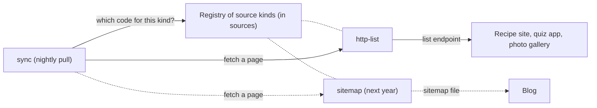

## In one sentence

A plug-in point lets new behaviour be added to a module without changing it: `sync` pulls through whatever source kind a registry hands it, so a new kind of source needs a new plug-in, not a new `sync`.

## Example: the blog that can’t build a list endpoint

Today all three apps are pulled the same way. Each one serves Shelf’s list endpoint: pages of up to 500 items, with a `nextCursor` until the last page. Shelf calls this kind of source `http-list`.

Next year a blog wants to plug in. Its team is small and can’t build a list endpoint. But the blog already publishes a sitemap-style file listing every post, with its title, link and when it last changed. That’s enough for a nightly pull. How does `sync` learn to read it?

### Without a plug-in point

The quick way is an `if` in `sync`:

```ts
if (source.kind === "sitemap") {
  // fetch the file, parse it, turn each entry into an item
} else {
  // page through the list endpoint
}
```

It works. But `sync` is the module that guards Shelf’s most important rule (only a complete listing may mark items missing), and now it is being edited to add file parsing. Every new kind means another edit, another branch and another chance to break the kinds that already work. With up to 20 sources in two years, `sync` turns into a list of special cases.

### With a plug-in point

Instead, the `sources` module says once what any source kind must be able to do, and nothing more:

```ts
// sources: the interface every source kind implements
interface SourceKind {
  name: string; // "http-list", "sitemap", ...
  // Return one page. Throw if the page can't be fetched.
  // nextCursor is null only when the listing is complete.
  fetchPage(source: Source, cursor: string | null): Promise<{
    items: { id: string; title: string; url?: string; scope?: string; updatedAt: string }[];
    nextCursor: string | null;
  }>;
}
```

Each kind is a small piece of code that implements it. `http-list` calls the list endpoint. `sitemap` fetches the file and hands it back in pages. Each registers itself in a registry, a lookup table from a kind’s name to its code, which `sources` keeps:

```ts
sourceKinds.register(httpList);
sourceKinds.register(sitemap); // added next year; sync doesn't change
```

Every registered source records its kind. When the nightly pull reaches a source, `sync` asks for the matching code and uses it:

```ts
const kind = sourceKinds.get(source.kind);
const page = await kind.fetchPage(source, cursor);
```

`sync` never learns what a sitemap is.

<Diagram
  title="The source kind registry"
  description="The nightly pull in sync asks the registry of source kinds which code handles a source's kind. The registry holds http-list today and, next year, sitemap. sync then asks that code to fetch a page. http-list calls the list endpoint of the recipe site, the quiz app and the photo gallery. The sitemap kind reads the blog's file."
>

</Diagram>

### What stays in sync, and what goes in the plug-in

The split matters more than the mechanism. Everything that protects tags stays in `sync`, the same for every kind:

- paging until `nextCursor` is null,
- retrying a failed page 3 times (after 2, 4 and 8 s), then giving up for the night,
- marking nothing missing unless the listing finished,
- holding the run and alerting the admin if a complete listing would mark more than 20% of a source’s items missing,
- handing each item to `catalog`, which applies the `updatedAt` rule.

The plug-in does one thing: fetch the next page and translate it into Shelf’s shape. It never decides what counts as missing, because it never sees the result. So a badly written sitemap kind can make a pull fail, but it can’t wrongly remove a tag, as long as it keeps one promise: `nextCursor` is null only when it really reached the end.

<Callout type="warning" title="The plug-in still has to meet the contract">
A sitemap lists links, and links make poor ids (see [Identity](/learn/domain-model/identity/)). A renamed post would look like a new item, and the old one would go missing. The sitemap kind is only safe if the blog includes a stable id for each post. A plug-in point makes new sources cheap; it doesn’t lower the bar they must meet.
</Callout>

Registering a source is still one form, as the admin’s user story asks: name, home scope, list URL, and a kind picked from what the registry offers. For a kind that already exists, a new app needs no code changes at all. A brand-new kind needs one new plug-in, and still no change to `sync`.

## The general idea

A <Term id="plug-in-point">plug-in point</Term> is a place where new behaviour can be added to a module from outside, without the module knowing the details. It has three parts:

1. **An <Term id="interface">interface</Term>** that says what every plug-in must do and what it must promise. For source kinds: fetch a page, and make `nextCursor` null only at the real end.
2. **A <Term id="registry">registry</Term>**: a list the module looks things up in while it runs. New entries can be added without changing the code that looks them up.
3. **Plug-ins** that implement the interface and register themselves. Many are an <Term id="adapter">adapter</Term>: code that translates something outside the system (a list endpoint, a sitemap) into the shape the module expects.

The module keeps its rules; the plug-ins supply the variety. Notice which way the dependencies point, too. Each plug-in depends on the interface in `sources`. `sync` depends on `sources`. Nothing in Shelf’s core depends on any particular plug-in.

You met a smaller plug-in point in [Which way dependencies point](/learn/boundaries/which-way-dependencies-point/): the “item trashed” hook that `catalog` offers and `tagging` plugs into.

<Callout type="tradeoff" title="Is one kind enough to need a registry?">
Today Shelf has exactly one source kind. A plug-in point has a cost: an interface to design and keep stable, and one more step when reading the code (“which `fetchPage` runs here?”). A common rule is to wait until you have two real cases. Shelf makes an exception because a second case is likely (up to 20 sources in two years, built by other teams, and some won’t build a list endpoint) and the cost is small: one interface and one lookup table. If the second kind never comes, the price was a few dozen lines.
</Callout>

## Common mistakes

- **Letting a plug-in make the module’s decisions.** If a source kind decided which items were missing, one careless plug-in could wipe a source’s tags. Keep the rules in the module; plug-ins only translate.
- **Keying the registry by app.** A registry with entries for `recipes`, `quizzes` and `photos` is the `if` on source ids in disguise. Key it by kind; each app is a row of configuration that names its kind.
- **Building the plug-in point with nothing to plug in.** An interface guessed from one example usually fits the second one badly. Wait until a second case is real, or very likely.

## Try it

<Quiz id="u4-spot-the-violation" />
