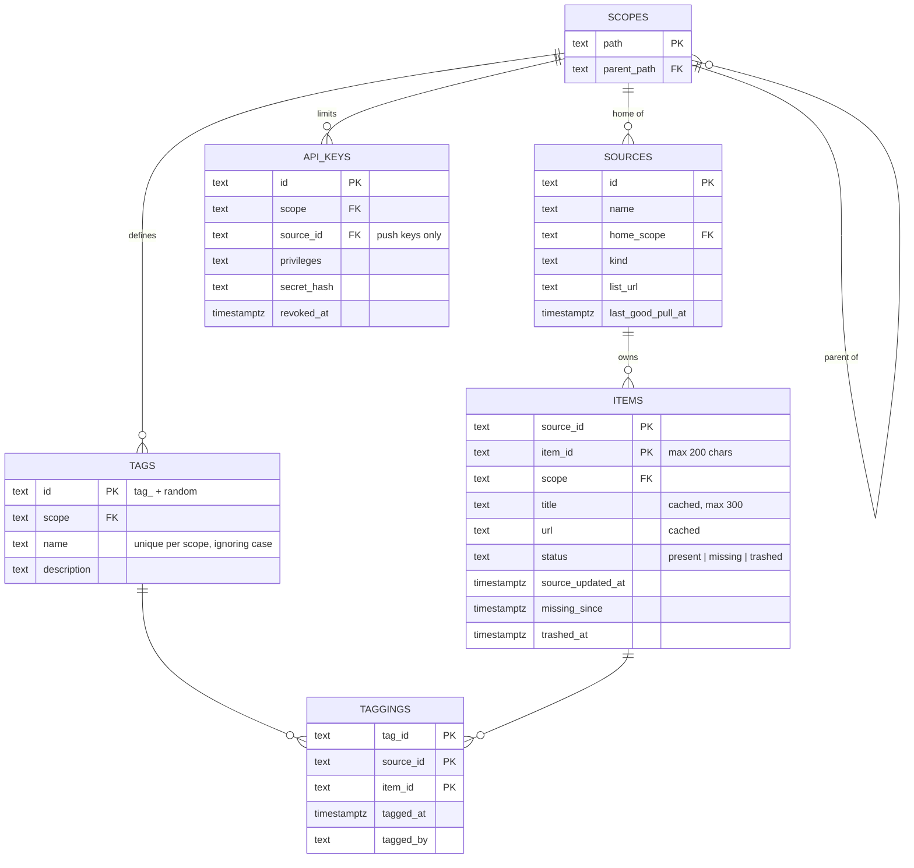

## In one sentence

Each concept becomes a table, its identity becomes the table’s primary key, each relationship becomes a foreign key, and each rule that fits becomes a constraint the database enforces for you.

## Example: Shelf’s concepts, one at a time

The domain model from [Relationships](/learn/domain-model/relationships/) has six concepts. Take them one at a time and ask three questions. What identifies one row? What does it point at? Which rules must always hold?

**Scope becomes `scopes`.** A scope is identified by its path, so the path is the key: `/learning/maths`. Each scope points at its parent, `/learning`; the root has none. That one column, `parent_path`, is enough to store the whole tree.

**Source becomes `sources`.** Identified by its id, `recipes`. It points at its home scope. It also stores its name, its kind (`http-list`), its list URL, and when it was last pulled successfully.

**Item becomes `items`.** Identified by the pair `source_id` + `item_id`. The pair is the key, not either half. `source_id` points at `sources`, and `scope` points at `scopes`. The rest is the cached title and link, the status, and three timestamps you’ll meet in the next two lessons.

**Tag becomes `tags`.** Identified by Shelf’s own id, `tag_7kq2m9`. It points at the scope it’s defined in. The name is an ordinary column with a rule attached: unique within its scope, ignoring case.

**Tagging becomes `taggings`.** The many-to-many becomes a table of its own, one row per link. Its key is all three columns together: `tag_id` + `source_id` + `item_id`. It points at one tag and at one item, and it records when the tagging was made and by whom.

**API key becomes `api_keys`.** Identified by its own id. It points at its scope and, for push keys, at the one source it may push for. It stores a hash of the secret, never the secret itself.

<Diagram
  title="Shelf's main tables"
  description="Six tables. Each scope is the parent of any number of scopes, the home of any number of sources, and defines any number of tags; it also limits any number of API keys. Each source owns any number of items. Taggings sit between tags and items: each tag has any number of taggings, each item has any number of taggings, and each tagging points at exactly one tag and one item. Items are keyed by source_id plus item_id; taggings by tag_id plus source_id plus item_id."
>

</Diagram>

### Rules the database can keep

Some of Shelf’s rules can be checked by looking at one row, or at one table. Give those to the database, so they hold even when the code has a bug, or when someone runs a script at midnight.

| Rule | How the database keeps it |
|---|---|
| No two items share a key. | Primary key on `(source_id, item_id)` |
| Tagging an item twice leaves one tag. | Primary key on `(tag_id, source_id, item_id)`. The second insert finds the row already there, and Shelf answers `created: false`. |
| A tagging can’t point at an item that doesn’t exist. | Foreign key from `taggings` to `items` |
| An item id is at most 200 characters. | A check on the length of `item_id` |
| Status is present, missing or trashed. | A check listing the three values |
| Tag names are unique in a scope, ignoring case. | A unique index on the scope and the lower-case name |
| A tag name is at most 50 characters. | A check on the length of `name` |

<Callout type="shelf" title="A foreign key that says no">
The foreign key from `taggings` to `items` deliberately doesn’t cascade. If any code ever tries to delete an item row that still has tags, the database refuses. Shelf’s first priority is never to lose a tag wrongly, so that refusal is a feature: the retention job must remove the taggings on purpose first.
</Callout>

### A rule the database can’t keep easily

“A tag can go on items in its scope or below it.” To check it you need the tag’s scope, the item’s scope and the tree between them: three tables at once. An ordinary constraint can’t do that. So `tagging` checks it in code, asking `scopes` whether the item’s scope is inside the tag’s, and answers `tag_out_of_scope` if not. Write down which rules live where, so nobody assumes the database has one covered when it doesn’t.

### Tables the domain model didn’t mention

A few tables exist for the contracts and for running Shelf, not for the domain. `tag_aliases` keeps a renamed tag’s old name working for 30 days. `pull_runs` has one row per nightly pull and how it went. `idempotency_keys` remembers recent pushes for 24 hours. `audit_log` records changes such as removed tags. Expect this: the domain model says what Shelf is about, and the data model also has to hold what Shelf needs to run.

## The general idea

A <Term id="data-model">data model</Term> is how the data is stored. In a relational database like Postgres, that means <Term id="table">tables</Term>, their columns, and the rules that keep them correct. From a domain model, the steps are mechanical:

1. **Each concept becomes a table**, and each attribute a column.
2. **Its identity becomes the <Term id="primary-key">primary key</Term>.** A <Term id="composite-key">composite key</Term> becomes a primary key over several columns.
3. **Each “exactly one” end becomes a <Term id="foreign-key">foreign key</Term>** on the “many” side: `items.source_id` points at `sources.id`.
4. **Each many-to-many becomes a <Term id="join-table">join table</Term>**, with a foreign key to each side and both keys together as its primary key.
5. **Each rule that fits becomes a <Term id="db-constraint">database constraint</Term>**: not empty, unique, a check, a foreign key.

An <Term id="er-diagram">ER diagram</Term> (short for entity-relationship) draws the result. `||--o{` reads “exactly one to zero or more”: the two bars mean one, and the circle with the crow’s foot means any number, including none.

<GoDeeper title="Keys, indexes and the two lookups">
A primary key comes with an <Term id="index">index</Term>. On `taggings`, the key starts with `tag_id`, so “every item with this tag” (Shelf’s main lookup) is fast. “Every tag on this item” needs a second index on `(source_id, item_id)`; without it, the database reads all 300,000 rows to answer. Column order in a composite key isn’t cosmetic: put first the column you search by most often.
</GoDeeper>

## Common mistakes

- **Keeping every rule in code.** Code has bugs, and scripts skip it. If a rule fits in a constraint, put it there as well.
- **A surrogate id with no unique rule.** Giving `taggings` its own `id` column, and nothing else, lets the same tag go on the same item twice. If you add a surrogate, keep a unique constraint on the natural key.
- **A list in a column.** A column holding `vegetarian,quick-weeknight` can’t have a foreign key, can’t be indexed well, and can’t record when each tag was added.

## Try it

<DiagramExercise id="u5-tag-aliases-table" />
