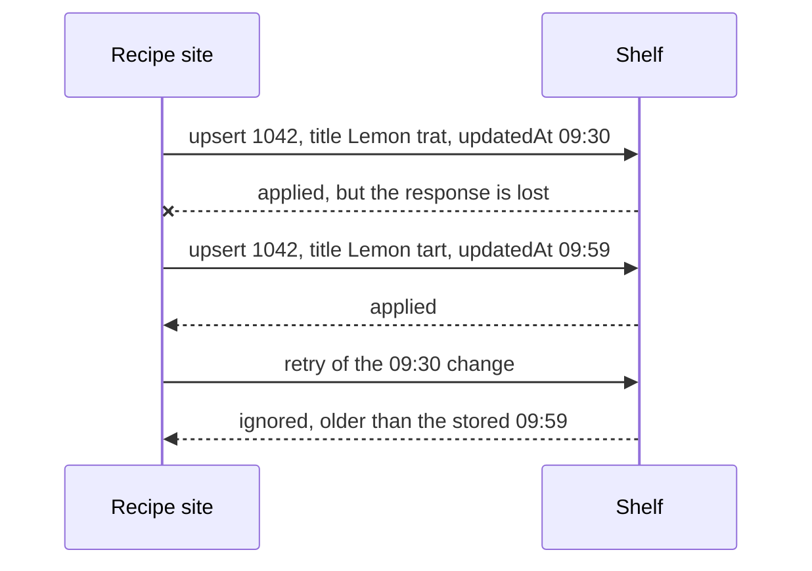

## In one sentence

Some columns in Shelf’s `items` table are Shelf’s own facts and some are copies of the app’s; the copies change only through pushes and the nightly pull, the newest version by the app’s `updatedAt` wins, and nobody edits them in Shelf.

## Example: one row, two kinds of column

Here is the row for recipe `1042` in Shelf’s `items` table.

| Column | Value | Whose truth? |
|---|---|---|
| `source_id` | `recipes` | Part of the key |
| `item_id` | `1042` | Part of the key |
| `title` | Lemon tart | **Copy** of the recipe site’s |
| `url` | `https://recipes.example/r/1042` | **Copy** |
| `scope` | `/food` | **Copy** |
| `source_updated_at` | 14 March, 09:59 | **Copy**: when the app last changed the recipe |
| `status` | `present` | **Shelf’s own** |
| `missing_since` | (empty) | **Shelf’s own** |
| `trashed_at` | (empty) | **Shelf’s own** |

The copies describe the recipe. Shelf didn’t decide any of them and may not change them. The owned columns record what Shelf has seen and decided: whether the item is present, and when it went missing or was trashed.

### Why keep copies at all

A lookup for `vegetarian` returns titles and links, so an app can show a list straight away. If Shelf stored only keys, every lookup would have to ask the recipe site for up to 100 titles. Lookups would be as slow as the slowest app, and down whenever any app was down. Shelf promises 95% of lookups within 200 ms and 99.9% availability, and it can’t promise that on top of three apps it doesn’t run.

So it keeps small copies: the title and link it shows, and the scope it needs for its own rules. Keeping the same fact in two places has a name: <Term id="denormalisation">denormalisation</Term>. It buys speed and independence, and it costs you the work of keeping the copies in step.

### Two ways in

The copies are refreshed along two paths, and nothing else writes to them:

1. **Push.** When the recipe site changes a recipe, it sends an `upsert` with the new title, link, scope and `updatedAt`. Shelf applies it, and 95% of batches show in lookups within 5 s.
2. **Pull.** Every night at 02:00 Shelf reads each app’s full list. Each listed item goes through the same rule as a pushed `upsert`. Anything a push missed is repaired within 24 hours.

### The newest change wins, not the last to arrive

Two paths, retries and slow networks mean changes can arrive out of order. Here’s how that goes wrong.

<Diagram
  title="A late change arrives"
  description="At 09:30 the recipe site pushes recipe 1042 with the title Lemon trat. Shelf applies it, but the response is lost, so the recipe site will retry. At 09:59 an editor fixes the typo and the recipe site pushes Lemon tart; Shelf applies it. At 10:01 the retry of the 09:30 change arrives. Because 09:30 is older than the stored 09:59, Shelf ignores it and the title stays Lemon tart."
>

</Diagram>

Without a rule, the retry would put the typo back. So Shelf has one: **a change older than the `updatedAt` Shelf has stored is ignored**, and Shelf reports it as `ignored: true`. Order is decided by when the change happened at the owner, not by when it reached Shelf. The same rule covers the nightly pull: if a listing carries an older version than a push already delivered, the pushed version stays.

Why the app’s clock and not Shelf’s? Because it’s the owner’s time that orders the owner’s changes. And Shelf only ever compares two timestamps for the same item from the same app, so it doesn’t matter if the recipe site’s clock is a minute off from the quiz app’s.

(An `Idempotency-Key` on the retry would also have caught this exact case. The `updatedAt` rule catches every late change, however it came to be late.)

### Never edited in Shelf

There is no endpoint that changes a title, and Shelf’s admin screens show titles read-only. If an admin could edit one, the next push or pull would overwrite it without a word, and the recipe site’s own users would never see the fix. A wrong title is fixed at the source; the copy follows.

## The general idea

In a table that holds data from another system, label every column as one of two kinds:

- **Owned columns** are this system’s <Term id="source-of-truth">source of truth</Term>. Shelf writes them from its own observations and decisions: `status`, `missing_since`, `trashed_at`.
- **Cached columns** are a <Term id="cache">cache</Term> of someone else’s truth: `title`, `url`, `scope`, `source_updated_at`.

For every cached column, the design should say:

1. **Who owns the truth.** For Shelf’s items, the app.
2. **How it gets in.** Only through the refresh paths (push and pull), and only through the module that owns the table (`catalog`).
3. **How stale it may be.** Shelf’s <Term id="freshness">freshness</Term> targets: within 5 s after a push, within 24 hours without one.
4. **How updates are ordered.** By a version or timestamp from the owner, never by arrival time. That is an <Term id="ordering">ordering guarantee</Term>.
5. **That nobody edits it.** A cached column has exactly one way in.

<GoDeeper title="Why not a cache that expires?">
Many caches expire: keep a copy for 30 seconds, then fetch it again. Shelf does that for tag lookups. Titles work differently: Shelf never asks for a single title. The apps tell it (push), and it checks everything once a night (pull). An expiring cache suits data you can fetch cheaply at the moment someone asks. A copy kept up to date by its owner suits data you can’t, or shouldn’t, fetch while someone waits.
</GoDeeper>

## Common mistakes

- **Editing a copy.** It will be overwritten, and until then there are two truths.
- **Letting the last arrival win.** Retries, slow networks and a nightly pull mean arrival order isn’t change order. Compare the owner’s timestamps.
- **Unlabelled copies.** If nobody can tell which columns are cached, someone will one day build a feature that edits one. Say so in the schema: Shelf’s data model marks `title` and `url` as cached.

## Try it

<Quiz id="u5-keeping-copies-fresh" />
