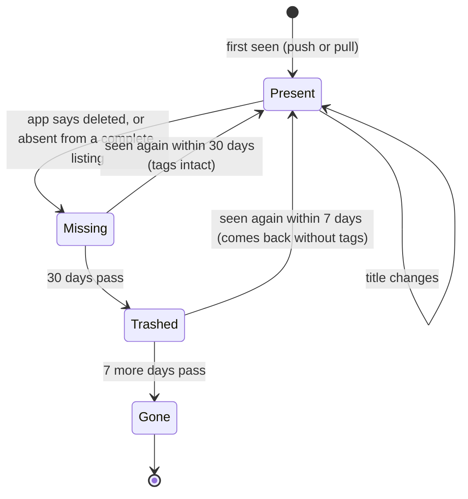

## In one sentence

Shelf never deletes an item at once: it marks it missing, removes its tags only after 30 days, deletes the row 7 days after that, and leaves the timing to an hourly job that is safe to run twice.

## Example: the recipe deleted by mistake

On 1 March an editor on the recipe site deletes recipe `1042`, “Lemon tart”, by mistake. It has five tags. The recipe site pushes a `delete`. Here is what Shelf does, and what it doesn’t.

**1 March: missing.** Shelf sets the status to `missing` and `missing_since` to 1 March. The recipe disappears from lookups (an app can still ask for it with `include=missing`). Its five taggings aren’t touched. A delete never removes tags directly.

**10 March: back again.** The editor notices and restores the recipe. The recipe site pushes an `upsert`. Shelf sets the status back to `present` and clears `missing_since`. All five tags are still there, and nobody had to do anything else.

That’s the case the whole design exists for. Now suppose the recipe really was meant to go.

**31 March: trashed.** After 30 days missing, the retention job moves the item to `trashed`: it removes the five taggings, records each one in the audit log, and sets `trashed_at`. The row stays, so an admin can still see what went, and when.

**7 April: gone.** After 7 more days, the retention job deletes the row. If the recipe site ever lists `1042` again, it is a brand-new item with no history. (One more reason why ids are never reused.)

And one more case. If the recipe had come back on 3 April, while trashed, it would be present again, but **without** its tags: they were removed on 31 March. The audit log shows which ones they were, so a curator could put them back by hand.

<Diagram
  title="An item's life"
  description="An item starts present when first seen by a push or a pull. A title change leaves it present. If the app says it was deleted, or it is absent from a complete listing, it becomes missing. A missing item seen again within 30 days is present again with its tags intact. After 30 days missing it is trashed. A trashed item seen again within 7 days comes back present, without tags. After 7 more days it is gone and its row is deleted."
>

</Diagram>

| State | In lookups? | Tags | Row | Leaves when… |
|---|---|---|---|---|
| Present | Yes | Kept | Kept | the app deletes it, or it’s absent from a complete listing |
| Missing | Only with `include=missing` | Kept | Kept | it’s seen again, or 30 days pass |
| Trashed | No | Removed, and recorded in the audit log | Kept | it’s seen again (without tags), or 7 more days pass |
| Gone | No | None | Deleted | never: if it’s listed again, it’s a new item |

### Going missing is cautious too

Only two things make an item missing: the app pushes a `delete`, or the item is absent from a **complete** nightly listing. If any page of the listing failed, nothing is marked missing. And if a complete listing would mark more than 20% of a source’s items missing, Shelf holds the run and alerts the admin instead.

### The retention job

Nobody moves items to trashed or gone by hand. A job runs every hour and does two things:

```sql
-- 1. Missing for 30 days: trash. In batches of 1,000, each in one transaction
--    that also removes the items' taggings and writes the audit log.
UPDATE items SET status = 'trashed', trashed_at = now()
WHERE status = 'missing' AND missing_since <= now() - interval '30 days';

-- 2. Trashed for 7 days: delete the row.
DELETE FROM items
WHERE status = 'trashed' AND trashed_at <= now() - interval '7 days';
```

Each step describes what should be true, not what to do next: “trash every item that has been missing for at least 30 days”. Run it once and those items are trashed. Run it again a minute later and it finds nothing to do, because they are no longer missing. That is what “safe to run twice” means.

<Compare>
<Side title="Safe to run twice" tone="good">
Store *when* the item went missing (`missing_since`). Each run trashes items whose date is 30 or more days ago. Running twice, or skipping a run, gives the same result.
</Side>
<Side title="Not safe" tone="bad">
Store a countdown (`days_left`, starting at 30) and have a nightly job subtract one. Run the job twice and every item ages 2 days. Skip a night and every item gets an extra day.
</Side>
</Compare>

The batches help too. Each batch is one <Term id="transaction">transaction</Term>: the status, the taggings and the audit log change together or not at all. If the job crashes halfway, finished batches stay finished, and the next run picks up the rest.

## The general idea

A <Term id="soft-delete">soft delete</Term> marks a row as deleted, with a status or a date, instead of removing it. It turns deletion from one step that can’t be undone into a series of <Term id="state">states</Term>, each with a way back. <Term id="retention">Retention</Term> is the rule for how long each stage lasts and when the data finally goes.

Soft deletes earn their cost when:

- deletions are sometimes mistakes, or happen without anyone meaning them (a bug, a broken listing);
- what hangs off the deleted thing is valuable (Shelf’s tags are its most important data);
- someone will need to see afterwards what went, which is the job of an <Term id="audit-log">audit log</Term>.

They also have costs:

- **Every read must filter.** Lookups must skip missing items. Put that filter in one place, the `catalog` module, so no query forgets it.
- **Rows pile up** unless something removes them. That’s the retention job’s second step.
- **The timing needs a job**, and jobs fail, overlap and run twice. Write each step as a condition on the stored state, so running it again is harmless. That is <Term id="idempotency">idempotency</Term>, applied to a job.

<Callout type="tradeoff" title="Why 30 days, and then 7 more?">
A longer grace period would protect tags against mistakes that take longer to notice, but missing items would linger, hidden from lookups yet still holding tags. A shorter one would tidy up faster, but a mistake made the day before someone’s fortnight off could cost its tags. A 30-day grace period gives people a month to notice. The extra week as trashed costs a few rows and lets an admin answer “what happened to that recipe?” after the tags are gone.
</Callout>

## Common mistakes

- **Deleting at once.** One mistaken delete, or one buggy listing, and the tags are gone for good.
- **Soft deletes with no retention.** Without a rule for removing rows, “deleted” data lives for ever, and every query has to step around it.
- **A clean-up job that counts.** Countdowns and “next step” flags go wrong when a job runs twice or not at all. Store dates and states, and let each run work out what should be true now.

## Try it

<Sort id="u5-what-state-now" />
