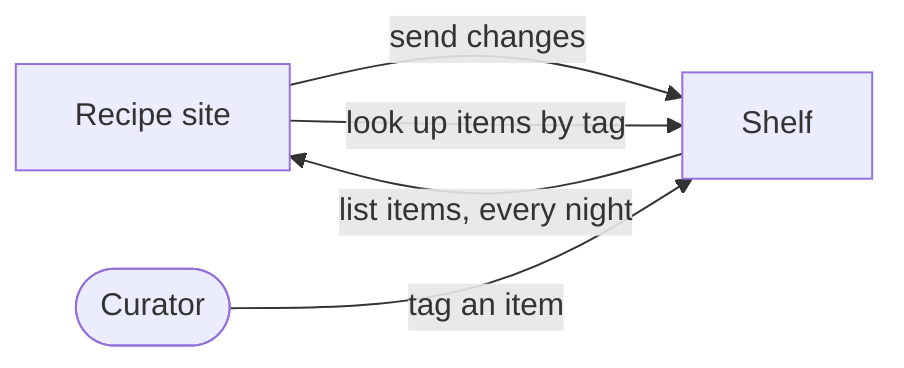

## In one sentence

A contract is a promise between two parts of a system: what one side may send, what the other side will answer, and how both behave when something goes wrong.

## Example: the quiz app wants to tag a quiz

The quiz app’s team wants a “Tag this quiz” button. Their code has to talk to Shelf, but they didn’t write Shelf and they can’t read its code. What do they need to know?

- **Where to send the request, and what to put in it.** A `PUT` to the item’s tag path, with their key. No body.
- **What comes back when it works.** The ids, `created: true` (or `false` if the quiz already had that tag) and when it was tagged.
- **What comes back when it doesn’t.** For example, `422 tag_out_of_scope` if someone tries to put `algebra` on a history quiz.
- **How it behaves.** Tagging twice leaves one tag, so it’s safe to try again after a timeout. The tag shows in lookups as soon as the answer arrives.

```http
PUT /v1/items/quizzes/q-311/tags/tag_7kq2m9
Authorization: Bearer <the quiz app's key>

200 OK
{ "tagId": "tag_7kq2m9", "sourceId": "quizzes", "itemId": "q-311",
  "created": true, "taggedAt": "2026-03-14T09:30:00Z" }
```

That list is everything the quiz app may rely on, and everything Shelf must keep true. Shelf can rewrite its code, change its tables or move to a new server. As long as the list stays true, the quiz app never notices.

### Contracts are everywhere

This isn’t only about web APIs. Whenever one piece of code relies on another behaving a certain way, there’s a promise between them, written down or not.

| Kind | Who offers it | Who relies on it | A Shelf example |
|---|---|---|---|
| HTTP API | a service | the programs that call it | Send changes: `POST /v1/sources/{sourceId}/changes` takes up to 500 changes and answers with one result per change. |
| Function signature | a module | the code that calls it | The `scopes` module’s `contains(outer, inner)`: give it two scope paths, get back true or false. |
| Shared type | whoever publishes it | all the code that uses it | A `ScopePath` type: text that starts with `/`, such as `/learning/maths`. |
| Config file | the program that reads it | the person who writes it | Shelf’s settings file has a line `pull_page_timeout: 10`. The program promises what it means (10 seconds, not milliseconds) and what happens if the line is missing. |
| Event | the part that sends it | every part that listens | If the `catalog` module announced “item trashed” as a message, the `tagging` module would rely on its fields to remove the right tags. |

Some of these are checked for you. The compiler complains if you call `contains` with a number. Nothing checks that an app sends the right JSON, unless someone writes the contract down and builds the check.

### Shelf’s contracts at a glance

| Contract | Who answers | Who calls |
|---|---|---|
| **Send changes** (push): `POST /v1/sources/{sourceId}/changes` | Shelf | each app, when its items change |
| **List items** (pull): `GET {listUrl}` | each app | Shelf, every night |
| **Tag an item**: `PUT /v1/items/{sourceId}/{itemId}/tags/{tagId}` | Shelf | an app, or a curator in the admin screens |
| **Look up items by tag**: `GET /v1/tags/{tagId}/items` | Shelf | each app |

Look at the second row. The arrow points the other way: Shelf calls the apps. The next lesson shows why that one is unusual, and who gets to write it.

<Diagram
  title="Who calls whom in Shelf's contracts"
  description="Arrows point from the side that calls to the side that answers. The recipe site calls Shelf to send changes and to look up items by tag. A curator calls Shelf to tag an item. Every night Shelf calls the recipe site to list its items, so on that contract the arrow points the other way."
>

</Diagram>

## The general idea

A <Term id="contract">contract</Term> is a promise between two parts of a system. One side, the <Term id="provider">provider</Term>, offers something: it answers requests, reads a file or sends messages. The other side, the <Term id="consumer">consumer</Term>, uses it. An <Term id="api">API</Term> is the most familiar kind, but a function signature, a shared type, a config file and an <Term id="event">event</Term> are contracts too.

Every contract has two halves:

- **What the consumer may rely on.** Anything written in the contract, the provider must keep true.
- **What the consumer must not rely on.** Anything left out, the provider may change at any time.

The second half matters as much as the first. Shelf’s tag ids happen to start with `tag_`. The contract doesn’t promise that, so no app should depend on it. If the photo gallery checks that a tag id starts with `tag_`, that’s the gallery’s bug, not Shelf’s.

A contract describes what each side can see from the outside, not how it’s built. That is what lets both sides change their insides freely.

**What a full contract says.** The rest of this unit builds one, a step at a time:

1. [Sides and ownership](/learn/contracts/sides-and-ownership/): who provides, who consumes, who owns each piece of data.
2. [Nouns and identity](/learn/contracts/nouns-and-identity/): the things it talks about, their keys and limits.
3. [Operations](/learn/contracts/operations/): inputs, outputs, and what is true before and after.
4. [Errors](/learn/contracts/errors-are-part-of-the-contract/): every way it can fail, and what the caller sees.
5. [Behavioural guarantees](/learn/contracts/behavioural-guarantees/): retries, ordering, freshness, paging, limits, timeouts.
6. [Who may call it](/learn/contracts/who-may-call-it/): keys, privileges and scopes.
7. [Changing it safely](/learn/contracts/changing-a-contract-safely/): what you may add, and what you must never remove.
8. [Writing it down for machines](/learn/contracts/write-it-down-for-machines/): so a program can check it.

<Callout type="note" title="Unwritten contracts still exist">
If nobody writes a contract down, the real contract becomes whatever the code happens to do today, and consumers start to rely on all of it: the order of fields, the speed, the wording of messages. Writing it down is how you decide which of those you are promising.
</Callout>

## Common mistakes

- **Thinking only HTTP APIs have contracts.** A config file where `timeout: 10` could mean seconds or milliseconds is a contract nobody finished writing.
- **Describing only the happy path.** A contract that says what a successful call returns, but not how it fails, leaves every consumer to guess.
- **Leaking the inside.** When a contract mentions table names, module names or how ids are made, consumers start to depend on them, and you can no longer change them freely.

## Try it

<Sort id="u6-a-in-the-contract" />
