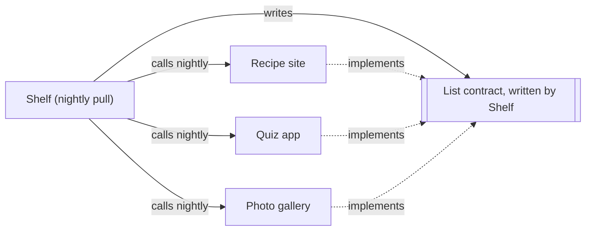

## In one sentence

Before you design a single field, decide who provides, who consumes, who writes the contract down and who owns each piece of data in it, because most bad contracts go wrong right here.

## Example: two contracts, pointing opposite ways

Take two of Shelf’s contracts and ask the same four questions of each.

| Question | Send changes (push) | List items (pull) |
|---|---|---|
| Who answers the request? | Shelf | each app, at its registered list URL |
| Who makes the request? | each app, when its items change | Shelf, every night at 02:00 |
| Who writes the contract? | Shelf | **Shelf** |
| Who owns the item data in it? | the app | the app |

The first column is what you’d expect. Shelf offers an API, apps call it, and Shelf writes down what the API accepts and returns. The side that answers writes the contract, and the callers adapt.

The second column has a twist. Each app answers the list request, but Shelf, the side that calls, decides what it must look like. The recipe site, the quiz app and the photo gallery each build the same endpoint, to a contract written by Shelf.

### Why the caller writes this one

Imagine it the other way round, with each app designing its own list endpoint:

- The recipe site returns `{ "recipes": [...], "page": 2 }`, with page numbers.
- The quiz app returns a plain array, and puts the next page’s address in a header.
- The photo gallery returns all 45,000 photos in one response.

Shelf would need three different pieces of code to read them, and one more for each of the 20 apps it may have in two years. Worse, it would have three different ideas of what “that was the last page” means. And Shelf’s most dangerous rule depends on exactly that: after a **complete** listing, any item that didn’t appear is marked missing.

So Shelf writes one contract. It says what a page looks like, that a page holds at most 500 items, that `nextCursor: null` means the listing is complete, that each page must arrive within 10 s, and what Shelf does when a page fails. Every app builds to it, and Shelf’s pull code reads every app the same way.

<Diagram
  title="The list contract: Shelf writes it, the apps build it"
  description="Shelf writes the list contract. The recipe site, the quiz app and the photo gallery each implement it, shown by dotted arrows to the contract. Solid arrows show that every night Shelf calls each app's list endpoint, so Shelf is the consumer even though it wrote the contract."
>

</Diagram>

### Ownership inside the contract

Sides are only half of it. The contract also has to say who owns each piece of data and each decision, because that tells both sides who is right when they disagree. Here is the list contract:

| Thing | Owner | What the contract says |
|---|---|---|
| An item’s id, title, link and scope | the app | Shelf keeps a copy and never edits it. |
| Whether an item still exists | the app | Shelf learns it from a delete, or from a complete listing. |
| What a cursor looks like inside | the app | Opaque to Shelf: at most 500 characters, valid for at least an hour. |
| How many items a page may hold | Shelf | Shelf asks for a `limit` of 1–500. The app may return fewer, never more. |
| What “complete” means, and what follows from it | Shelf | Items Shelf knows that didn’t appear are marked missing. |
| The scope tree | Shelf | An app may put an item in its home scope or below it, never outside. |

<Callout type="story" title="The title nobody owned">

An early draft of Shelf let curators fix typos in item titles, right in Shelf’s admin screens. It seemed helpful. Then the nightly pull ran, the recipe site listed its items with the old titles, and every fix disappeared. The curators fixed them again. The next pull undid them again.

The contract never said who owned titles, so two places both acted as the owner. The fix was one sentence: “The app owns titles; Shelf keeps a copy.” Typos now get fixed in the recipe site, and the fix reaches Shelf with the next push.

</Callout>

## The general idea

Every contract has two sides. The <Term id="provider">provider</Term> answers; the <Term id="consumer">consumer</Term> calls. Step 1 is to name them, and then to settle three kinds of ownership.

**1. Who writes the contract.** Usually the provider: it has one API and many consumers, so it sets the terms. But when one consumer talks to many providers, it often goes the other way. The consumer writes one contract and every provider builds to it. The contract becomes a <Term id="plug-in-point">plug-in point</Term>: a new app plugs in by implementing it, and Shelf’s code doesn’t change. A useful question: “Which side has many partners?” That side usually writes the contract, so it only has to handle one shape.

**2. Who owns each piece of data.** For every field, one side is the <Term id="source-of-truth">source of truth</Term>. The other side may keep a <Term id="cache">cached copy</Term>, but never edits it. Write the owner next to the field.

**3. Who owns each decision.** Page size, cursor format, how long to wait, what counts as “complete”. If nobody is named, both sides will decide, differently.

The side that writes a contract also owns changing it, and that is a burden as much as a power. Shelf can’t reshape the list endpoint on a whim: three teams, and later up to 20, would have to change their code at once. You’ll see how to change a contract without that in [Step 7](/learn/contracts/changing-a-contract-safely/).

<Callout type="tradeoff" title="When the consumer writes the contract">

**What Shelf gains:** one piece of pull code for every app, one clear meaning of “complete”, and new apps that plug in without Shelf changing.

**What it costs:** Shelf is asking other teams to build something, and asking them for more than one endpoint is expensive, so the contract has to stay small. And once 20 apps implement it, every change is slow. Shelf pays for that by thinking hard about the list contract up front.

</Callout>

## Common mistakes

- **Two owners for one field.** If both sides can change it, they will, and whichever writes last wins. Pick one owner and make the other side read-only.
- **Assuming the provider always writes the contract.** When one consumer talks to many providers, letting each provider invent its own shape leaves the consumer with one adapter per provider.
- **Leaving decisions unowned.** “The app returns a sensible number of items” means one app returns 20 and another returns 50,000. Say who decides, and within what limits.

## Try it

<Quiz id="u6-a-who-decides" />
