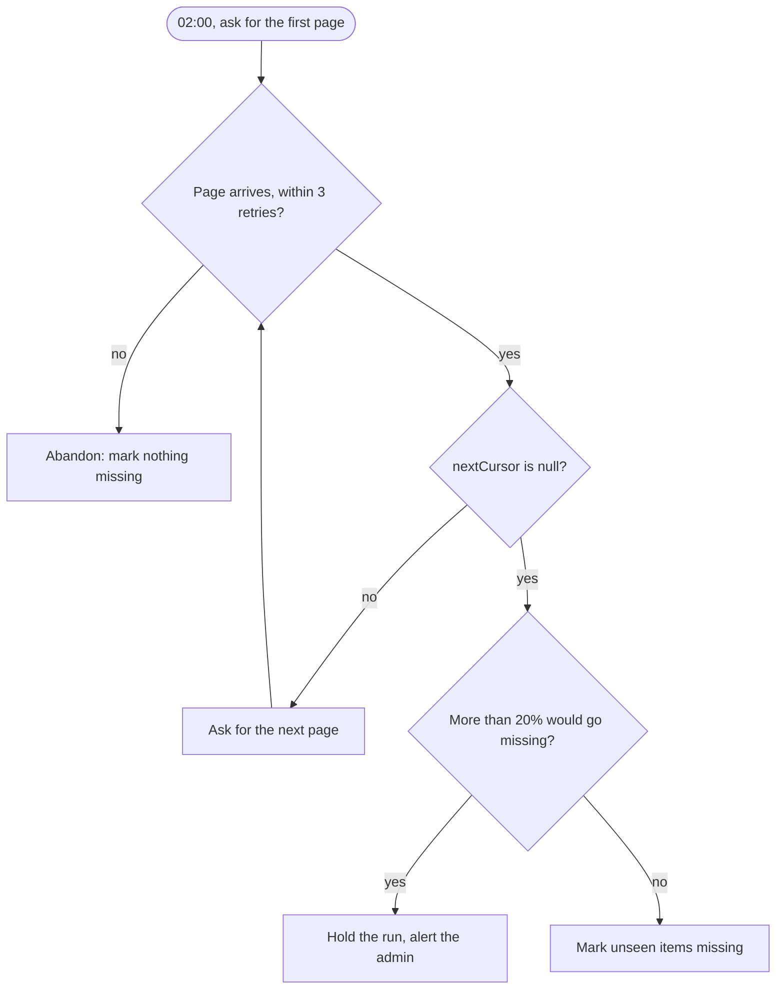

## In one sentence

Taking Shelf’s list endpoint through all eight steps shows how each answer builds on the one before, and how a single sentence about what absence means decides whether tags are safe.

## Example: Shelf’s list endpoint, start to finish

**The problem.** Apps sometimes fail to tell Shelf about a change. A missed title change is a small blemish. A missed delete is worse: a recipe the site removed stays in Shelf’s lookups for ever, a ghost with tags on it. Shelf needs a way to learn what each app really has, without relying on the app to remember to say. That is what the nightly pull is for, and the list endpoint is its <Term id="contract">contract</Term>.

### Step 1: sides and ownership

- **Provider:** each app, at the list URL it registered.
- **Consumer:** Shelf’s nightly pull, at 02:00.
- **Who writes it:** Shelf. Every app must answer the same way, and asking other teams for more than one endpoint is expensive, so Shelf writes one contract and every app builds it.
- **Who owns the data:** the app. A listing is the app’s word on which items exist. Shelf only copies.

[Step 1](/learn/contracts/sides-and-ownership/) explains why the caller writes this one.

### Step 2: nouns and identity

One noun: an item, as the app sees it.

| Field | Rule |
|---|---|
| `id` | The app’s own id. Text, at most 200 characters, never reused. Required. |
| `title` | At most 300 characters. Required. Shelf keeps a copy. |
| `url` | Optional. At most 2,000 characters. |
| `scope` | Optional, such as `/learning/maths`. Defaults to the app’s home scope. |
| `updatedAt` | When the item last changed in the app. Required. |

There is no source id in the response, because Shelf knows which app it called. The two together, (source id, item id), are the item’s identity.

### Step 3: operations

One read-only operation: `GET {listUrl}?cursor=…&limit=…`.

- **Inputs:** `cursor` (opaque, at most 500 characters, left out for the first page) and `limit` (1–500, and the app may return fewer).
- **Output:** a page, `{ "items": [...], "nextCursor": "…" }`, where `nextCursor` is `null` on the last page.
- **Precondition:** the caller sends the right pull secret.
- **Postcondition:** nothing in the app has changed.

### Step 4: errors

| Error | When | What Shelf does |
|---|---|---|
| `400 invalid_cursor` | The cursor is unknown or more than an hour old. | Starts the listing again from the beginning. |
| `401 unauthenticated` | The pull secret is missing or wrong. | Stops and alerts the admin. |
| `503 unavailable` | The app can’t list right now. | Retries the page, then gives up for tonight. |

### Step 5: behavioural guarantees

- **Pagination:** keep calling with `nextCursor` until it is `null`.
- **Ordering:** any order, as long as moving through the pages never skips an item. Duplicates are fine; Shelf ignores repeats.
- **Limits:** at most 500 items a page. A cursor stays valid for at least an hour.
- **Timeouts:** each page within 10 s. Shelf retries a slow or failed page three times, after 2, 4 and 8 s.
- **Safe to repeat:** it only reads, so Shelf may ask for the same page twice.
- **Completeness:** a listing that reaches `null` is **complete**: every item that existed for the whole listing appeared at least once.

That last line is why the endpoint exists. The next decision rests on it.

### The key decision: what does absence mean?

> After a complete listing, any item Shelf knows for that source that did **not** appear is marked **missing**.

This is how the pull catches a delete the app never pushed. Nothing else can: an app that forgot to say “deleted” will never say it. But it is also the most dangerous sentence in Shelf’s design.

Picture a bug in the recipe site that returns `nextCursor: null` after page 3 of 24. Shelf has seen 1,500 recipes and believes it has seen them all. The other 10,500 look deleted. They vanish from lookups, and unless someone notices within 30 days, their tags are removed. **To Shelf, a listing that quietly stopped early looks exactly like mass deletion.**

Shelf’s first priority is never to lose or wrongly remove a tag, so the rule comes with guards.

<Diagram
  title="How a nightly listing ends"
  description="Shelf asks for the first page. If a page still fails after three retries, the listing is abandoned and nothing is marked missing. If the page arrives and nextCursor is not null, Shelf asks for the next page. When nextCursor is null the listing is complete. If it would then mark more than 20% of the source's items missing, Shelf holds the run and alerts the admin. Otherwise it marks the unseen items missing."
>

</Diagram>

1. **Only a complete listing counts.** Reaching `nextCursor: null` is the only way a listing ends well.
2. **A failed page abandons the listing.** If a page still fails after three retries, Shelf stops and marks nothing missing tonight. It doesn’t use the pages it did get, because every item on the pages it didn’t get would look deleted. Tomorrow night it tries again.
3. **The 20% guard.** Guard 1 trusts the app’s `null`, and the bug above would pass it. So if a complete listing would mark more than 20% of a source’s items missing, Shelf holds the run and alerts the admin. This is a <Term id="circuit-breaker">circuit breaker</Term>: when the result looks wrong, stop and ask a person. In the example, 10,500 out of 12,000 is 88%, so the run is held.
4. **Missing isn’t gone.** Missing is a <Term id="soft-delete">soft delete</Term>. The item keeps its tags for 30 days, and if it reappears in that time, it comes back with all of them.

The cost of all this caution is freshness: a real mass deletion waits for the admin, and a failed night leaves deleted items in lookups a day longer. Shelf accepts that, because correctness beats freshness.

### Step 6: who may call it

Shelf sends `Authorization: Bearer <pull secret>`, a secret the admin gave the app at registration. The app must check it: a listing shows every item’s title and link to whoever asks. A `401` makes Shelf stop and alert, because a wrong secret won’t fix itself.

### Step 7: changing it safely

Three teams have built this endpoint, and up to 20 may in two years. So Shelf only adds optional fields (a `thumbnailUrl`, say) and never renames `title` or changes what `updatedAt` means. Shelf reads pages as a <Term id="tolerant-reader">tolerant reader</Term>, ignoring fields it doesn’t know, so an app may send extras.

### Step 8: write it down for machines

The contract builder’s “Shelf pull: an app lists its items” example is this contract. Its OpenAPI goes to each app team, and its response schema lets Shelf check every page: a page that doesn’t match counts as a failed page.

## The general idea

The eight steps make a checklist. Here it is, filled in for the list endpoint.

| Step | The question | The list endpoint |
|---|---|---|
| 1. Sides | Who provides, consumes, owns? | Apps provide; Shelf consumes and writes it; apps own items. |
| 2. Nouns | What things, identified how, how big? | An item: `id` up to 200, `title` up to 300, `updatedAt`. |
| 3. Operations | Inputs, outputs, before and after? | One read-only `GET` with `cursor` and `limit`. |
| 4. Errors | How can it fail, and what then? | `invalid_cursor`, `unauthenticated`, `unavailable`. |
| 5. Guarantees | Repeats, order, pages, limits, time? | Pages until `null`; complete means every item; 10 s a page. |
| 6. Access | Who may call it? | Shelf, with the pull secret. |
| 7. Change | What may change later? | Optional additions only. |
| 8. Machines | Where is the checkable version? | OpenAPI for the apps, a schema for Shelf. |

Two ideas reach beyond Shelf.

**The biggest decision was about meaning, not shape.** No field matters as much as what a *missing* item means. No schema can express it, so it has to be written in words, agreed with every app team and tested.

**A powerful rule needs guards.** When silence in a contract can cause a large effect, stack the defences. Trust only complete input. Give up on the whole when part of it fails. Check the size of the effect. Make the effect reversible.

## Common mistakes

- **Using what you got.** Treating the pages from a failed listing as the truth turns one network hiccup into mass deletion.
- **Trusting “done” without a sanity check.** The provider’s `null` can be wrong. A threshold catches the bug the contract can’t.
- **Deleting on absence.** If the first reaction to “not listed” is removing tags, there is no way back. Mark, wait, then remove.

## Try it

<Quiz id="u6-b-listing-what-if" />
