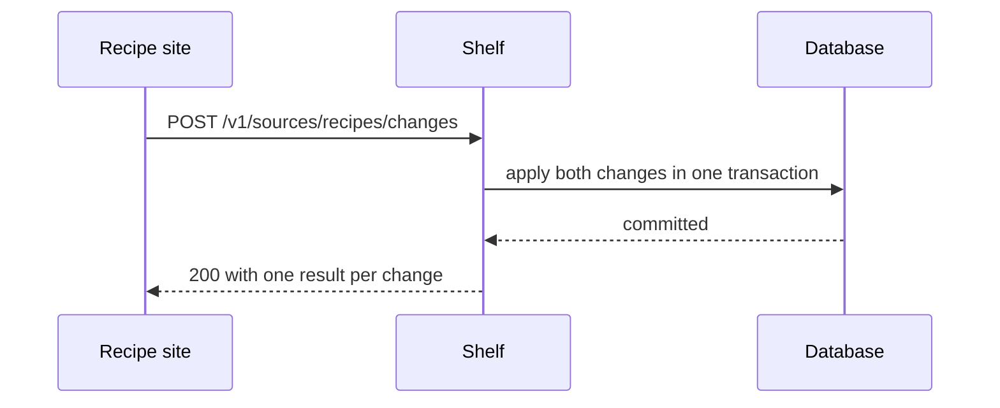
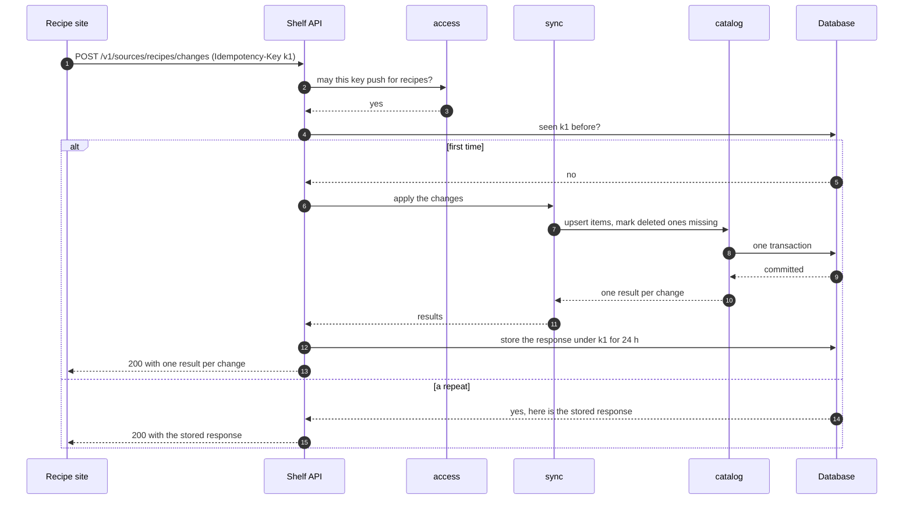

## In one sentence

A sequence diagram draws one flow as a row of participants with arrows running down the page in time order, so you can see who calls whom and what comes back.

## Example: an app pushes a change

An editor on the recipe site renames “Quick dal” to “Weeknight dal”. Another editor deletes a recipe nobody ever cooked. The recipe site sends both changes to Shelf in one request.

Here is what happens next, in words:

1. The recipe site sends `POST /v1/sources/recipes/changes` with its key and an `Idempotency-Key` header.
2. Shelf asks its `access` module whether this key may push changes for `recipes`.
3. Shelf checks whether it has seen that idempotency key before.
4. If not, the `sync` module hands the changes to `catalog`, which writes them in one database transaction. The renamed recipe gets its new title; the deleted one is marked missing.
5. Shelf stores its response under the idempotency key for 24 hours and replies with one result per change.

A numbered list works for five steps. But it hides things. Who is waiting while the database writes? What comes back from each call? What happens if step 3 *does* find the key? A picture answers those at a glance.

### First sketch: three participants

Start with the fewest boxes that tell the story.

<Diagram
  title="An app pushes a change: the short version"
  description="Three columns: the recipe site, Shelf and the database. The recipe site sends a POST request to Shelf. Shelf asks the database to apply both changes in one transaction. The database replies that the transaction is committed, and Shelf replies to the recipe site with one result per change."
>

</Diagram>

Each participant gets a column. Time runs down the page. A solid arrow is a call: one participant asking another to do something. A dashed arrow is the reply. Read it top to bottom, like a comic strip.

### The full flow, with the repeat

Now zoom in to Shelf’s modules, and add the case the short version skipped. The recipe site timed out waiting for an answer, so it sends the same request again with the same `Idempotency-Key`.

<Diagram
  title="An app pushes a change, including a repeated request"
  description="Six columns: the recipe site, Shelf's API, the access module, the sync module, the catalog module and the database. Every arrow is numbered. 1: the recipe site sends the POST with Idempotency-Key k1. 2 and 3: the API asks access whether the key may push for recipes, and access says yes. 4: the API asks the database whether it has seen k1 before. Then a box with two branches. First time: 5, the database says no. 6 to 11: the API asks sync to apply the changes, sync asks catalog to upsert items and mark deleted ones missing, catalog writes them in one transaction, and the results come back up. 12: the API stores the response under k1 for 24 hours. 13: it replies 200 to the recipe site. Repeat: 14, the database returns the stored response, and 15, the API sends it back without applying anything."
>

</Diagram>

Three new pieces appear:

- **`autonumber`** puts a number on every arrow. In a design review you can say “step 4” and everyone looks at the same arrow.
- **`alt` … `else` … `end`** draws a box with two branches. Only one of them happens. Here the branches are “first time” and “a repeat”.
- **In the repeat branch, nothing reaches `sync` or `catalog`.** Shelf sends back the answer it stored at step 12. The changes aren’t applied twice.

<Callout type="shelf" title="Why check the key before the repeat?">
Look at steps 2 and 4. Shelf checks the key first, then looks for the idempotency key. The other way round, a caller with a bad key could learn whether a request had been seen before. In a sequence diagram, order is a decision you can see, question and change.
</Callout>

## The general idea

A <Term id="flow">flow</Term> is the steps that happen, in order, when something occurs. A <Term id="sequence-diagram">sequence diagram</Term> draws one flow: one column per participant, arrows going down the page in time order. It comes from <Term id="uml">UML</Term>, but you only need a handful of its pieces.

| Piece | In Mermaid | What it means |
|---|---|---|
| Participant | `participant API as Shelf API` | One column: a person, an app, a module or a database. |
| Call | `App->>API: text` | A solid arrow. One participant asks another to do something. |
| Reply | `API-->>App: text` | A dashed arrow. The answer coming back. |
| Numbering | `autonumber` | Numbers every arrow, so text can point at a step. |
| Branch | `alt` / `else` / `end` | Two or more alternatives. Only one happens. |
| Optional part | `opt` / `end` | Steps that happen only sometimes. |
| Repeat | `loop` / `end` | Steps that repeat, such as fetching page after page in the nightly pull. |
| Aside | `Note over API: text` | A comment attached to the diagram. |

**What a sequence diagram is good for:**

- **Showing one flow from start to finish,** across every part it touches.
- **Finding questions.** Every arrow is a place where something can fail, be slow or happen twice. The <Term id="idempotency-key">idempotency key</Term> in the full diagram is the answer to one of those questions. The next unit asks them for every arrow.
- **Checking boundaries.** If an arrow goes from `catalog` to the API, a dependency points the wrong way, and you can see it before anyone writes the code.
- **Showing where the all-or-nothing part is.** Step 8 is one <Term id="transaction">transaction</Term>. If it fails, nothing is committed and no response is stored at step 12, so a retry starts fresh.

**What it isn’t for:** every possible branch at once (draw one diagram per interesting path), the stages one thing passes through (that’s a state diagram, in the next lesson), or code detail. If it’s as long as the code, it isn’t helping.

<Callout type="tradeoff" title="How far to zoom in?">
The three-participant sketch is right for the recipe site’s team: they care what they send and what comes back. The six-participant version is for whoever builds Shelf: it shows which module does what. Adding every function call would make the diagram as long as the code and twice as hard to change. Pick the level your reader needs, and keep every participant in one diagram at the same level.
</Callout>

You can try any of these in the [diagram playground](/playground/).

## Common mistakes

- **Drawing every branch in one diagram.** Three nested `alt` boxes are unreadable. Draw the main path, then a separate small diagram for each alternative that matters.
- **Leaving out the replies.** A call with no dashed arrow back hides what the caller learns, including errors, and whether it waits.
- **Mixing levels.** “Recipe site” in one column and “the `upsertItem` function” in the next. Keep participants at the same zoom.

## Try it

Draw a second flow yourself: a curator putting a tag on a recipe.

<DiagramExercise id="u7-tagging-sequence" />
