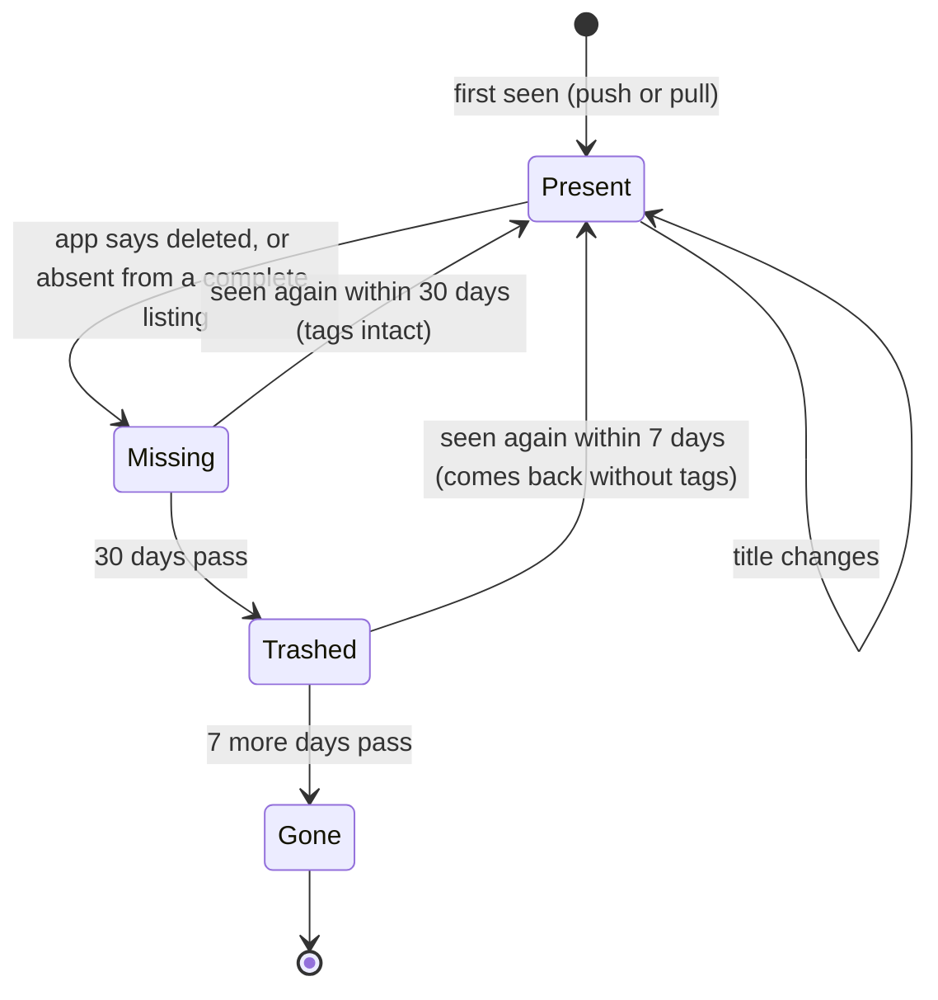

## In one sentence

A state diagram shows the stages one thing can be in and the events that move it from one stage to another, including the ways back.

## Example: an item’s life

Two recipes, two stories.

**The recipe that came back.** An editor unpublishes “Lemon tart” by mistake, and the recipe site pushes a delete. Shelf throws nothing away. It marks the item *missing* and hides it from lookups, but keeps its six tags. Ten days later the editor notices and republishes it. The next push (or that night’s pull) sees the recipe again, and it’s *present* once more, with all six tags.

**The recipe that didn’t.** “Jelly salad” is deleted on purpose. It stays missing for 30 days. Then the clean-up job that Shelf runs every hour (the *retention job*) moves it to *trashed*: its tags are removed, and each removal is written to the audit log. The row stays for 7 more days so the admin can see what went. Then the job deletes the row, and the item is *gone*.

Both stories are paths through the same drawing.

<Diagram
  title="An item’s life"
  description="An item starts Present when it is first seen, through a push or a pull. A title change keeps it Present. If the app says it was deleted, or it is absent from a complete listing, it becomes Missing. From Missing it goes back to Present, with its tags, if it is seen again within 30 days. Otherwise, when 30 days pass, it becomes Trashed and loses its tags. From Trashed it goes back to Present, without tags, if it is seen again within 7 days. Otherwise, after 7 more days, it is Gone and its life ends."
>

</Diagram>

“Lemon tart” went Present → Missing → Present. “Jelly salad” went all the way down. Each box says how the item behaves while it’s there:

| State | In lookups? | Its tags | It leaves when… |
|---|---|---|---|
| Present | Yes | Kept | the app deletes it, or a complete listing leaves it out |
| Missing | Only if asked for (`include=missing`) | Kept | it’s seen again, or 30 days pass |
| Trashed | No | Removed, and recorded in the audit log | it’s seen again, or 7 more days pass |
| Gone | No: the row is deleted | None | never. If the app lists it later, it’s a brand-new item. |

### What the drawing makes you ask

Once the states are on paper, you can go through them one at a time and ask: what if *this* event happens *here*? Each answer is a small decision. Shelf’s answers:

- **The app pushes a delete for an item that’s already missing.** It stays missing. The 30 days count from the day it first went missing, so repeating the delete doesn’t reset the clock.
- **A curator tries to tag a missing item.** Refused, with `item_missing` (409). The item keeps the tags it had, but gets no new ones until its app sends it again.
- **A trashed item is seen again.** It comes back present, without tags. The audit log still shows which tags it had.
- **The retention job runs twice in the same hour.** Nothing extra happens. It moves an item only if the item is *still* in the right state and its time is up, so the second run finds nothing to do.

Without the diagram, most of these get decided by accident, inside a function, by whoever happens to write it first.

## The general idea

A <Term id="state">state</Term> is one stage a thing can be in, where it behaves in a particular way. A <Term id="transition">transition</Term> is a move from one state to another, labelled with the event that causes it. A <Term id="state-diagram">state diagram</Term> draws them all for one kind of thing.

In Mermaid (`stateDiagram-v2`) you need four pieces:

| Piece | In Mermaid | Means |
|---|---|---|
| Start | `[*] --> Present` | Where every item begins. |
| Transition | `Present --> Missing : deleted` | The text after the colon names the event. |
| Self-transition | `Present --> Present : title changes` | Something happens, but the state stays the same. |
| End | `Gone --> [*]` | The thing’s life is over. |

**Events come in three kinds.** Something a caller does (the app pushes a delete). Something the system notices (the item is absent from a complete listing). And time passing (30 days). Time is the one people forget. In Shelf, a job that runs every hour turns “30 days pass” into an actual change.

**Store the state; don’t work it out each time.** Shelf keeps each item’s state in a column, `items.status`, with a timestamp for each step (`missing_since`, `trashed_at`). This is a <Term id="soft-delete">soft delete</Term>: the row stays, marked, and <Term id="retention">retention</Term> rules decide when it goes for good. You met the tables in [Soft deletes and retention](/learn/data-model/soft-deletes-and-retention/).

**When to draw one.** Anything with a life cycle that other things depend on: items, nightly pull runs, API keys (active, then revoked), tags. A good sign is a `status` column. If a thing can only exist or not exist, it probably doesn’t need a diagram.

**How it differs from a sequence diagram.** A sequence diagram follows one flow across many participants. A state diagram follows one thing across many flows. The push, the pull and the retention job all move items, and only the state diagram shows how they fit together.

<Callout type="tradeoff" title="How many states?">
Every state adds rules: what lookups show, what’s allowed, what moves it on. Shelf could drop *trashed* and delete rows after 30 days. That would mean one state fewer and one timestamp fewer. But a recipe that came back on day 31 would look brand new, with no trace of what happened to it, and the admin couldn’t see what the job removed that week. Shelf’s first priority is never to lose or wrongly remove a tag, so it pays for the extra state.
</Callout>

## Common mistakes

- **Naming events as states.** “Deleting” or “Renaming” isn’t a stage a thing rests in; it’s what happens between stages. If nothing waits there, it’s a transition.
- **Forgetting the ways back.** Drawing only the path forwards, from present to gone, leaves out the recipe that comes back. That recipe is the reason *missing* exists.
- **Leaving time out.** “30 days pass” is an event. If no job or check makes it happen, items stay missing for ever.

## Try it

A tag has a life too. Its interesting moment is being renamed, because the old name doesn’t vanish at once.

<DiagramExercise id="u7-tag-rename-states" />
