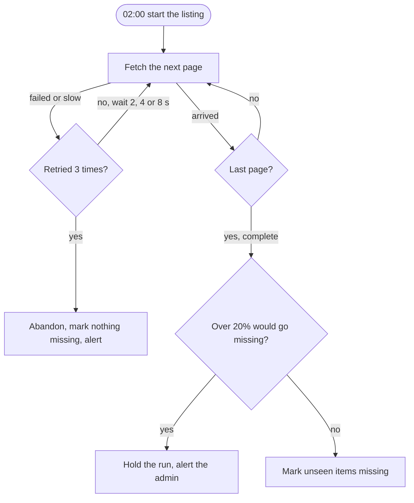

## In one sentence

Once you know how a step can fail, choose what happens next: try again, undo, keep the most important part working, tell a person, or stop on purpose until someone has looked.

## Example: five responses in Shelf

The last lesson listed what can go wrong. Each failure needs an answer, and there are only a handful of kinds. Here is each one, with the place Shelf uses it.

### Retry

At 02:00 the nightly pull asks the photo gallery for page 41 of 90. No answer within 10 s. Shelf waits 2 s and asks again. Still nothing. It waits 4 s and asks a third time, and the gallery answers. The listing carries on as if nothing happened.

That was safe because asking for a page is a read: asking twice changes nothing. The same goes for an app sending a push again after a `503`, because pushes are safe to repeat.

Retrying something that *isn’t* safe to repeat is where the trouble starts. Creating a tag (`POST /v1/tags`) is one. If the answer is lost and the curator’s screen sends it again, the second attempt gets `409 tag_name_taken`. No duplicate is made, because names are unique in a scope. But the screen has to understand that this “error” probably means the first attempt worked.

### Roll back

One morning the quiz app pushes 500 changes. At change 317 the database connection drops. The batch is one transaction, so the database undoes the 316 changes it had made. The quiz app gets `503 unavailable` and sends the same batch again 10 s later, and all 500 go in.

Without the undo, lookups would show a half-applied batch until the retry arrived, and a crash at the wrong moment could leave it half-applied for good.

### Degrade

One Friday the recipe site sends its newsletter, and lookups jump from about 17 a second to 60. Shelf keeps each tag lookup’s answer for 30 s, so most of those requests never reach the database. Meanwhile a broken script at the quiz app starts sending 200 lookups a second. It hits its key’s rate limit and gets `429 rate_limited`, so every other app stays fast.

Shelf is doing less than usual (answers may be up to 30 s old; one caller is refused), but the important part, lookups for everyone else, keeps working.

### Alert

One night the recipe site’s list endpoint answers `503` to every retry of page 12. Shelf gives up on tonight’s listing and marks nothing missing. That keeps the data safe, but nobody knows yet. So Shelf sends the admin a message: “recipes: tonight’s pull abandoned at page 12 after 4 attempts”. The admin sees it that morning and calls the recipe site’s team.

### Stop on purpose

Another night the photo gallery’s listing finishes. It contains 33,000 photos. Shelf knows 45,000. Marking the other 12,000 missing would be 27% of the source, which is over Shelf’s 20% line. So Shelf holds the run: nothing is marked missing, and the admin gets an alert. In the morning it turns out the gallery’s new release hid every photo in a private album from its listing.

Every step had worked. Shelf stopped because the *result* looked wrong, and waited for a person.

## The general idea

These are the five responses. Most real designs combine several.

| Response | Use it when | What it costs | In Shelf |
|---|---|---|---|
| **Retry** | the failure may be brief, and the step is safe to repeat | extra load on something already struggling | pull pages; apps sending pushes again |
| **Roll back** | a group of changes must happen together or not at all | needs a transaction; works only inside one database | each push batch; each retention job batch |
| **Degrade** | part of the system is struggling, but the most important part can carry on | a reduced service: older answers, some callers refused | 30 s lookup cache; per-key rate limits |
| **Alert** | a person must do something | someone’s attention, so use it sparingly | failed or held pulls, failed backups, disk over 80% |
| **Stop (circuit breaker)** | carrying on could do damage that’s hard to undo | work waits, sometimes until morning | the 20% guard |

**Retry** well or not at all. A <Term id="retry">retry</Term> needs three things. The step must be safe to repeat. It needs <Term id="backoff">backoff</Term>: waiting longer each time (2, 4, then 8 s), so a struggling system isn’t hit harder while it recovers. And it needs a limit, after which you stop and do something else. Retry only failures that might go away on their own, such as a timeout or a `503`. A `401` or a `422` will fail the same way every time.

**Roll back** with a <Term id="rollback">rollback</Term>: the database undoes everything since the transaction began. It works because all the changes are in one place. Once a change has left the building (an email sent, another system called), there’s nothing to undo. You’d need a second action that reverses the first.

**Degrade** means <Term id="graceful-degradation">graceful degradation</Term>: deciding in advance what may get worse so that the most important thing doesn’t. Shelf’s priorities decide it. Lookups staying up comes before freshness, so slightly old answers are acceptable. Never losing a tag comes first of all, so writes are never “degraded”: if Shelf can’t store a tag, it says so with `503`.

**Alert** a person with an <Term id="alert">alert</Term> when, and only when, someone must act. Say what happened and where. An alert that fires every day for nothing trains people to ignore the one that matters.

**Stop** with a <Term id="circuit-breaker">circuit breaker</Term>: a guard that notices something is wrong and refuses to carry on until a timer or a person says so. The classic version sits in front of a failing service: after enough failures in a row it stops calling for a while, then lets one trial call through. Shelf’s version trips on a suspicious result instead of on errors, and waits for the admin.

### How they combine

The nightly pull uses four of them in a row.

<Diagram
  title="Responses in the nightly pull"
  description="Shelf fetches a page. If it fails or takes longer than 10 seconds, Shelf retries after waiting 2, 4 and then 8 seconds. After 3 failed retries it abandons the listing, marks nothing missing, and alerts the admin. If the page arrives and there are more pages, it fetches the next one. When the listing is complete, Shelf checks whether more than 20% of the source's items would be marked missing. If so, it holds the run and alerts the admin. If not, it marks the unseen items missing."
>

</Diagram>

Retry handles the brief failure. Abandoning the listing is a kind of rollback: nothing half-done is kept. The alert makes sure a person knows. The guard catches the failure that looks like success.

## Common mistakes

- **Retrying everything.** Retrying a `401` only repeats the failure. Retrying without backoff turns a struggling server into a dead one, as every caller hammers it at once.
- **Alerting on everything.** An admin who gets forty alerts a day stops reading them, including the one that matters.
- **Degrading without deciding what matters most.** “Keep things working” isn’t a plan. Decide in advance which parts may get worse (freshness, admin screens) and which may not (lookups, stored tags).

## Try it

<Sort id="u8-pick-the-response" />
