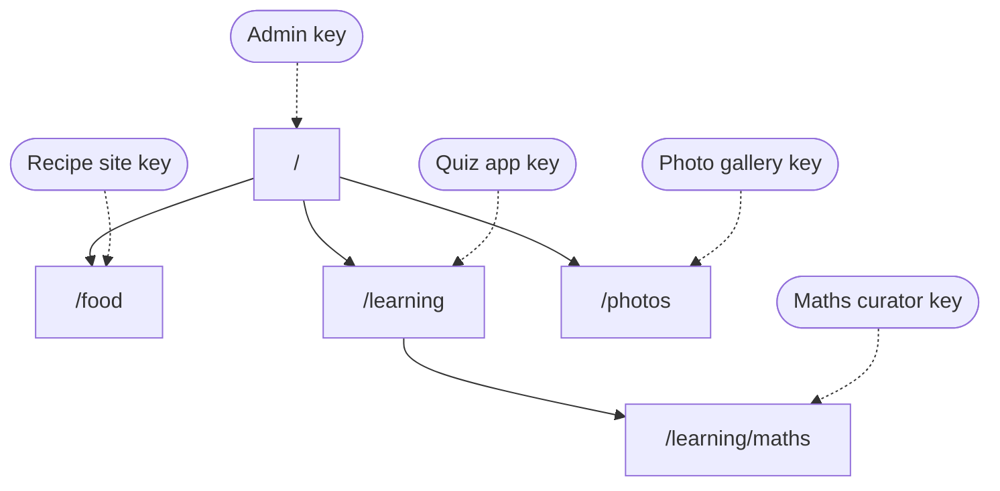
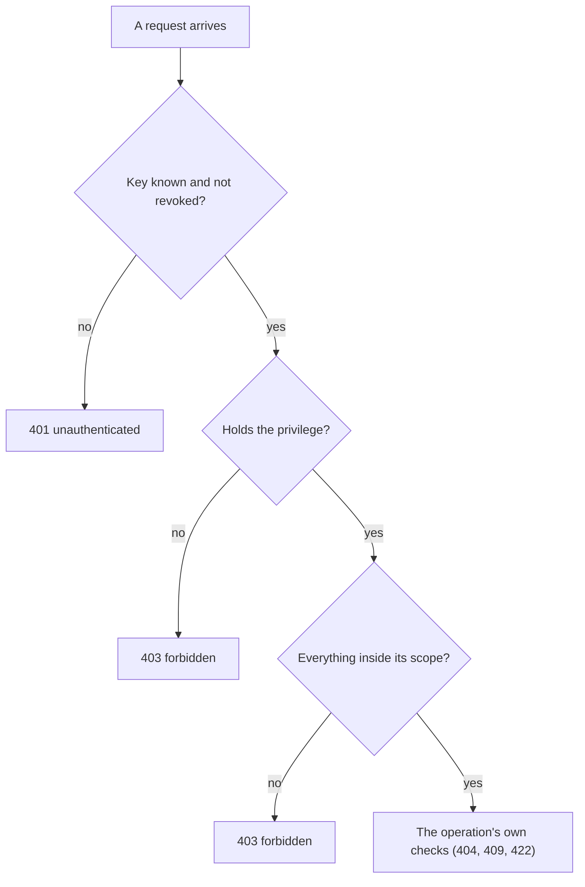

## In one sentence

Every request to Shelf must settle who is calling, what they may do and where they may do it; in Shelf the answers are a key, its privileges and its scope.

## Example: a new curator for maths

The quiz app’s team finds a maths teacher who will look after the maths quizzes: tagging them, and creating tags such as `fractions`. The admin has three questions to answer before she can start.

**Who is she?** She gets her own key. Not the quiz app’s key, and not one shared by all curators. Every tagging records who made it, and when she moves on, the admin can revoke her key without touching anyone else’s.

**What may she do?** The *curator* bundle: `tags:read`, `tags:apply` and `tags:manage`. She can look up tags, put them on quizzes and take them off, and create, rename and delete tags.

**Where?** The scope `/learning/maths`. Her key reaches that scope and anything below it. Nothing above, nothing beside.

<Diagram
  title="Every key is pinned to one scope"
  description="The scope tree: the root, written as a slash, has three children, /food, /learning and /photos, and /learning has one child, /learning/maths. Each key is attached to one scope: the admin's key to the root, the recipe site's key to /food, the quiz app's key to /learning, the photo gallery's key to /photos, and the new maths curator's key to /learning/maths. A key reaches its own scope and everything below it."
>

</Diagram>

Here is her first week.

| She asks to… | Shelf answers | Because |
|---|---|---|
| create a tag `fractions` | allowed | She has `tags:manage`, and the tag goes in `/learning/maths`, her scope. |
| put `algebra` and `fractions` on a maths quiz | allowed | She has `tags:apply`, and the quiz and both tags are inside her scope. |
| put `exam-prep` on a maths quiz | `403 forbidden` | The quiz is hers, but `exam-prep` is defined in `/learning`, one level above her scope. |
| tag a history quiz in `/learning` | `403 forbidden` | The quiz is outside her scope. |
| look up the recipes tagged `vegetarian` | `403 forbidden` | `vegetarian` lives in `/food`, nowhere near her scope. |

A year later she moves to another school. The admin revokes her key. From then on, anything sent with it gets `401 unauthenticated`: Shelf no longer knows who is calling.

The `exam-prep` row is the interesting one. She wants to mark maths quizzes for exam season. The admin could move her key up to `/learning`. That works, but it also lets her rename or delete `exam-prep` and every other tag in `/learning`, and tag every history quiz. A scope gives everything inside it, or nothing. Choosing between those two options is the subject of the next lesson.

## The general idea

Every request goes through two different checks, in this order.

1. **<Term id="authentication">Authentication</Term>: who is calling?** Shelf checks the <Term id="api-key">API key</Term>. It must be one Shelf issued, and not revoked. If not: `401 unauthenticated`, which means “I don’t know who you are.” The caller fixes it by sending a valid key.
2. **<Term id="authorisation">Authorisation</Term>: may this caller do this, here?** If not: `403 forbidden`, which means “I know who you are, and no.” Sending the same request again will never work. The fix is a different key, or a different request.

In Shelf, authorisation has two parts, and both must say yes.

**What: the privilege.** A <Term id="privilege">privilege</Term> is permission for one kind of action. Shelf has five: `tags:read`, `tags:apply`, `tags:manage`, `items:push` (for one source only) and `admin`.

**Where: the scope.** A key has one <Term id="scope">scope</Term>, and it reaches that scope and everything below it. Reach runs down the tree, never up and never sideways. Everything a request touches must be inside it: the item, the tag, or both. That’s what “a key only sees its own scope” means. The maths curator’s key can’t use `exam-prep`, and a lookup made with the quiz app’s key never returns a photo.

**Roles are bundles.** A <Term id="role">role</Term> is a named set of privileges that people can talk about.

| Role | Privileges | Scope |
|---|---|---|
| App | `items:push` (its own source), `tags:read`, `tags:apply` | its home scope |
| Read-only app | `tags:read` | a scope |
| Curator | `tags:read`, `tags:apply`, `tags:manage` | a scope |
| Admin | everything | `/` |

People say “she’s a curator”. Shelf checks privileges, never role names. So when someone needs a curator who may not delete tags, the admin gives a key `tags:read` and `tags:apply` without `tags:manage`, and no code changes.

<Diagram
  title="The order of the checks"
  description="A request arrives. First: is the key known and not revoked? If not, the answer is 401 unauthenticated. Then: does the key hold the privilege this operation needs? If not, 403 forbidden. Then: is everything the request touches inside the key's scope? If not, 403 forbidden. Only then does the operation run its own checks, such as 404 for a tag that doesn't exist or 422 for a tag that doesn't fit the item."
>

</Diagram>

The last box matters. When the admin, who may do anything anywhere, tries to put `algebra` on a recipe, the answer is `422 tag_out_of_scope`. That refusal has nothing to do with who is asking: nobody may do it. You met the same split in [Who may call it](/learn/contracts/who-may-call-it/).

<Callout type="tradeoff" title="403, or pretend it isn’t there?">
Some services answer `404` for anything outside the caller’s reach, so a caller can’t even learn that it exists. The maths curator would get `404 tag_not_found` for `vegetarian`, exactly as if no such tag existed. That hides more, but it makes mistakes painful to track down: nobody can tell “deleted” from “not yours”. Shelf answers `403`. Its callers are teams in the same organisation, its scope names aren’t secret, and its tag ids are random. What a `403` from Shelf never contains is anything from outside the key’s scope: no tag names, no titles. A public service with strangers calling it would weigh this differently.
</Callout>

## Common mistakes

- **Checking who, but not what.** A valid key isn’t permission. Every operation must name the privilege it needs.
- **Checking what, but not where.** A `tags:apply` check with no scope check lets the maths curator tag photos.
- **Checking role names in code.** A line like “if the caller is a curator” breaks the day someone needs a curator who may not delete tags. Check privileges, and keep roles as names for bundles.

## Try it

<Sort id="u9-which-check-says-no" />
