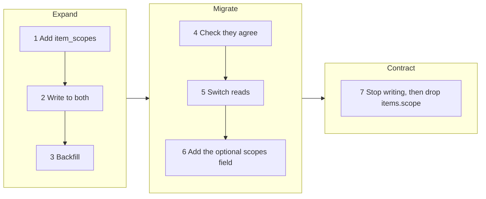

## In one sentence

To change a model that people already rely on, add the new shape next to the old one, move everything across in small steps you can undo, and remove the old shape only when nothing uses it any more.

## Example: an item in several scopes

Picture Shelf a year from now. The quiz app has added a physics section, with its own scope, `/learning/physics`. Some quizzes belong in two places. “Speed, distance and time” is as much physics as maths, and curators want to tag it both `algebra` (defined in `/learning/maths`) and `mechanics` (defined in `/learning/physics`).

Today they can’t. Each item has exactly one scope, stored in one column, `items.scope`. A tag fits an item only if the item’s scope is the tag’s scope or below it. So the quiz can have `algebra` or `mechanics`, never both.

The new model is short to describe: an item may belong to several scopes. In the database, the single column becomes a table, `item_scopes`, with one row per item per scope.

<Compare>
<Side title="Today">
`items.scope` holds one path for quiz `q-812`: `/learning/maths`.
</Side>
<Side title="A year from now">
`item_scopes` holds two rows for quiz `q-812`: one for `/learning/maths` and one for `/learning/physics`.
</Side>
</Compare>

The tempting plan is one big release on a Sunday night: create the table, copy the data, drop the column, change the code. First, look at everything that depends on the old shape:

- **Shelf’s own code:** the check that a tag fits an item, lookups, and the check that a key only sees its own scope.
- **The push API:** every app sends a `scope` with each change.
- **The list endpoint** that each app implements: it returns a `scope` for each item.
- **Real data:** 60,000 items, and 300,000 taggings that were checked against those scopes.

One big release changes all of that at once. If anything goes wrong, there is no way back, because the old column is gone. So Shelf changes in seven small steps instead. After each one the system works, and every app sees exactly what it saw before.

### The seven steps

1. **Add the new table next to the old column.** Create `item_scopes`. Nothing reads it yet, so this release changes nothing anyone can see.
2. **Write to both.** Every push and every nightly pull that sets `items.scope` now also writes the matching row in `item_scopes`. The old column is still the truth.
3. **Backfill.** A one-off job copies each existing item’s scope into `item_scopes`, 1,000 items at a time. It is safe to run twice: a row that already exists is skipped.
4. **Check.** Every item should now have exactly one row in `item_scopes`, matching `items.scope`. A difference means a bug in step 2 or 3. Fix it now, while nothing depends on the new table.
5. **Switch reads.** The tag check, lookups and key checks read `item_scopes` instead. The switch is a setting, so it can be flipped back in seconds. Because Shelf still writes both, flipping back loses nothing.
6. **Open up the contract.** Add an optional `scopes` list to pushed changes and to the list endpoint. An app that sends only `scope` gets exactly what it had before. The quiz app starts sending `scopes` for its cross-subject quizzes.
7. **Remove the old.** Stop writing `items.scope`. Once nothing has read it for a couple of weeks, take a backup and drop the column.

Step 6 comes after step 5 for a reason: the old column can hold only one scope, so everything must already read the new table before any item gets a second one.

<Diagram
  title="The seven steps, in three phases"
  description="Seven boxes in three groups, left to right. Expand: 1, add item_scopes; 2, write to both; 3, backfill. Migrate: 4, check the two agree; 5, switch reads; 6, add the optional scopes field. Contract: 7, stop writing items.scope, then drop it. Only the last step cannot be undone."
>

</Diagram>

Steps 1 to 6 can each be undone. Step 7 can’t, so it comes last, and only once nothing needs the old column.

## The general idea

A <Term id="migration">migration</Term> moves a live system from an old shape to a new one. The shape might be a table, a field in an API or a rule. The new shape is rarely the hard part. The hard part is the time in between, when real data and real callers still depend on the old one.

The safe pattern is called <Term id="expand-and-contract">expand and contract</Term>. It has three phases:

| Phase | What you do | Who notices |
|---|---|---|
| **Expand** | Add the new shape next to the old. Write every change to both (a <Term id="dual-write">dual write</Term>). Fill the new shape with the existing data (a <Term id="backfill">backfill</Term>). | Nobody. |
| **Migrate** | Check the two agree. Move readers across, with a way back. Then open up the new abilities. | Nobody, if the check passed. |
| **Contract** | Stop writing the old shape. Remove it once nothing reads it. | Nobody, if you waited long enough. |

Three rules make it work:

- **Each step ships on its own.** The system works after every step, so you can pause halfway for a month if something more urgent comes up.
- **Each step but the last can be undone.** Keep the old shape up to date until you’re sure you won’t need it.
- **Removing needs proof.** Before you drop anything, show that nothing reads it: search the code, check the database’s query statistics, and wait through a quiet week or two of nightly pulls.

The same pattern works for contracts, with one difference. Shelf can drop its own column once nothing reads it. It can’t drop the `scope` field that three apps send, because that would be a <Term id="breaking-change">breaking change</Term>. So in version 1, Shelf keeps accepting `scope` for good and treats it as a list of one. If the old field must ever go, that happens in a `/v2`, announced well ahead (see [Changing a contract safely](/learn/contracts/changing-a-contract-safely/)).

<Callout type="tradeoff" title="Seven releases instead of one">

Expand and contract is slower. It takes seven small releases over a few weeks, and for a while Shelf writes everything twice and carries code for both shapes.

In return, no step can take lookups down or lose a tag, and any step can wait if something else is on fire. For a one-developer service whose first priority is “never lose or wrongly remove a tag”, that’s a good deal. For a brand-new table that nothing reads yet, one release is fine.

</Callout>

## Common mistakes

- **Backfilling before writing to both.** Anything that changes between the backfill and the first dual write lands only in the old shape, and the new one is quietly wrong. Start the dual writes, then backfill.
- **Removing the old too soon.** A monthly report nobody mentioned, or an old worker still running, reads the column the day after you drop it. Look for readers, wait, back up, then remove.
- **Treating your own table like someone else’s contract, or the other way round.** Shelf can drop `items.scope` when it likes. It can’t drop the `scope` field that three apps send.
- **Moving the data before deciding the rules.** Before step 1, decide what the new model means. Here: a tag fits an item if **any** of the item’s scopes is the tag’s scope or below it, and every scope must still be inside the app’s home scope.

## Try it

<Quiz id="u10-safe-migration-steps" />
