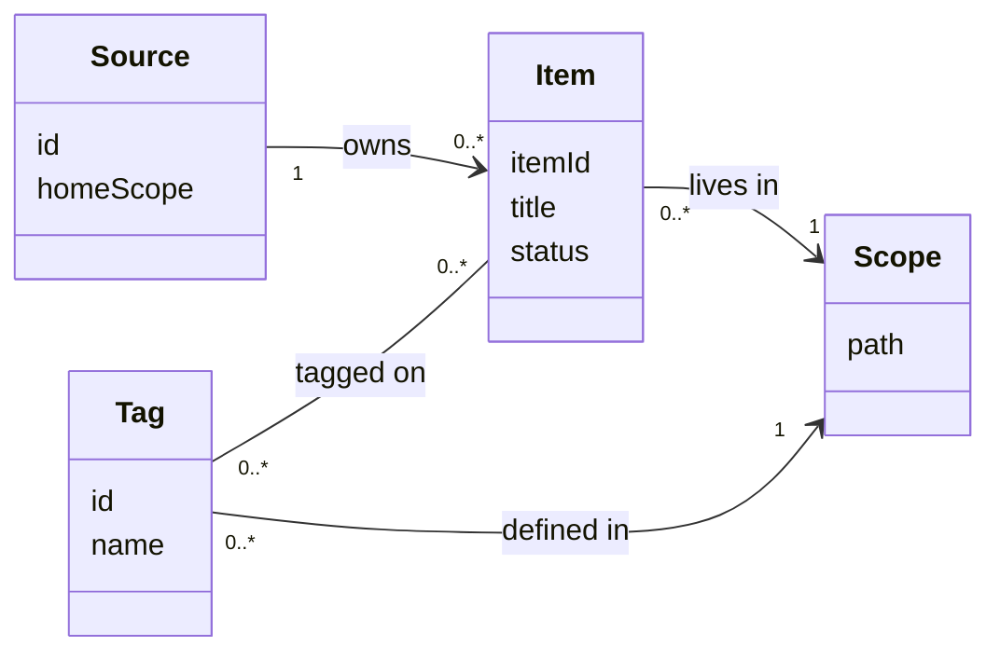
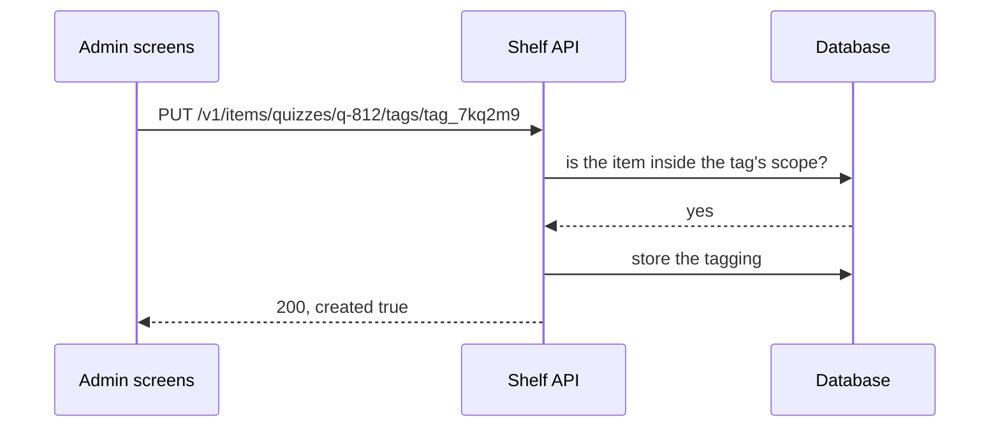
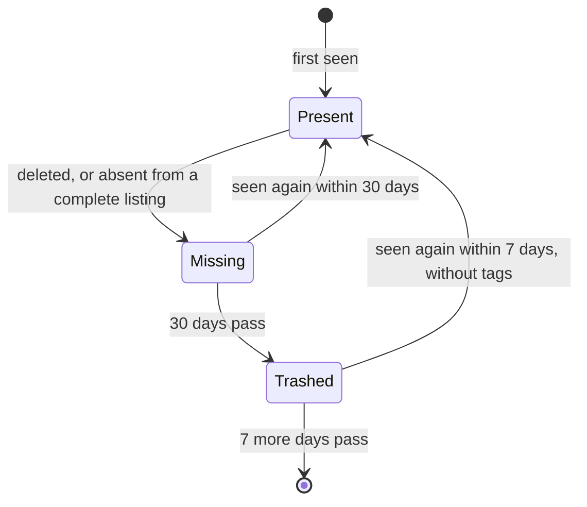
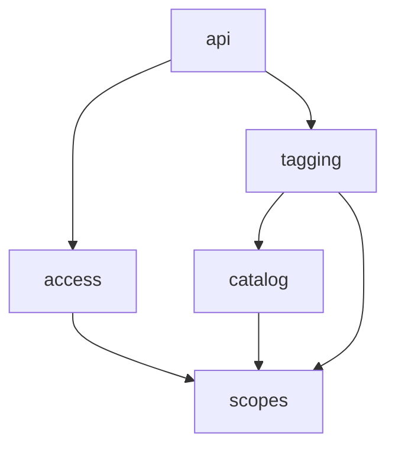
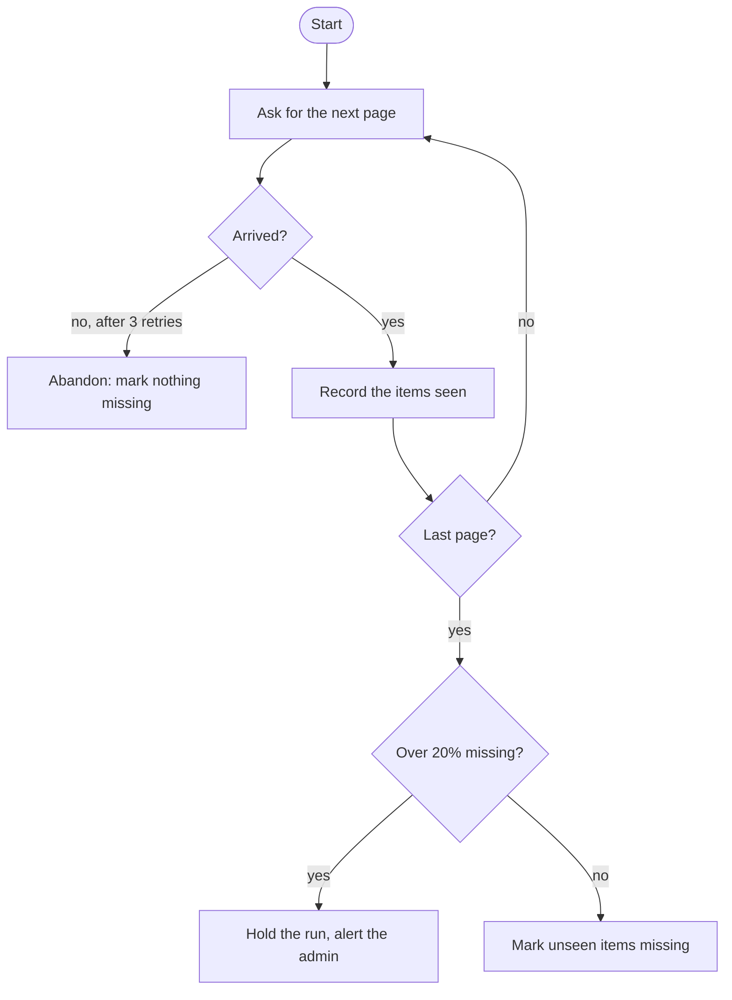

## In one sentence

UML has more than a dozen kinds of diagram, but five cover nearly everything you’ll draw: class for things, sequence for conversations, state for lifecycles, component for parts, and activity for processes.

## Example: five questions about Shelf

Each of these diagrams answers one kind of question. Here are five questions you have already asked about Shelf, and the diagram that answers each one.

### “What are the things, and how do they relate?” A class diagram

One box per kind of thing, with its attributes inside. Lines show relationships, and the numbers at each end say how many: `1`, or `0..*` for “any number”.

<Diagram
  title="Shelf's main concepts"
  description="A source owns any number of items. Each item lives in one scope. Each tag is defined in one scope. A tag can go on any number of items, and an item can have any number of tags."
>

</Diagram>

Reach for it when you’re naming the concepts (the domain model), and to agree words with other people before anyone designs tables.

### “Who calls whom, and in what order?” A sequence diagram

One column per participant, with time running down the page. Solid arrows are calls; dashed arrows are replies.

<Diagram
  title="A curator tags a quiz"
  description="The admin screens ask the Shelf API to put a tag on quiz q-812. The API asks the database whether the item is inside the tag's scope. The database says yes. The API stores the tagging and replies that the tag was created."
>

</Diagram>

Reach for it when a flow crosses several parts, and especially to show what happens on a timeout or a retry.

### “What stages does it go through?” A state diagram

Rounded boxes are states. Arrows are the events that move a thing from one state to the next.

<Diagram
  title="An item's life"
  description="An item starts present. If it is deleted, or absent from a complete listing, it becomes missing. Seen again within 30 days, it is present again. After 30 days missing it is trashed. Seen again within 7 days, it comes back present but without tags. After 7 more days it is gone."
>

</Diagram>

Reach for it when one thing has a lifecycle with rules: which moves are allowed, and what triggers each one.

### “What are the parts, and which depends on which?” A component diagram

Boxes are parts of the system. Arrows point from a part to the parts it uses. UML has its own symbols for components, but plain boxes and arrows do the job.

<Diagram
  title="The modules involved in tagging"
  description="The api module calls access, to check the key, and tagging. The tagging module calls catalog, to find the item, and scopes, to check that the tag fits. The access and catalog modules also call scopes. Every arrow points towards scopes, which calls nothing."
>

</Diagram>

Reach for it when you’re drawing boundaries, and to spot a dependency that points the wrong way.

### “What are the steps and the decisions?” An activity diagram

A flowchart: steps in boxes, decisions in diamonds, and loops as arrows that go back.

<Diagram
  title="The nightly pull for one source"
  description="Shelf asks the app for the next page. If the page doesn't arrive, even after three retries, Shelf abandons the listing and marks nothing missing. If it arrives, Shelf records the items it saw, and loops back until the last page (the one whose nextCursor is null). Then, if more than 20% of the source's items would go missing, Shelf holds the run and alerts the admin. Otherwise it marks the unseen items missing."
>

</Diagram>

Reach for it when one part runs a process with branches and loops, such as a job.

### All five at a glance

| Diagram | Shows | Reach for it when | In Shelf |
|---|---|---|---|
| Class | kinds of thing, their attributes and relationships | naming the concepts | sources, items, scopes, tags |
| Sequence | messages between participants, in time order | a flow crosses several parts | a curator tags a quiz |
| State | the stages one thing goes through, and what moves it on | something has a lifecycle | an item’s life |
| Component | the parts, and which uses which | drawing boundaries | the modules |
| Activity | the steps, decisions and loops of one process | a job or rule with branches | the nightly pull |

## The general idea

<Term id="uml">UML</Term> (the Unified Modeling Language) is a standard set of diagram types for software, agreed in the late 1990s. The full standard has 14 diagram types and a thick rulebook. Few teams use the rulebook today. What lasted is a shared picture language: a box with attributes is a kind of thing, a dashed arrow back is a reply, a rounded box is a state.

Five diagrams do nearly all the work, and each answers one question:

- A <Term id="class-diagram">class diagram</Term>: what are the things?
- A <Term id="sequence-diagram">sequence diagram</Term>: who talks to whom, in what order?
- A <Term id="state-diagram">state diagram</Term>: what stages does this one thing go through?
- A <Term id="component-diagram">component diagram</Term>: what are the parts, and which depends on which?
- An <Term id="activity-diagram">activity diagram</Term>: what are the steps, and where does it branch?

To pick one, say the question out loud first. The question nearly always names the diagram. For tables, reach for an <Term id="er-diagram">ER diagram</Term>. It isn’t UML, but it works the same way; you met it in [From concepts to tables](/learn/data-model/from-concepts-to-tables/).

**Where each one lives in a design.** Every diagram belongs to a part of the map. The class diagram draws the domain model, and the component diagram draws the boundaries. Sequence diagrams draw flows. State diagrams draw state. Activity diagrams turn up wherever a process branches: a job, a rule, or what happens when a step fails. A one-page design like Shelf’s usually needs three or four of them, one per part, and rarely more than one of each.

Draw UML as a sketch, not a specification. Use the notation that makes the picture clearer, and skip the rest: nobody needs the small symbols for public and private on a domain model. A plain arrow with a clear label beats a correct symbol nobody remembers.

<Callout type="tip" title="One diagram, one question">
If a sequence diagram starts growing decision diamonds, or a class diagram starts showing steps, you are answering two questions in one picture. Split it into two diagrams.
</Callout>

## Common mistakes

- **Drawing everything.** A diagram of every class in the code is out of date by Friday, and nobody reads it. Draw what answers a question someone is asking.
- **Using a sequence diagram for a solo process.** If one part does all the work, like the hourly retention job, there is nobody for it to talk to. An activity diagram fits better.
- **Confusing state with activity.** A state diagram follows one *thing* (an item) through its life. An activity diagram follows one *process* (the retention job) through its steps. The job moves items between states, but the two pictures answer different questions.
- **Caring more about notation than meaning.** Arrowheads matter less than labels.

## Try it

<Quiz id="u11-pick-the-diagram" />
