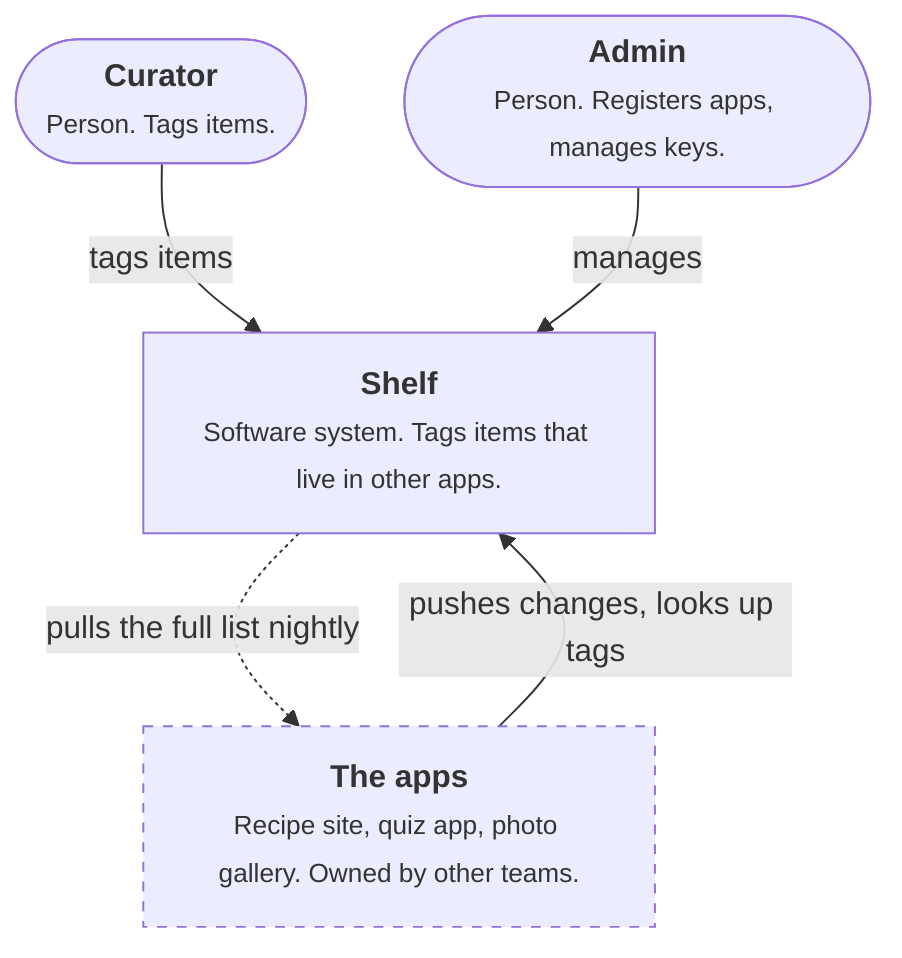
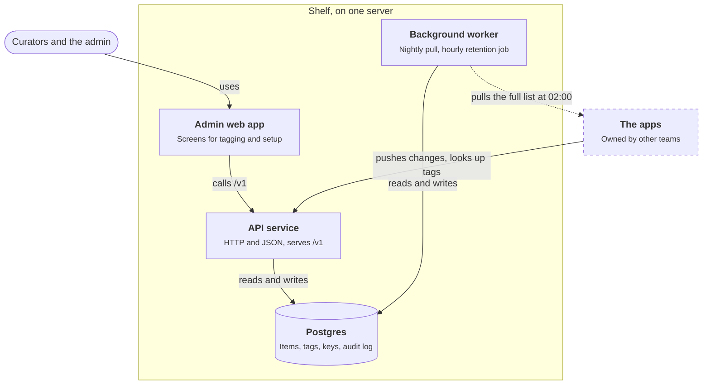
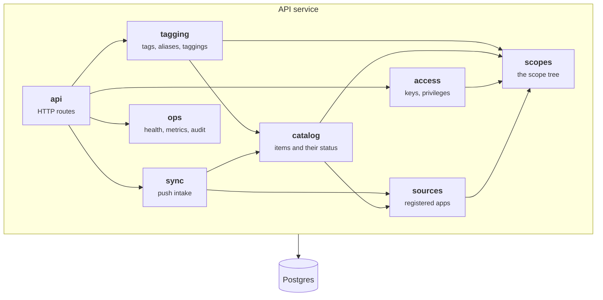
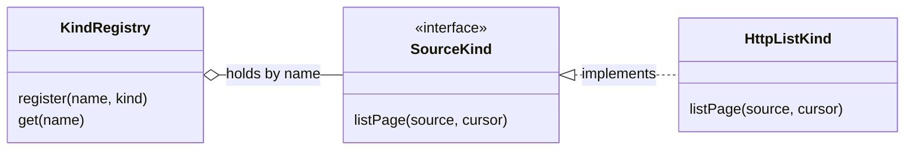

## In one sentence

The C4 model draws a system at four zoom levels, like an online map, so each reader can stop at the detail they need: the system in its world, the pieces that run, the parts inside one piece, and the code.

## Example: Shelf at four zoom levels

Three people ask about Shelf on the same morning. The quiz app’s product manager wants to know what Shelf is and who uses it. Someone joining the on-call rota wants to know what actually runs on the server. A developer wants to know where the “does this tag fit this item?” rule lives.

One diagram can’t answer all three without turning into a mess. Four diagrams, each zoomed one step further in, can.

### Level 1: context

Shelf is a single box. Around it are the people who use it and the systems it talks to. No technology, no insides.

<Diagram
  title="Level 1: Shelf in its world"
  description="Shelf is one box. Curators tag items in it, and the admin registers apps and manages keys. The apps (the recipe site, the quiz app and the photo gallery), drawn with dashed borders because other teams own them, push changes to Shelf and look up tags. Shelf pulls each app's full list every night."
>

</Diagram>

**For:** anyone. Product managers, app teams, a new admin on their first day.

### Level 2: containers

Zoom into the Shelf box. A container is anything that runs or stores data on its own: a web app, a service, a database. (It has nothing to do with Docker, though a container might run in one.)

<Diagram
  title="Level 2: what runs inside Shelf"
  description="Inside a box labelled 'Shelf, on one server' are four containers. Curators and the admin use the admin web app, which calls the API service. The apps push changes to the API service and look up tags there. The API service and the background worker both read and write Postgres. The background worker also pulls each app's full list at 02:00 and runs the hourly retention job."
>

</Diagram>

**For:** developers, and whoever runs Shelf. Four containers on one server is normal: containers are about what runs separately, not how many machines you have. The worker is its own container so that a slow pull can’t hold up lookups, and restarting the API service doesn’t cut a pull off halfway.

### Level 3: components

Zoom into one container, the API service. Its components are Shelf’s modules.

<Diagram
  title="Level 3: inside the API service"
  description="Inside the API service, the api module turns HTTP requests into calls to access, tagging, sync and ops. The tagging module uses catalog and scopes. The sync module uses catalog and sources. The catalog module uses sources and scopes. The access and sources modules use scopes. Every arrow points down towards scopes, which uses nothing. The service as a whole reads and writes Postgres."
>

</Diagram>

**For:** developers working on Shelf. It answers the developer’s question: the “does this tag fit?” rule lives in `scopes`, and `tagging` asks it. It also shows every dependency pointing one way, towards `scopes`. The worker is built from the same modules (it runs `sync` for the pull and `catalog` for retention), so its own level 3 diagram would be small.

### Level 4: code

Zoom into one component and you’re looking at classes and functions. For most components the code itself is the best level 4 view: your editor shows it, and it’s always up to date. Draw one only for a part that’s hard to see from the code, such as a plug-in point.

<Diagram
  title="Level 4: the source-kind plug-in point"
  description="A SourceKind interface has one method, listPage. HttpListKind, the only kind today, implements it. A KindRegistry holds the kinds by name, so a new kind can register itself without the code that uses the registry changing."
>

</Diagram>

**For:** the developer about to change that component.

## The general idea

The <Term id="c4-model">C4 model</Term>, created by Simon Brown, is a way of drawing software at four zoom levels. Each level is its own diagram, for its own reader:

| Level | Zoom | The boxes are | For | In Shelf |
|---|---|---|---|---|
| 1. Context | the system in its world | the system, people, other systems | everyone | Shelf, curators, the admin, the apps |
| 2. Containers | inside the system | things that run or store data on their own | developers and whoever runs it | admin web app, API service, worker, Postgres |
| 3. Components | inside one container | the main parts of its code | developers of that container | the modules |
| 4. Code | inside one component | classes and functions | the developer changing it | the source-kind registry |

A <Term id="c4-container">container</Term> is the idea people find strangest. It means a separately running thing, not a server and not a Docker image. Level 3 is a <Term id="component-diagram">component diagram</Term> of one container; in Shelf, its components are the <Term id="module">modules</Term>. Level 4 is usually a class diagram.

C4 isn’t a new notation. It’s plain boxes and arrows, plus a few rules:

- **One zoom level per diagram.** Never a person, a database and a class in the same picture.
- **Every box says what it is and what it does:** a name, its kind (person, system, container) and one line about its job.
- **Every arrow has a label** saying what flows along it, and from level 2 on, how (HTTP, SQL).
- **Most systems need only levels 1 and 2.** Draw level 3 for the containers with real complexity in them, and level 4 almost never by hand.

<Callout type="note" title="C4 and UML">
C4 and UML get along. Level 3 is a component diagram and level 4 is a class diagram. What C4 adds is the zooming: which picture to draw for which reader, and the rule that each picture stays at one level. To write the model once as text and draw every level from it, see [Diagrams as code](/learn/the-toolbox/diagrams-as-code/).
</Callout>

## Common mistakes

- **Mixing zoom levels.** Postgres next to the curator next to the `tagging` module. Each belongs on a different diagram.
- **Unlabelled arrows.** An arrow from the worker to the apps says “something happens”. “Pulls the full list at 02:00” says what.
- **Confusing containers with servers.** Shelf has four containers on one server. Where things run is a separate question, with its own picture if you need one.
- **Drawing level 4 by hand for everything.** It goes stale fastest. Let the code speak, and draw only the tricky parts.

## Try it

<Sort id="u11-which-zoom-level" />
