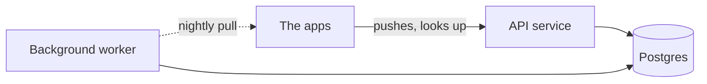

## In one sentence

Diagrams as code means writing a diagram as a short text file that a tool turns into a picture, so it lives in the repository and every change to it is reviewed like any other change.

## Example: the diagram that went stale

<Callout type="story" title="Three boxes, four containers">
Shelf’s first container diagram was drawn in a drawing app and pasted into the README as a picture. When the nightly pull moved out of the API service into its own background worker, nobody updated the picture: the drawing file was on the first developer’s laptop. Six months later, a new developer spent an afternoon hunting for the pull code in the API service, because the README said that’s where it lived.
</Callout>

Here is the same diagram written as text in <Term id="mermaid">Mermaid</Term>, in a file next to the code. This site draws the picture from the text; open “Show the Mermaid source” under it to see the file’s contents.

<Diagram
  title="Shelf's containers, drawn from text"
  description="The apps push changes to the API service and look up tags there. The API service reads and writes Postgres. The background worker also reads and writes Postgres, and pulls each app's full list every night."
>

</Diagram>

When the worker was split out, the diagram changed by three lines, in the same pull request as the code that moved:

```diff
 flowchart LR
   apps[The apps] -->|pushes, looks up| api[API service]
   api --> db[(Postgres)]
-  api -.->|nightly pull| apps
+  worker[Background worker] --> db
+  worker -.->|nightly pull| apps
```

A reviewer sees the picture change right next to the code change. And if the code changes but the diagram doesn’t, the reviewer can ask why.

### The same thing in other tools

Mermaid isn’t the only choice. Here is the same diagram in <Term id="d2">D2</Term>:

```text
apps: The apps
api: API service
db: Postgres {shape: cylinder}
worker: Background worker

apps -> api: pushes, looks up
api -> db
worker -> db
worker -> apps: nightly pull {style.stroke-dash: 3}
```

And in the language of <Term id="structurizr">Structurizr</Term>, which describes the model once and then asks for views of it:

```text
workspace {
  model {
    apps = softwareSystem "The apps"
    shelf = softwareSystem "Shelf" {
      api = container "API service"
      worker = container "Background worker"
      db = container "Postgres" "Items, tags, keys" "PostgreSQL"
    }
    apps -> api "Pushes changes, looks up tags"
    api -> db "Reads and writes"
    worker -> db "Reads and writes"
    worker -> apps "Pulls the full list nightly"
  }
  views {
    systemContext shelf {
      include *
    }
    container shelf {
      include *
    }
  }
}
```

The `views` block is what makes Structurizr different. The context view (C4 level 1) and the container view (level 2) are both drawn from one description, so they can’t disagree.

Tables have a tool of their own. <Term id="dbml">DBML</Term> describes them; tools draw the diagram, and can turn it into SQL:

```text
Table items {
  source_id text
  item_id text [note: 'at most 200 characters']
  scope text [ref: > scopes.path]
  title text [note: 'cached copy']
  status text

  indexes {
    (source_id, item_id) [pk]
  }
}
```

The fifth common tool, <Term id="plantuml">PlantUML</Term>, is the oldest of the group and the strongest on UML. You’ll translate a PlantUML diagram in the exercise below.

### Which one?

| Tool | Best at | Where it renders | Watch out for |
|---|---|---|---|
| Mermaid | flowcharts, sequence, class, state and ER diagrams | GitHub, GitLab, many wikis and docs sites, this course | layout is automatic and hard to steer |
| PlantUML | every UML diagram type, in detail | a PlantUML server, or a plug-in for your editor or wiki | needs Java or a server to draw; looks dated unless styled |
| Structurizr | C4: one model, several views | its own tools, which export to other formats | made for C4 architecture diagrams, and little else |
| D2 | good-looking boxes and arrows, with strong layout | its own command-line tool and editor plug-ins | fewer diagram types; fewer places draw it |
| DBML | database tables and relationships | dbdiagram.io and other tools; converts to and from SQL | tables only |

## The general idea

<Term id="diagrams-as-code">Diagrams as code</Term> means the diagram’s source is text, and a tool draws the picture from it. The text lives in the repository, next to the code it describes. That one change brings several things with it:

- **Reviewed with the code.** A diagram change arrives in the same pull request as the code change, and one reviewer sees both.
- **Diffable.** Version control shows what changed, line by line, in words anyone can read.
- **No lost source files.** Anyone with the repository can edit the diagram. Nobody needs a licence, or somebody’s old laptop.
- **Cheap to change,** so people actually change it.
- **Sometimes generated.** Some diagrams can be produced from the real thing: DBML from a live database, class diagrams from code.

**How to choose.** Start with Mermaid, because it renders where you already read: on GitHub, in most docs tools, and in this course. Reach for Structurizr when you draw C4 at several levels and want them to agree. Use PlantUML when you need a UML diagram that Mermaid can’t draw well. Pick D2 when the picture has to look polished, say on a public docs site. Use DBML for tables. One or two tools per repository is plenty.

<Callout type="tradeoff" title="Text or a drawing tool?">
Text gives up control. The tool decides where the boxes go, and nudging one a few pixels ranges from fiddly to impossible. A drawing tool is quicker for a one-off sketch in a meeting. A good rule: if the diagram must stay true while the code changes, write it as text. If it’s for one conversation, sketch it, and let it go.
</Callout>

## Common mistakes

- **Committing the picture instead of the text.** A PNG can’t be diffed or edited. Commit the text, and let the docs build draw it.
- **Assuming text stays true by itself.** Text makes updates cheap, not automatic. When a boundary moves, updating the diagram is part of the change; put it on your pull request checklist.
- **Fighting the layout.** Invisible boxes and tricks to push a box sideways are a sign the diagram is too big. Split it.
- **One huge diagram.** Text makes it painless to keep adding lines. Keep each diagram to 3–10 boxes, and split by zoom level.

## Try it

The exercise starts from a PlantUML diagram. Rewrite it in Mermaid, and see how close the two languages are.

<DiagramExercise id="u11-plantuml-to-mermaid" />
