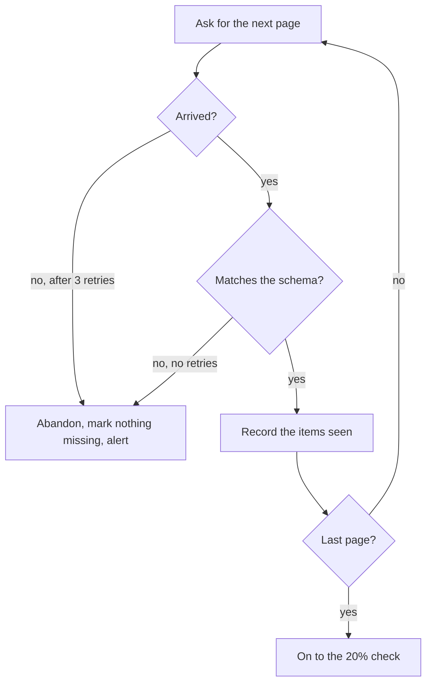

## In one sentence

A contract test calls the real thing and checks its answer against the written contract, so the code and the promise can’t quietly drift apart.

## Example: the renamed cursor

<Callout type="story" title="next_cursor">

The recipe site’s team tidies up their code and renames `nextCursor` to `next_cursor` in their list endpoint’s response. They update their own tests to match, and everything passes.

At 02:00, Shelf pulls. The first page arrives with 500 recipes and no `nextCursor` field. Shelf’s code reads the missing field as `null`, which means “last page”. The listing looks complete after one page: 500 of 12,000 recipes appeared, so the other 11,500 would be marked missing. The 20% guard holds the run and alerts the admin. No tags are lost, but only because the last line of defence held.

</Callout>

The contract was written down. Shelf publishes a <Term id="json-schema">JSON Schema</Term> for each page of a listing. Nobody checked the real response against it. Here it is:

```json
{
  "$schema": "https://json-schema.org/draft/2020-12/schema",
  "type": "object",
  "required": ["items", "nextCursor"],
  "properties": {
    "items": {
      "type": "array",
      "maxItems": 500,
      "items": {
        "type": "object",
        "required": ["id", "title", "updatedAt"],
        "properties": {
          "id": { "type": "string", "minLength": 1, "maxLength": 200 },
          "title": { "type": "string", "maxLength": 300 },
          "url": { "type": "string", "maxLength": 2000 },
          "scope": { "type": "string", "pattern": "^/", "maxLength": 200 },
          "updatedAt": { "type": "string", "format": "date-time" }
        }
      }
    },
    "nextCursor": { "type": ["string", "null"], "maxLength": 500 }
  }
}
```

`nextCursor` is **required**, and may be `null`. A page without it fails. The schema doesn’t forbid extra fields, so an app can add fields without breaking anything.

Two checks, one on each side, would each have caught the rename.

### Check 1: the app tests its own endpoint

The recipe site adds one test to its build. The test starts the site with a handful of test recipes, calls the real list endpoint with a small `limit`, follows `nextCursor` to the end, and validates every page against Shelf’s published schema:

```typescript
test('the list endpoint keeps the Shelf contract', async () => {
  let cursor: string | null | undefined = undefined;
  do {
    const page = await getListPage({ cursor, limit: 2 }); // the real endpoint, test data
    expect(validatePage(page), explain(validatePage.errors)).toBe(true);
    cursor = page.nextCursor;
  } while (cursor !== null);
});
```

`validatePage` is the schema, compiled by any JSON Schema validator. With this test in place, the rename breaks the recipe site’s build in the afternoon, instead of Shelf’s pull in the night.

### Check 2: Shelf checks before it trusts

Shelf can’t make every app run that test. So Shelf checks too, as the consumer:

- **At registration.** When the admin registers a source, Shelf fetches its first page and validates it. A list endpoint that doesn’t match the schema can’t be registered.
- **Every page, every night.** The worker validates each page before using it. A page that doesn’t match counts as a failed page: the listing is abandoned, nothing is marked missing, and the alert names the source and the first error (“page 1: `nextCursor` is required”). There’s no retry, because asking again gets the same wrong answer.

<Diagram
  title="The nightly pull checks each page before trusting it"
  description="Shelf asks the app for the next page. If the page doesn't arrive within three retries, Shelf abandons the listing, marks nothing missing and alerts the admin. If it arrives but doesn't match the schema, Shelf does the same, without retrying. If it matches, Shelf records the items it saw and asks for the next page, until the last page (the one whose nextCursor is null). Then the 20% check runs."
>

</Diagram>

Now the rename is caught on page 1, loudly and safely. The 20% guard stays, for the mistakes no schema can see.

### The other direction: Shelf as provider

Shelf is also a provider, of its own `/v1` API. Its build starts a test copy of Shelf, calls every endpoint (including the failing cases, like putting `vegetarian` on a photo), and checks each real response against `openapi.yaml`: status codes, bodies, and error codes such as `tag_out_of_scope`.

The apps can go further. The quiz app writes down exactly what it relies on: “`GET /v1/tags/{tagId}/items` returns `items`, each with an `id` and a `title`, and a `nextCursor`.” Each app publishes its expectations, and Shelf’s build runs all of them. If a change to Shelf would break the quiz app, Shelf finds out before the release, even if its own spec was changed to match. Pact is a popular tool for this.

## The general idea

A <Term id="contract-test">contract test</Term> checks that the real thing keeps the written promise: the shapes, the required fields, the status codes, the error codes. It doesn’t check that the system does the right thing overall; other tests do that. It checks that the promise and the code still agree.

There are two places to run one:

- **In <Term id="continuous-integration">continuous integration</Term> (CI)**, before a release, on the provider’s side. It’s the cheapest place to catch a break, because the person who caused it is still looking at the code.
- **At run time**, at the boundary, on the consumer’s side. The consumer validates what it receives before acting on it. It costs a little work per page, and turns a quiet disaster into a loud, safe failure.

And there are two ways to decide what to check:

| | Provider test | Consumer-driven contract |
|---|---|---|
| **Who writes the expectations** | the provider, from its own spec | each consumer, from what it actually uses |
| **What it catches** | code that has drifted from the spec | a change that would break a real consumer, even if the spec changed too |
| **What it costs** | one spec, one test suite | every consumer keeps its expectations up to date, in a shared place |
| **In Shelf** | each app tests its list endpoint against Shelf’s schema; Shelf tests `/v1` against `openapi.yaml` | each app publishes what it reads from lookups; Shelf’s build runs them all |

<Term id="consumer-driven-contract">Consumer-driven contracts</Term> pay off when a provider has many consumers and needs to know exactly what each one relies on. For Shelf, with three apps and one developer, provider tests plus Shelf’s own checks at run time cover most of it.

<Callout type="warning" title="A schema checks shape, not meaning">
A listing that leaves out every recipe whose title starts with “Z”, then ends with `nextCursor: null`, passes every schema check. Completeness, ordering, freshness and idempotency are promises about behaviour. They need behaviour tests, and guards like the 20% rule.
</Callout>

## Common mistakes

- **Testing against a fake of yourself.** A contract test that calls a mock of your own endpoint only proves the mock matches. Call the real endpoint, with test data.
- **Testing against a stale copy.** A team that pasted the schema into their repository last year is testing against last year’s contract. Fetch the published version, or pin a version and update it on purpose.
- **Forbidding extra fields.** A response schema that rejects unknown fields turns every harmless addition into a failure. Allow what the contract allows.

## Try it

<Sort id="u11-can-a-schema-catch-it" />
