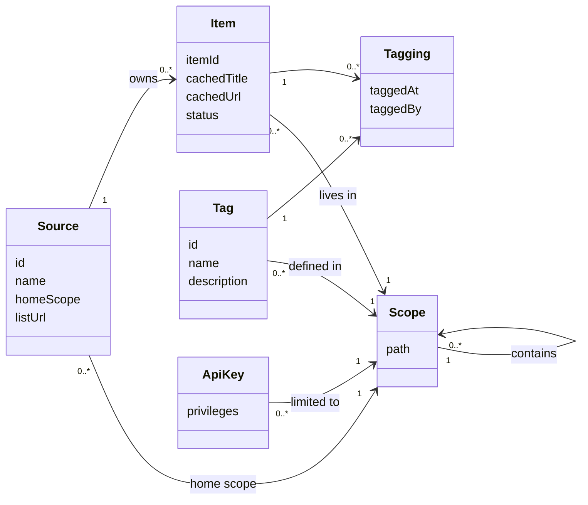
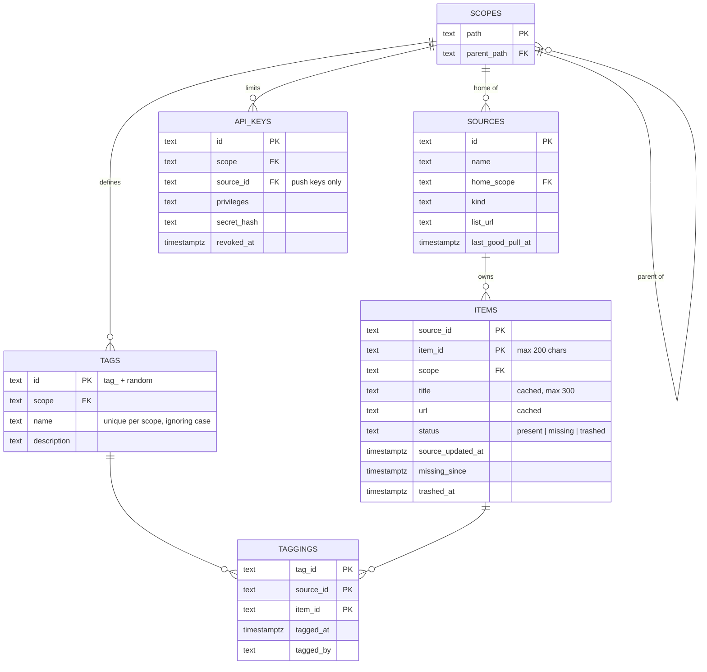
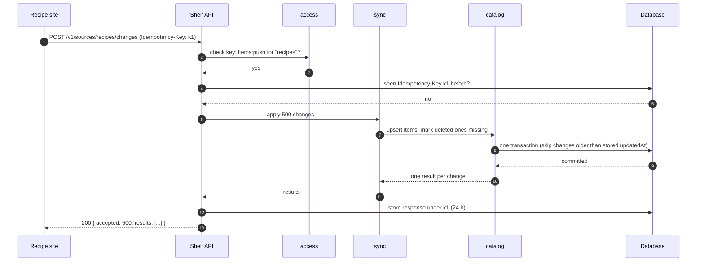
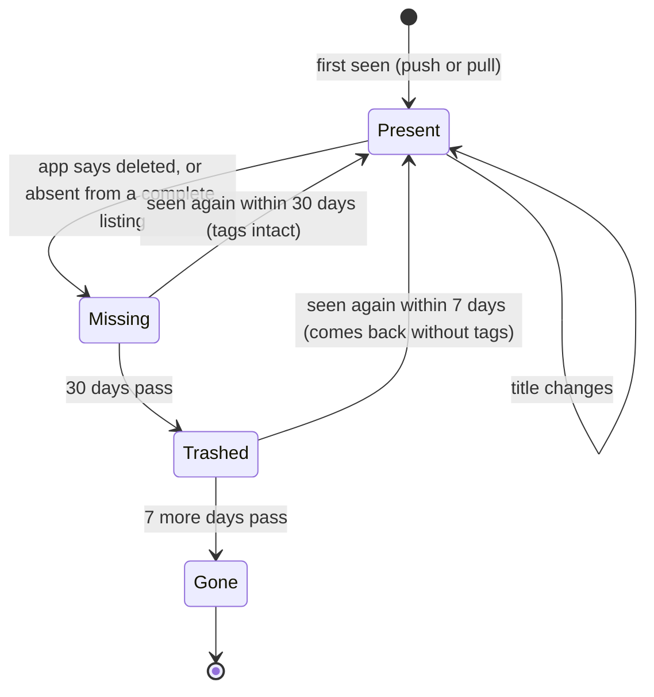

# Shelf: design on one page

*Reference design for the capstone. Yours will differ in wording and in some choices; what matters is that every part is there and that each choice has a reason.*

## 1. What Shelf is

Shelf is a small labelling service. Other apps (the **recipe site**, the **quiz app** and the **photo gallery**) keep their own items. Shelf lets people put **tags** on those items and look items up by tag. Shelf never stores the items themselves, only a cached title and link so it can show them.

## 2. Requirements

### User stories

| # | Story | Acceptance criteria |
|---|---|---|
| S1 | As a **curator**, I want to put a tag on an item, so that people can find it by that tag. | The tag appears on the item at once. Tagging twice leaves one tag. A tag can only go on items inside its scope. |
| S2 | As an **app**, I want to ask for the items that have a tag, so that I can show them to my users. | Returns present items only (missing ones on request), in pages of up to 100, newest tag first. |
| S3 | As an **app**, I want to tell Shelf when my items change, so that titles and deletions show up quickly. | Up to 500 changes per request; applied within 5 s; a delete keeps the item's tags for 30 days. |
| S4 | As an **admin**, I want to register a new app, so that it can plug in without code changes. | Registering takes one form: name, home scope, list URL. The app gets a key. |
| S5 | As an **admin**, I want to know when a nightly pull fails, so that I can fix it before tags go stale. | An alert within 15 minutes of a failed or held pull, naming the source. |

### Quality attributes (measurable)

| Attribute | Requirement |
|---|---|
| Latency | 95% of lookups finish within 200 ms and 99% within 500 ms, at 20 requests per second, measured at Shelf's front door. |
| Throughput | Sustains 20 lookups/s while applying a burst of 500 pushed changes. |
| Availability | Lookup API: 99.9% of each calendar month (≈ 43 min downtime). Admin screens: 99%. |
| Durability | No tag change is lost once Shelf has said "OK". |
| Recovery | After losing the server: back within 2 hours (RTO), losing at most 15 minutes of tag changes (RPO). |
| Freshness | A pushed change shows in lookups within 5 s for 95% of batches. An unpushed change shows within 24 h (the nightly pull). |
| Scalability | Handles 500,000 items and 50 lookups/s by moving to a bigger server, with no redesign. |
| Security | Every call needs a key; a key sees only its own scope; keys are stored hashed. |
| Maintainability | A new app plugs in with registration only: no Shelf code changes. |
| Operability | Every failed pull alerts within 15 minutes; a dashboard shows each source's last good pull. |
| Cost | Runs on one server for under $40 a month. |

**Back-of-the-envelope.** 5,000 app users a day × 30 lookups = 150,000 lookups/day ≈ 1.7/s on average; × 10 at peak ≈ 17/s, so design for 20/s. 60,000 items × 1 KB ≈ 60 MB; 300,000 tag links × 100 bytes ≈ 30 MB. One small server with Postgres is plenty.

### Quality scenario

| Part | Scenario |
|---|---|
| Source | The recipe site |
| Stimulus | pushes 500 changed items in one request |
| Environment | during normal traffic (about 20 lookups a second) |
| Response | Shelf applies every change in one transaction and answers with one result per change |
| Measure | within 10 s, with all 500 changes visible in lookups within 5 s after that, for 95% of such batches |

### Constraints and priorities

- **Constraints:** one server (a VPS); one developer; Postgres; Shelf may store only an item's id, title, link and scope, never its content; the apps are built by other teams, so asking them for more than one list endpoint is expensive.
- **Priorities, in order:** (1) never lose or wrongly remove a tag; (2) lookups stay up; (3) freshness; (4) speed; (5) cost.
- **When they conflict:** correctness beats freshness. If a nightly listing looks incomplete, Shelf marks nothing missing rather than risk removing tags.

## 3. Domain model

- **Scope**: a node in a tree, written as a path: `/`, `/food`, `/learning`, `/learning/maths`, `/photos`.
- **Source**: a registered app, with a *home scope*. Its items live in its home scope or below it.
- **Item**: identified by *(source id, item id)*. The item id is the app's own id: text, at most 200 characters, never reused. The app owns the item; Shelf keeps a cached title and link.
- **Tag**: defined in one scope, with a name unique (ignoring case) within that scope. It can go on items in that scope **or below it**: `exam-prep` in `/learning` fits a quiz in `/learning/maths`, but not a photo in `/photos`.
- **Tagging**: one tag on one item (the many-to-many link).
- **Who owns the truth:** apps own items (id, title, link, whether they exist). Shelf owns scopes, tags, taggings and keys.

## 4. Modules

| Module | Owns | May call |
|---|---|---|
| `scopes` | the scope tree; the "is this scope inside that one?" rule | — |
| `access` | API keys, privileges; checks every request | scopes |
| `sources` | registered apps, their home scopes, list URLs, schedules; the registry of *source kinds* | scopes |
| `catalog` | items, their cached titles and their status (present, missing, trashed) | scopes, sources |
| `tagging` | tags, tag aliases, taggings | catalog, scopes |
| `sync` | push intake and the nightly pull | sources, catalog |
| `api` | HTTP: turns requests into module calls | all of the above |
| `ops` | health checks, metrics, audit log | read-only views of the others |

Dependencies point one way: `api` → modules → `scopes`. No module knows about recipes, quizzes or photos. **Plug-in point:** `sync` pulls through a *source kind* adapter looked up in a registry (`http-list` today); a new kind (say, a sitemap reader) registers itself without `sync` changing.

## 5. Data model

- `items.title` and `items.url` are **cached copies**: refreshed by every push and every nightly pull, never edited in Shelf.
- `tag_aliases(scope, name, tag_id, expires_at)` keeps a renamed tag's old name working for 30 days.
- Deleting is **soft**: status changes first; rows are removed only by the retention job (section 8).
- Other tables: `pull_runs` (one row per nightly pull and its outcome), `idempotency_keys` (24 hours), `audit_log`.

## 6. One contract: the list endpoint each app provides

Shelf defines this contract; each app **implements** it; Shelf **calls** it every night.

**`GET {listUrl}?cursor=…&limit=…`**, with `Authorization: Bearer <pull secret>`.

| | |
|---|---|
| **Inputs** | `cursor` (optional, opaque, ≤ 500 chars): leave out for the first page. `limit` (optional, 1–500). |
| **Output** | `{ "items": [ { "id", "title", "url"?, "scope"?, "updatedAt" } ], "nextCursor": "…" or null }` |
| **Errors** | `400 invalid_cursor` (unknown or older than an hour: Shelf restarts); `401 unauthenticated` (Shelf stops and alerts); `503 unavailable` (Shelf retries, then gives up for tonight). |
| **Pagination** | Keep calling with `nextCursor` until it is `null`. |
| **Completeness** | A listing that reaches `null` is **complete**: every item that existed for the whole listing appeared at least once. Duplicates are fine. |
| **The key rule** | After a complete listing, any item Shelf knows for that source that did **not** appear is marked **missing**. If any page fails, Shelf abandons the listing and marks **nothing** missing. |
| **Limits and timeouts** | ≤ 500 items per page; each page within 10 s; Shelf retries a page 3 times (after 2, 4 and 8 s). A cursor stays valid for at least an hour. |

**Why the key rule matters:** a listing that quietly stopped early would look like "hundreds of items were deleted", and their tags would start to disappear. So Shelf only trusts a listing that finished, and it adds a second guard: if a finished listing would mark more than 20% of a source's items missing, Shelf holds the run and asks the admin.

## 7. One flow: an app pushes a change

If the app times out and sends the same request again with the same `Idempotency-Key`, step 4 finds it and Shelf returns the stored response without applying anything twice.

## 8. One state diagram: an item's life

- **Present**: shown in lookups.
- **Missing**: hidden from lookups unless asked for (`include=missing`); tags kept.
- **Trashed**: tags removed (and recorded in the audit log); row kept for a week so admins can see what went.
- **Gone**: row deleted. If the app lists it again later, it is a brand-new item.

A retention job runs every hour and moves items along; it is safe to run twice.

## 9. Failure modes

| Step | What can go wrong | What happens |
|---|---|---|
| Push | Sent twice after a timeout | Same end state; with the same Idempotency-Key, the stored response is replayed. |
| Push | Database unavailable | `503` with `Retry-After`; the app retries with backoff; the nightly pull repairs anything lost. |
| Push | Changes arrive out of order | A change older than the stored `updatedAt` is ignored (`ignored: true`). |
| Pull | A page times out or fails | Retry 3 times with backoff, then abandon: nothing is marked missing. Alert if a source fails two nights running. |
| Pull | The app's listing is cut short by a bug | The 20% guard holds the run and alerts the admin. |
| Lookup | Traffic spike above 20/s | Per-key rate limit (`429`); tag lookups cached for 30 s. |
| Retention job | Crashes halfway | Works in small batches, each in a transaction; the next run carries on. |
| Server | Lost completely | Rebuild from nightly backup plus 15-minute log shipping: back within 2 h, losing ≤ 15 min. |
| Key | Leaked | Revoke it; it only ever saw its own scope, which limits the damage. |

**Knowing it's healthy.** `/healthz` (process up) and `/readyz` (database reachable). Metrics: requests, errors and p95 latency per endpoint; items by status per source; pull outcomes. **SLI:** share of lookups answered successfully within 500 ms. **SLO:** 99.9% per month. Alerts: SLO burning too fast, a failed or held pull, a failed backup, disk over 80%.

## 10. Permissions

| Privilege | Lets a key… |
|---|---|
| `tags:read` | look up tags and tagged items |
| `tags:apply` | put tags on items and take them off |
| `tags:manage` | create, rename and delete tags |
| `items:push` | send changes for its own source (push keys are tied to one source) |
| `admin` | register sources, manage scopes and keys (root scope only) |

| Role | Privileges | Scope |
|---|---|---|
| App (source) | `items:push`, `tags:read`, `tags:apply` | its home scope |
| Read-only app | `tags:read` | a scope |
| Curator | `tags:read`, `tags:apply`, `tags:manage` | a scope |
| Admin | everything | `/` |

**Default deny:** a key can do nothing it wasn't given, and only inside its scope. A key for `/learning` can tag a quiz in `/learning/maths`, but anything in `/photos` gets `403 forbidden`: it can't read or change a thing there.

## 11. One decision (ADR-001): push, pull, or both?

- **Status:** accepted.
- **Context:** Shelf's copy of each app's items must stay fresh (titles, deletions). The apps are built by other teams and will sometimes fail to tell Shelf about a change. One developer runs Shelf.
- **Options:**
  1. *Push only.* Fresh, but a missed push is never repaired, and a missed delete leaves a ghost item forever.
  2. *Pull only.* Simple for apps (one list endpoint) and self-repairing, but changes take up to a day to appear, and big sources are listed in full every time.
  3. *Both.* Apps push for freshness; Shelf pulls nightly as a safety net.
- **Decision:** both.
- **Consequences:** apps must implement the list endpoint and should push. Shelf has two paths that can disagree, so it orders changes by `updatedAt` and never lets an incomplete listing mark items missing. More code, but the system repairs itself overnight.
