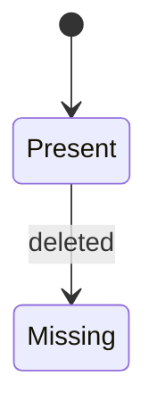

# Writing lessons

How to write a lesson for *System Design, in Plain English*. Read this, the plan (`PLAN.md`), the reference design (`content/reference/shelf-design.md`) and the Unit 1 lessons (`content/lessons/01-getting-oriented/`) before writing. Unit 1 is the model for tone and shape.

## Voice

- **Plain English first.** Introduce every idea in everyday words, then give its name: “A promise between two parts of a system. This is called a *contract*.”
- **Show, then name, then practise.** A concrete Shelf example, then the general idea, then an exercise.
- **Short sentences. One idea per paragraph.** Aim for sentences under 25 words. Use lists and tables when there are several parallel things.
- **Talk to the reader** (“you”). Be warm and direct, never cute.
- **Honest about trade-offs.** When there isn’t one right answer, say so and show what each choice costs. Use a `<Callout type="tradeoff">`.
- **British spelling:** behaviour, organise, colour, licence (noun), catalogue, favourite, modelling.
- **No em dashes (—).** Use a full stop, a colon, a comma or brackets instead. En dashes only in ranges (5–10).
- **Avoid** “simply”, “just”, “obviously”, “easy”, “of course”, “basically”, “note that”, “it’s worth noting”, “in this lesson we will”.
- **Numbers:** digits for 10 and above and for all measurements (5 s, 200 ms, 30 days). Thousands separators (60,000). “ms” and “s” with a space.
- **Code-ish things** (field names, paths, error codes, privileges) go in backticks: `items:push`, `tag_out_of_scope`, `/learning/maths`.
- Use curly quotes (“ ” ‘ ’) in prose.

## Lesson format

One file per lesson: `content/lessons/<nn>-<unit-slug>/<nn>-<lesson-slug>.mdx`. The file names are fixed (see the table at the end).

```mdx
---
unit: 2
order: 3
title: Making a requirement measurable
summary: One sentence (max 240 characters) shown under the title and in lists.
minutes: 8
terms: [measurable, percentile, latency]
---

## In one sentence

One or two sentences. The whole idea of the lesson, in plain English.

## Example

A concrete Shelf example. Usually the longest part.

## The general idea

Now name the idea and generalise it. Formal terms appear here, linked with <Term>.

## Common mistakes

Two or three, briefly, as a bulleted list with a bold lead-in each.

## Try it

<Quiz id="u2-is-it-measurable" />
```

Rules the content tests enforce (`tests/content.test.ts`):

- The five `##` headings, in that order, spelled exactly like that. `## Example` may have a subtitle: `## Example: Shelf's list endpoint`. Use `###` for sub-sections; don’t add other `##` headings.
- “In one sentence” is one or two sentences.
- `terms` lists 2–6 glossary ids: the lesson’s key terms. The page shows them in a “Key terms” box at the end automatically; don’t write that section yourself.
- Every `<Term id>` and every `terms` entry exists in the glossary.
- Every `<Diagram>` has a `description` of at least 40 characters and a ```` ```mermaid ```` fence inside it. No Mermaid outside `<Diagram>`.
- “Try it” contains at least one exercise component. Every exercise file is used by exactly one lesson.
- 350–2,000 words of prose (aim for 800–1,400). `minutes` is 3–10 and at least words ÷ 260.
- Internal links point at pages that exist: `/learn/<unit-slug>/<lesson-slug>/`, `/glossary/#<id>`, `/tools/`, `/playground/`, `/capstone/`.
- Only the components listed below.

The map strip at the top of the lesson comes from the unit (`content/units.yaml`). A lesson can override it with `mapPart:` in its frontmatter (one of `requirements, domain-model, boundaries, data-model, contracts, flows, state, failure, security, operations, evolution`).

## Components

### `<Term id="…">text</Term>`

Links a word to the glossary: a dotted underline with a definition on hover. Link a technical term the **first time** it appears in a lesson (usually in “The general idea”), not every time. `<Term id="idempotency" />` with no text shows the glossary’s own term name.

### `<Callout type="…" title="…">`

Types: `note` (blue), `tip` (green), `warning` (amber, “Watch out”), `tradeoff` (violet), `shelf` (teal, “In Shelf”), `story` (brown, “A short story”). `title` is optional. At most two or three callouts per lesson. Leave a blank line after the opening tag and before the closing tag if the body has lists or several paragraphs.

```mdx
<Callout type="story" title="The double-counted import">

The quiz app’s network drops just after Shelf applies a batch…

</Callout>
```

### `<Compare>` and `<Side title="…" tone="bad|good|neutral">`

Two things side by side (stacked on phones), such as a vague wish next to a measurable requirement.

```mdx
<Compare>
<Side title="A wish" tone="bad">
Lookups should be fast.
</Side>
<Side title="A requirement" tone="good">
95% of lookups finish within 200 ms at 20 requests per second.
</Side>
</Compare>
```

### `<Diagram title="…" description="…">` with a Mermaid fence

```mdx
<Diagram
  title="An item's life"
  description="An item starts present. If the app deletes it, it becomes missing. After 30 days missing it is trashed…"
>

</Diagram>
```

- `description` says in words what the diagram shows (it is shown under it and read by screen readers). Write it as full sentences.
- Keep diagrams small: 3–10 boxes. Prefer `flowchart LR/TD`, `sequenceDiagram`, `classDiagram`, `stateDiagram-v2`, `erDiagram`.
- Mermaid gotchas: in labels avoid `;` and unbalanced quotes; put text with parentheses, colons or slashes in node labels inside quotes: `A["Shelf (API)"]`. In `classDiagram`, a member with `()` becomes a method. In `erDiagram`, attribute comments must be in double quotes. Check with the diagram checker (below).

### `<GoDeeper title="…">`

A closed box with extra technical detail for readers who want it. Optional, at most one per lesson. The lesson must make sense without it.

### Exercises

All exercise content lives in `content/exercises/<id>.yaml`. Ids look like `u2-is-it-measurable` (`u<unit number>-<short-slug>`).

| Component | YAML `type` | Use for |
|---|---|---|
| `<Quiz id="…" />` | `quiz` | multiple choice; an explanation for **every** option |
| `<Sort id="…" />` | `sort` | put items into 2–4 buckets; a reason for every item |
| `<WriteIt id="…" />` | `write` | free writing, then compare with a model answer and a checklist |
| `<ScenarioExercise id="…" />` | `scenario` | the five-part quality-scenario builder with a model answer |
| `<DiagramExercise id="…" />` | `diagram` | draw a Mermaid diagram, then compare with a model answer |

Tools that can also serve as the exercise: `<EstimationCalculator />`, `<AvailabilityCalculator />`, `<ContractBuilder />`, `<ScenarioBuilder />`. Special: `<ResponseTimeChart />` (the percentile picture, Unit 2 lesson 3), `<DesignMap />` (the eleven parts; `current="contracts"` highlights one).

A lesson may have a small quiz earlier in the lesson too, but the main exercise goes under “Try it”.

#### Quiz

```yaml
id: u6-spot-the-missing-error
type: quiz
title: Spot the missing error          # optional
intro: Optional markdown shown above the questions.
questions:
  - prompt: |
      Markdown. Can include a code block or a table.
    options:
      - text: The option (inline markdown)
        explanation: Why this is wrong. Every option gets one.
      - text: The right option
        correct: true
        explanation: Why this is right.
```

Exactly one `correct: true` per question; 3–4 options; 3–6 questions. Wrong options should be tempting, not silly, and their explanations should teach something.

#### Sort

```yaml
id: u3-who-owns-it
type: sort
title: Who owns the truth?
intro: For each piece of data, decide which side is its source of truth.
buckets:
  - id: shelf
    label: Shelf
    hint: optional
  - id: app
    label: The app
items:
  - text: An item's title
    bucket: app
    reason: The app creates and edits titles. Shelf keeps a cached copy.
```

2–4 buckets, 6–12 items, mixed order (don’t put all of one bucket first).

#### Write

```yaml
id: u10-adr-push-or-pull
type: write
title: Write the ADR
prompt: |
  Markdown: what to write.
starter: |
  Optional text pre-filled in the box, e.g. a template with headings.
rows: 14                      # optional height of the box
hints:
  - One hint at a time is revealed.
checklist:
  - Names the options it compared
modelAnswer: |
  Markdown. One good answer, not the only one.
```

#### Scenario

```yaml
id: u2-push-500-scenario
type: scenario
title: …
prompt: |
  Markdown.
starter:            # optional, any of the five fields
  source: The recipe site
modelAnswer:
  source: …
  stimulus: …
  environment: …
  response: …
  measure: …
notes: |
  Optional markdown shown under the model answer.
```

#### Diagram

```yaml
id: u7-tag-rename-states
type: diagram
title: …
prompt: |
  Markdown.
starter: |
  stateDiagram-v2
    [*] --> Active
hints:
  - …
modelAnswer: |
  stateDiagram-v2
    …
modelDescription: The model answer in words (full sentences).
checklist:
  - …
```

#### YAML gotchas

- Quote a value that contains `: ` or starts with `*`, `&`, `!`, `%`, `@`, `` ` ``, `{`, `[`, `>`, `|` or `-`: `text: "Shelf: the API"`. Or use a block scalar (`|`) for anything long or multi-line.
- Markdown works inside strings: `**bold**`, `` `code` ``, links.

## MDX gotchas

- `{` `}` and `<` are special in MDX prose. Put paths like `{sourceId}` in backticks (`` `/v1/sources/{sourceId}` ``) and write “under 200 ms” instead of “< 200 ms”.
- Don’t indent markdown inside a component by four spaces (it becomes a code block).
- Leave a blank line before and after tables, lists and fenced code.
- No `import` or `export` lines; every component is already available.
- Headings inside components (`<Callout>`, `<Side>`) aren’t allowed; use bold text.

## The glossary

`content/glossary.yaml` has 167 terms. Use `grep -n "^- id:" content/glossary.yaml` to list the ids. Prefer an existing term. If a lesson needs a new one, add it to `content/glossary-drafts/unit-<nn>.yaml` (same format as the glossary; the content loader merges drafts in). Check the id and the term aren’t already in the glossary.

```yaml
- id: long-polling
  term: Long polling
  short: One or two plain-English sentences, at most 260 characters.
  see: [push, pull]        # optional, existing ids
```

## Shelf: the facts every lesson must agree with

The full design is `content/reference/shelf-design.md`. Never contradict it. Key facts:

- **What it is.** A small labelling service. Apps (“sources”) keep their own items; Shelf lets people tag those items and look items up by tag. Shelf stores only an item’s id, a cached title and link, and its scope. Never the item itself.
- **The apps:** the **recipe site** (source id `recipes`, home scope `/food`), the **quiz app** (`quizzes`, `/learning`; puts maths quizzes in `/learning/maths`), the **photo gallery** (`photos`, `/photos`). Call them by these plain names, not brand names.
- **People:** *curators* tag items; the *admin* (Shelf’s one developer) registers sources, manages scopes and keys; the apps’ own users see tagged items through the apps.
- **Scopes** form a tree written as paths: `/`, `/food`, `/learning`, `/learning/maths`, `/photos`. A tag defined in a scope can go on items in that scope **or below it**. `favourite` (in `/`) fits anything; `vegetarian` (in `/food`) fits recipes only; `exam-prep` (in `/learning`) fits any quiz; `algebra` (in `/learning/maths`) fits maths quizzes only.
- **Identity.** An item is identified by (source id, item id). The item id is the app’s own id: text, at most 200 characters, never reused. Tag ids are Shelf’s (`tag_7kq2m9`); tag names are unique per scope, ignoring case, at most 50 characters.
- **Ownership.** Apps own items (whether they exist, their titles, links, scope). Shelf owns scopes, tags, taggings and keys. Titles in Shelf are cached copies.
- **Push:** `POST /v1/sources/{sourceId}/changes` with up to 500 changes (`op: upsert | delete`, `id`, `title`, `url`, `scope`, `updatedAt`). All-or-nothing per request. Safe to retry; optional `Idempotency-Key` header (remembered 24 hours). A change older than the stored `updatedAt` is ignored. Visible in lookups within 5 s (p95). A delete marks the item **missing**; it never removes tags directly. Limits: 500 changes and 1 MB per request, 60 requests a minute per key.
- **Pull:** every night (02:00) Shelf calls each app’s list endpoint, `GET {listUrl}?cursor=…&limit=…` (the app implements it; Shelf defines the contract), pages of at most 500, `nextCursor: null` on the last page. After a **complete** listing, items Shelf knows that did not appear are marked missing. If any page fails (after 3 retries at 2, 4 and 8 s; 10 s timeout per page), the listing is abandoned and **nothing** is marked missing. If a complete listing would mark more than **20%** of a source’s items missing, Shelf holds the run and alerts the admin (a circuit breaker).
- **Item states:** `present` → `missing` (deleted, or absent from a complete listing) → `trashed` after **30 days** (tags removed, recorded in the audit log) → `gone` after **7 more days** (row deleted). Missing → present if seen again within 30 days (tags intact). Trashed → present if seen within the 7 days (comes back **without** tags). Missing items are hidden from lookups unless `include=missing`. A retention job runs hourly and is safe to run twice.
- **Tags:** created in a scope (`POST /v1/tags`), renamed (`PATCH /v1/tags/{tagId}`: the old name stays as an **alias for 30 days**, so lookups by the old name still work and nobody can take that name in that scope meanwhile), deleted (`DELETE /v1/tags/{tagId}` removes its taggings). Tagging: `PUT /v1/items/{sourceId}/{itemId}/tags/{tagId}` (idempotent; `created: false` if already tagged); untagging `DELETE` on the same path (idempotent). Lookups: `GET /v1/tags/{tagId}/items` (pages of up to 100, newest tag first), `GET /v1/items/{sourceId}/{itemId}/tags`.
- **Error codes** (JSON body `{ "error": { "code", "message", "details" } }`): `invalid_request` 400, `invalid_cursor` 400, `unauthenticated` 401, `forbidden` 403, `source_not_found`/`item_not_found`/`tag_not_found` 404, `item_missing` 409, `tag_name_taken` 409, `too_many_changes` 413, `scope_not_allowed` 422, `tag_out_of_scope` 422, `rate_limited` 429, `unavailable` 503. Callers branch on `code`, never on `message`.
- **Privileges:** `tags:read`, `tags:apply`, `tags:manage`, `items:push` (push keys are tied to one source), `admin` (root scope only). Roles: App = `items:push` + `tags:read` + `tags:apply` in its home scope; Read-only app = `tags:read`; Curator = `tags:read` + `tags:apply` + `tags:manage` in a scope; Admin = everything in `/`. Default deny. Keys stored hashed; a key sees only its scope and below.
- **Numbers:** 3 sources now, up to 20 in two years. 60,000 items now (recipes 12,000; quizzes 3,000; photos 45,000), up to 500,000. About 2,000 tags and 300,000 taggings. 5,000 app users a day × 30 lookups = 150,000 lookups/day ≈ 1.7/s average, ×10 peak ≈ 17/s, so design for 20/s. Storage ≈ 60 MB items + 30 MB taggings.
- **Quality targets:** lookups p95 200 ms and p99 500 ms at 20 req/s; availability 99.9% a month for lookups (≈ 43 min), 99% for admin screens; RPO 15 min, RTO 2 h; pushed changes visible within 5 s (p95), unpushed within 24 h; under $40 a month on one server.
- **Constraints:** one server (a VPS), one developer, Postgres, apps built by other teams (asking them for more than one list endpoint is expensive), Shelf may not store item content.
- **Priorities:** (1) never lose or wrongly remove a tag, (2) lookups stay up, (3) freshness, (4) speed, (5) cost. Correctness beats freshness.
- **Modules:** `scopes`, `access`, `sources`, `catalog`, `tagging`, `sync`, `api`, `ops` (see the reference for who owns what and who may call whom). Plug-in point: *source kinds* (`http-list` today) in a registry used by `sync`.
- **Tables:** `scopes`, `sources`, `items` (PK source_id + item_id), `tags`, `tag_aliases`, `taggings` (PK tag_id + source_id + item_id), `api_keys`, `pull_runs`, `idempotency_keys`, `audit_log`.
- **Operations:** `/healthz`, `/readyz`; SLI = share of lookups answered successfully within 500 ms; SLO 99.9% a month; alerts for SLO burn, failed or held pulls, failed backups, disk over 80%. Nightly backup plus log shipping every 15 minutes.
- **ADR-001:** push *and* pull.
- **Example ids used across lessons:** tag `exam-prep` is `tag_7kq2m9`; tag `vegetarian` is `tag_4vn8x2`; recipes look like `r-812`, quizzes `q-311`. Item ids are compared exactly (case matters), may contain `/`, and are URL-encoded in paths (`maths/fractions-3`).
- **Details settled while writing:** anything outside a key’s scope gets `403 forbidden` (Shelf decided against hiding it behind `404`); `tag_out_of_scope` details carry `tagScope` and `itemScope`; a tag description is at most 500 characters; a rename answers with the old name and the date its alias expires, and renaming again makes the just-dropped name the alias for a fresh 30 days; deleting an already-missing item doesn’t restart its 30 days; writes are never degraded (they fail with `503`), while lookups may be served from a 30-second cache under load; a list page that fails schema validation counts as a failed page; deprecations announce a `Sunset` date about 6 months ahead and `/v1` stays until nobody calls it; logs record a key’s id, never the key; keys are replaced by issuing the new one, switching, then revoking the old; Shelf has no SLA (its users are internal teams); a process manager restarts Shelf when `/healthz` stops answering; the hourly retention job lives in `catalog`, which runs an “item trashed” hook that `tagging` registers (same transaction), so the two modules don’t call each other in a loop; the foreign key from `taggings` to `items` doesn’t cascade; `sync` owns `pull_runs`; the `SourceKind` interface and its registry live in `sources`; coming back to present clears `missing_since`; Shelf is written in TypeScript and has four containers (admin web app, API service, background worker, Postgres).

If a lesson needs a detail that isn’t here, invent something small and consistent with the rest, and mention it in your hand-off note so the reference can be updated.

## Lesson files and links

| Unit | Folder | Lessons (file name = `<nn>-<slug>.mdx`; link = `/learn/<unit-slug>/<slug>/`) |
|---|---|---|
| 1 | `01-getting-oriented` | `what-designing-means`, `design-vs-architecture`, `meet-shelf`, `the-map` |
| 2 | `02-requirements` | `what-it-must-do`, `how-well-it-must-do-it`, `making-it-measurable`, `back-of-the-envelope`, `availability-in-real-time`, `quality-scenarios`, `constraints-and-priorities` |
| 3 | `03-domain-model` | `finding-the-nouns`, `relationships`, `identity`, `who-owns-the-truth` |
| 4 | `04-boundaries` | `drawing-the-lines`, `which-way-dependencies-point`, `plug-in-points` |
| 5 | `05-data-model` | `from-concepts-to-tables`, `cached-vs-owned-columns`, `soft-deletes-and-retention` |
| 6 | `06-contracts` | `what-a-contract-is`, `sides-and-ownership`, `nouns-and-identity`, `operations`, `errors-are-part-of-the-contract`, `behavioural-guarantees`, `who-may-call-it`, `changing-a-contract-safely`, `write-it-down-for-machines`, `worked-example` |
| 7 | `07-flows-and-state` | `sequence-diagrams`, `state-diagrams` (frontmatter `mapPart: state`) |
| 8 | `08-when-things-go-wrong` | `listing-failure-modes`, `responses-to-failure`, `knowing-its-healthy` (frontmatter `mapPart: operations`) |
| 9 | `09-security` | `who-can-do-what-where`, `least-access` |
| 10 | `10-changing-over-time` | `migrations-without-breaking-users`, `recording-decisions` |
| 11 | `11-the-toolbox` | `uml-the-useful-parts`, `c4-zooming-in-and-out`, `diagrams-as-code`, `contract-tools`, `keeping-contracts-honest` |

Unit slugs: `getting-oriented`, `requirements`, `domain-model`, `boundaries`, `data-model`, `contracts`, `flows-and-state`, `when-things-go-wrong`, `security`, `changing-over-time`, `the-toolbox`.

Link to other lessons where it helps (“You met idempotency in [Behavioural guarantees](/learn/contracts/behavioural-guarantees/).”), but each lesson must stand on its own.

## Checking your work

```bash
UNIT=2 npx vitest run tests/content.test.ts    # format, terms, links, exercises, length, compiles
node scripts/check-diagrams.mjs 02-requirements  # renders every Mermaid diagram in the unit
node scripts/check-diagrams.mjs u2-              # …and in the unit's diagram exercises
npm run build                                   # the whole site
```

## Definition of done (per lesson)

- follows the lesson format above
- uses Shelf as its example
- has at least one exercise with feedback
- every technical term is in the glossary
- every diagram has a text description
- readable in 10 minutes or less
